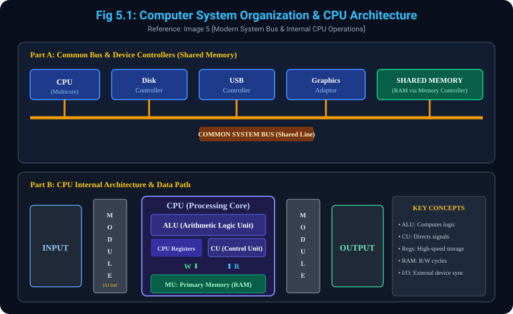

# 5. Computer System Organization & Architecture

> **Reference to Previous Concepts:**
> - **Concept 2.1 & 2.3** mein humne computer system ka layered view aur hardware resources (CPU, Memory, I/O devices) dekha tha.
> - Yeh topic aapki share ki gayi **Image 5** par aadharit hai jisme modern computer system ka **Common Bus Architecture**, **Device Controllers**, aur bottom slide mein **CPU ki Internal Working (ALU, CU, Registers, I/O Modules)** explain ki gayi hai.

---

## 5.1 Modern Computer System Operation & Common Bus
- **Definition:** Ek modern general-purpose computer system mein ek ya ek se zyada **CPUs (Central Processing Units)** aur bohot saare **Device Controllers** hote hain.
- **Common Bus Connection:** Yeh sabhi components ek single **Common System Bus** ke zariye aapas mein jude hote hain jo shared memory (RAM) ka access provide karta hai.
- **Multicore Architecture (Image 5 Handwritten Note):**
  - Image 5 ke top-right corner mein handwritten note hai: **"Multicore"**.
  - Multicore ka matlab hai ek hi processor chip par multiple execution cores hona, jisse multiple tasks parallel mein run ho sakein aur overall throughput dramatically badh jaye.

---

## 5.2 Device Controllers & Concurrent Execution
- **Role of Device Controllers:**
  - Har specific type ke device ke liye ek dedicated controller hota hai:
    - `Disk Controller` (Hard Drive / SSD ke liye)
    - `USB Controller` (Mouse, Keyboard, Flash drives ke liye)
    - `Graphics Adaptor / Controller` (Display / Monitor ke liye)
- **Concurrent Execution & Memory Competition:**
  - CPU aur Device Controllers **concurrently (ek sath)** execute ho sakte hain.
  - Jab dono ek sath chalte hain, toh woh shared memory (RAM) ke data cycles ke liye aapas mein compete karte hain (Memory cycle competition).

---

## 5.3 Memory Controller & Synchronization
- **Need for Memory Controller:**
  - Agar CPU aur multiple device controllers ek hi samay par bina kisi niyam ke memory ko read ya write karne lagen, toh data corruption ho sakta hai.
  - Isliye system mein ek **Memory Controller** provide kiya jata hai jiska kaam shared memory ke access ko synchronize karna aur orderly access ensure karna hai.

---

## 5.4 CPU Internal Architecture (Image 5 Bottom Handwritten Diagram)
Image 5 ke lower half mein ek detailed handwritten diagram diya gaya hai jo CPU ke internal components aur data flow ko dikhata hai:

- **5.4.1 ALU (Arithmetic Logic Unit):**
  - Saare mathematical calculations (`+`, `-`, `*`, `/`) aur logical comparisons (`AND`, `OR`, `<`, `>`) ALU ke andar execute hote hain.
- **5.4.2 CU (Control Unit):**
  - Yeh CPU ka manager hai. Yeh control signals bhejkar data movement aur instruction decoding ko coordinate karta hai.
- **5.4.3 CPU Registers:**
  - CPU ke andar maujood ultra-fast temporary storage (jaise Accumulator, Program Counter, Instruction Register) jisme current calculation ka data store hota hai.
- **5.4.4 Memory Unit (MU / Primary RAM - Read & Write):**
  - CPU memory ke saath do primary operations karta hai:
    - **Read (R):** RAM se instructions aur data CPU registers mein load karna.
    - **Write (W):** Calculation ka final result RAM mein wapas store karna.
- **5.4.5 I/O Modules & Interfaces:**
  - External input devices (Keyboard/Mouse) **Input Interface Module** ke zariye CPU tak data pahunchate hain.
  - Processing ke baad data **Output Interface Module** ke zariye screen ya printer tak deliver hota hai.

---

## 5.5 Diagram Reference (Image 5)
### Visual Representation: System Bus & CPU Internal Architecture


```
Part A: Common Bus & Shared Memory Architecture
[ CPU (Multicore) ]   [ Disk Controller ]   [ USB Controller ]   [ Graphics Adaptor ]
        |                     |                     |                    |
========+=====================+=====================+====================+========== COMMON BUS
                                         |
                                [ Memory Controller ]
                                         |
                                [ SHARED MEMORY (RAM) ]

Part B: CPU Internal Architecture
[ INPUT ] ---> [ I/O Module ] ---> [ CPU: ALU | CU | Registers ] ---> [ I/O Module ] ---> [ OUTPUT ]
                                          | Read (R) / Write (W)
                                          v
                                   [ Primary RAM ]
```

---
*Next Module: [6. Bootstrap Program and How it Works](../6_Bootstrap_Program_and_Booting/README.md)*
