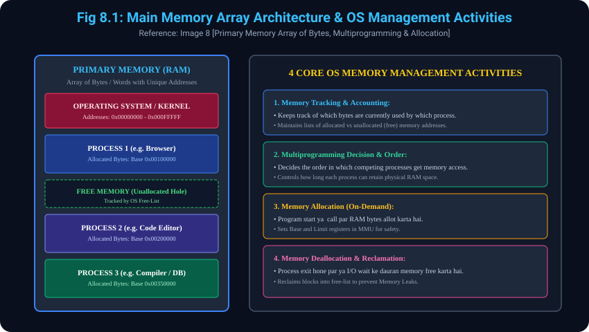

# 8. Functions of Operating System: Memory Management

> **Reference to Previous Concepts:**
> - **Concept 4.2.2** mein humne dekha tha ki Kernel ke 5 core functions mein se ek **Memory Management** hai.
> - **Concept 3.3** ke numerical example (`a = b + c`) mein humne dekha tha ki OS address space allot karta hai aur memory protection check karta hai.
> - Yeh topic aapki **Image 8 (bottom slide)** par aadharit hai jisme **Primary Memory (RAM) ki Sanrachna** aur **OS ki 4 Core Memory Management Activities** explain ki gayi hain.

---

## 8.1 Primary Memory / Main Memory kya hai?
- **Array of Bytes / Words:**
  - Main Memory (RAM) ek bahut bada **array of bytes ya words** hoti hai.
  - Har single byte ya word ko ek unique **memory address (numeric identifier)** assign kiya jata hai.
- **Fast Storage directly accessible by CPU:**
  - Secondary storage (HDD/SSD) ke mukable RAM behad fast hoti hai aur CPU isse system bus ke zariye direct read/write access kar sakta hai.
- **Mandatory Loading Rule for Execution:**
  - Kisi bhi program ya code ko execute hone ke liye, uska sabse pehle **Main Memory (RAM)** mein load hona anivarya (mandatory) hota hai. Agar code RAM mein nahi hai, toh CPU usse execute nahi kar sakta.

---

## 8.2 OS ki 4 Core Activities in Memory Management (Image 8 Reference)
Operating System memory management ke dauran nimnalikhit 4 mukhya activities perform karta hai:

- **1. Memory Tracking & Accounting:**
  - OS primary memory ke ek-ek hisse ka hisab rakhta hai: Kaun se memory bytes kis user program ke dwara use kiye ja rahe hain?
  - Yeh track karta hai ki kaun se memory addresses already allocated hain aur kaun se addresses abhi khaali (unallocated / free) hain.
- **2. Multiprogramming Access Decision & Scheduling:**
  - Multiprogramming system mein ek sath kayi programs memory mangte hain.
  - OS decide karta hai ki competing processes ko kis kram (order) mein memory allot ki jaye aur kaun sa process kitni der tak RAM mein rahega.
- **3. Dynamic Memory Allocation:**
  - Jab koi process request karta hai (program launch hone par ya runtime par `malloc()` / `new` ke zariye), OS usse zaroorat ke hisab se memory space allocate karta hai.
- **4. Memory Deallocation & Reclamation:**
  - Jab koi process apna kaam khatam (terminate) kar leta hai ya I/O operation ke liye wait karta hai, toh OS uski memory ko deallocate (free) karke available pool mein wapas daal deta hai taaki memory waste na ho aur Memory Leaks se bacha ja sake.

---

## 8.3 Numerical / Computational Example & Step-by-Step Thought Process: Memory Addressing & Allocation Tracking

### Scenario:
Ek system ke paas **1024 KB (1 MB)** ki Primary Memory (RAM) hai:
- Address `0x00000000` se `0x00032000` (Pehle 200 KB) OS Kernel ke liye reserved hain.
- Process $P_1$ (Text Editor) ko 300 KB memory chahiye.
- Process $P_2$ (Compiler) ko 250 KB memory chahiye.

### Step-by-Step Thought Process:

#### Step 1: Memory Tracking (Activity 1):
- OS free-list check karta hai:
  - Total Memory = 1024 KB
  - Reserved for OS = 200 KB (Addresses: 0 to 199 KB)
  - Remaining Free Memory = 824 KB (Addresses: 200 to 1023 KB)

#### Step 2: Dynamic Allocation for Process $P_1$ (Activity 3):
- OS $P_1$ ko 300 KB allot karta hai:
  - **Base Address Register ($P_1$)** = 200 KB
  - **Limit Register ($P_1$)** = 300 KB
  - $P_1$ ka allocated range: `200 KB se 499 KB`.
  - Ab free memory bachi: $824 - 300 = 524	ext{ KB}$ (Addresses: 500 to 1023 KB).

#### Step 3: Allocation for Process $P_2$ & Safety Verification:
- OS $P_2$ ko 250 KB allot karta hai:
  - **Base Address Register ($P_2$)** = 500 KB
  - **Limit Register ($P_2$)** = 250 KB
  - $P_2$ ka allocated range: `500 KB se 749 KB`.
- **Memory Protection Check (Thought Process):**
  - Agar $P_2$ galti se address 450 KB access karne ki koshish kare:
  - Hardware check: $450 < 	ext{Base}(500) \implies$ **Illegal Access Detected!**
  - Hardware trap generate karke OS Process $P_2$ ko kill kar dega, taaki $P_1$ ka data safe rahe!

#### Step 4: Deallocation on Termination (Activity 4):
- Jab $P_1$ terminate hota hai:
  - OS $P_1$ ke 300 KB block ko free karta hai aur free-list mein update karta hai.
  - Ab agle naye process ke liye turant memory available ho jati hai.

---

## 8.4 Diagram Reference (Image 8)
### Visual Representation: Memory Layout & Allocation Tracking

---
*Back to [Operating System Master Index](../README.md)*
