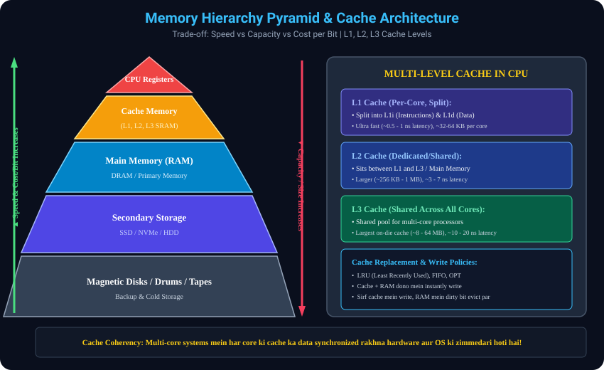

# 9. Memory Hierarchy & Caching Deep Dive

> **Interview Memory Hook:**
> Computer architecture ka sabse bada golden rule: *"Jo memory jitni tez hogi, woh utni hi mehngi aur chhoti hogi. Jo memory jitni sasti aur badi hogi, woh utni hi dheemi hogi."* Isi trade-off ko balance karne ke liye **Memory Hierarchy** aur **Multi-Level Caching** ka aavishkar hua!

---

## 9.1 Memory Hierarchy Pyramid & Core Trade-offs
- **Kyun Zaroorat Padi? (Von Neumann Bottleneck):**
  - CPU gigahertz ($10^9$ cycles/sec) ki speed par execute hota hai, jabki physical RAM (DRAM) uske mukable 100 guna slow hoti hai. Agar CPU har instruction ke liye direct RAM ya Hard Disk par jayega, toh 99% time CPU sirf wait karta reh jayega (Memory Wall problem).
- **Hierarchy ke 5 Levels (Top to Bottom):**
  - **Level 1 (Top) - CPU Registers:**
    - Size: Kuch bytes se lekar ~1-2 KB tak.
    - Speed: 0.25 - 0.5 nanoseconds (Same as CPU clock cycle).
    - Cost: Behad expensive, CPU core ke andar bane hote hain.
  - **Level 2 - Cache Memory (SRAM):**
    - Divided into **L1, L2, aur L3** levels.
    - Speed: 1 - 20 nanoseconds.
  - **Level 3 - Main Memory / Primary RAM (DRAM):**
    - Size: 8 GB - 64 GB.
    - Speed: 50 - 100 nanoseconds. Volatile memory.
  - **Level 4 - Secondary Storage:**
    - Solid State Drives (NVMe / SSD) aur Hard Disk Drives (HDD).
    - Size: 512 GB - several Terabytes. Non-volatile.
  - **Level 5 (Bottom) - Magnetic Disks / Backup Drums / Optical Tapes:**
    - Cold storage aur archival backup ke liye.

### Directional Trends (Interview Favorite):
- **Neeche se Upar jane par (▲):** Speed badhti hai, Cost per Bit badhta hai, Capacity kam hoti hai.
- **Upar se Neeche aane par (▼):** Capacity/Size badhta hai, Cost sasti hoti hai, Latency/Delay badhta hai.

---

## 9.2 Caching kya hai & Principle of Locality
- **Core Definition:** Cache ek temporary, ultra-fast storage space hai jisme frequently used data aur instructions ko store kiya jata hai taaki baar-baar slow memory par na jana pade.
- **Principle of Locality (Caching ka Magic Principle):**
  - **(a) Temporal Locality (Samay ka Niyam):** Agar koi memory location abhi access hui hai, toh bohot high chance hai ki agle kuch milliseconds mein woh dobara access hogi (e.g. Loop variables jaise `for(int i=0; i<N; i++)`).
  - **(b) Spatial Locality (Jagah ka Niyam):** Agar koi memory address access hua hai, toh uske agal-bagal ke addresses bhi jald hi access honge (e.g. Arrays traversal: `arr[0], arr[1], arr[2]`).

### Cache Hit vs Cache Miss & AMAT Formula:
- **Cache Hit:** CPU jo data mang raha hai, woh agar Cache mein mil jaye.
- **Cache Miss:** Agar data Cache mein na mile, toh CPU ko slow RAM se data laana padta hai aur cache ko update karna padta hai.
- **Hit Ratio ($H$):** Percentage of accesses that result in a hit.
- **Average Memory Access Time (AMAT):**
  $$	ext{AMAT} = T_{	ext{cache}} + (1 - H) 	imes T_{	ext{RAM}}$$
  *Interview Tip:* Hit ratio agar 95% se 98% ho jaye, toh system overall 2-3x fast mehsoos hota hai!

---

## 9.3 Multi-Level CPU Caches (L1, L2, L3)
Modern Multi-core processors mein teen levels hote hain:

- **9.3.1 L1 Cache (Level 1 - Closest to Core):**
  - Har CPU core ka apna dedicated L1 cache hota hai.
  - Size: 32 KB - 64 KB per core. Latency: ~1 nanosecond.
  - **Split Cache Architecture:**
    - `L1i` (Instruction Cache): CPU ke machine instructions ko hold karta hai.
    - `L1d` (Data Cache): Variables aur program data ko hold karta hai.
- **9.3.2 L2 Cache (Level 2 - Intermediate):**
  - L1 ke theek peeche rehta hai. Size: 512 KB - 2 MB per core.
  - Latency: ~3 - 7 nanoseconds. Jo data L1 mein fit nahi hota, woh yahan rehta hai.
- **9.3.3 L3 Cache (Level 3 - Shared Last Level Cache - LLC):**
  - Sabhi CPU cores ke beech shared rehta hai.
  - Size: 8 MB - 64+ MB. Latency: ~10 - 20 nanoseconds.
  - Jab Core 1 aur Core 2 ko aapas mein data share karna hota hai, toh L3 unke beech bridge banta hai.

---

## 9.4 Cache Replacement Policies & Write Policies

### Replacement Policies (Jab Cache Full ho jaye):
1. **LRU (Least Recently Used):** Jo data sabse lambe samay se use nahi hua, usse evict karo (Most popular & realistic).
2. **FIFO (First-In, First-Out):** Jo data pehle aaya tha, usse pehle nikaalo.
3. **Random Replacement:** Bina kisi hisab ke randomly evict karo (Hardware complexity kam karta hai).
4. **OPT (Belady's Optimal):** Us data ko evict karo jo future mein sabse der baad use hoga (Theoretical benchmark).

### Write Policies (Jab CPU Data Modify kare):
- **Write-Through Policy:** CPU jab cache mein data modify karta hai, toh woh usi samay Main Memory (RAM) mein bhi write karta hai.
  - *Fayda:* Data hamesha consistent rehta hai.
  - *Nuksan:* Har write par memory bus busy ho jati hai (slow).
- **Write-Back Policy:** CPU sirf Cache mein write karta hai aur us cache block par **Dirty Bit = 1** mark kar deta hai. RAM mein tabhi write kiya jata hai jab woh block cache se evict hota hai.
  - *Fayda:* Super fast, memory bus free rehti hai.
  - *Nuksan:* Agar power fail ho jaye, toh RAM mein stale data reh sakta hai.

---

## 9.5 Cache Coherency (Multi-Core Challenge)
- **Problem:** Multi-core systems mein agar Core 1 ne variable `x = 5` ko badalkar `x = 10` kar diya apne L1 cache mein, lekin Core 2 ke L1 cache mein abhi bhi purana `x = 5` hai, toh galat calculation ho jayegi!
- **Solution:** Hardware aur OS milkar **Cache Coherency Protocols (jaise MESI: Modified, Exclusive, Shared, Invalid)** use karte hain. Jaise hi koi core data badalta hai, baaki sabhi cores ki cache copies ko invalidate kar diya jata hai.

---

## 9.6 Visual Diagram: Memory Hierarchy & Cache

---
*Next Module: [10. Processor Management and CPU Scheduling](../10_Processor_Management_and_Scheduling/README.md)*
