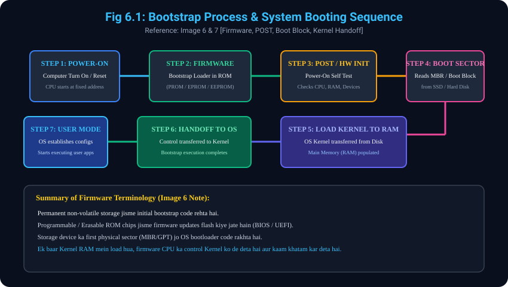

# 6. Bootstrap Program aur Booting Process

> **Reference to Previous Concepts:**
> - **Concept 4.1** mein humne dekha tha ki Kernel OS ka core engine hai jo system boot hone par RAM mein load hota hai.
> - **Concept 2.3 & 5.1** mein humne dekha ki CPU bina RAM ke program run nahi kar sakta. Lekin jab computer band hota hai, toh RAM bilkul khaali (volatile) hoti hai. Toh sawal uthta hai ki Kernel ko RAM mein sabse pehle kaun lata hai?
> - Yeh topic aapki **Image 6 aur Image 7** par aadharit hai jisme **Bootstrap Program (Firmware)** aur **Step-by-Step Booting Sequence** explain kiya gaya hai.

---

## 6.1 Bootstrap Program (Bootstrap Loader) kya hai?
- **Small Initial Code:** Bootstrap program (jise bootstrap loader bhi kehte hain) ek chhota sa code hota hai jo computer hardware ke **Firmware / Read-Only Memory (ROM)** mein permanently store rehta hai.
- **Primary Purpose:** Jab computer ko power-on ya restart/reboot kiya jata hai, toh yeh program sabse pehle chal kar hardware ko initialize karta hai aur storage device (Hard Disk/SSD) se Operating System ke **Kernel** ko dhundh kar main memory (RAM) mein load karta hai.

---

## 6.2 Firmware & ROM Storage Types (Image 6 Handwritten Notes)
Image 6 ke middle section mein handwritten notes hain: `Init Prog`, `firmware`, `ROM`, `PROM`, `EPROM`, `EEPROM`.
- **Firmware:** Software jo hardware chip ke andar permanently embedded hota hai.
- **ROM (Read-Only Memory):** Factory-programmed memory jise normal tarike se rewrite nahi kiya ja sakta.
- **PROM (Programmable ROM):** Blank chip jise ek baar program kiya ja sakta hai.
- **EPROM (Erasable Programmable ROM):** Ultraviolet (UV) light ke zariye erase karke dobara program kiya jane wala chip.
- **EEPROM (Electrically Erasable Programmable ROM):** Modern BIOS/UEFI chips jisme electric signals se firmware updates safely flash kiye ja sakte hain.

---

## 6.3 Step-by-Step Working of Bootstrap Program (Images 6 & 7)

- **Step 1: Power-On or Reset (Startup Routine):**
  - Jaise hi computer ka power button dabaya jata hai ya reboot hota hai, CPU ka Program Counter (PC) ek fixed predetermined firmware memory location par point karta hai aur instruction fetch karna shuru karta hai.
- **Step 2: Bootstrap Program Execution & Hardware Diagnostics (POST):**
  - Processor bootstrap program execute karta hai.
  - Yeh program **Power-On Self Test (POST)** karta hai: CPU registers, device controllers, memory bus aur attached hardware ki integrity verify karta hai.
- **Step 3: Loading the Operating System (Image 7 Top Slide):**
  - Hardware initialization ke baad, bootstrap program designated boot device (Hard Drive / SSD / NVMe) ko locate karta hai.
  - Yeh storage device ke first sector jise **Boot Sector ya Boot Block (MBR / GPT)** kehte hain, usse read karta hai.
  - Boot sector ke andar detailed instructions hote hain jo baaki poore Operating System Kernel ko disk se read karke **Main Memory (RAM)** mein load kar dete hain.
- **Step 4: Handoff to the Operating System:**
  - Jaise hi Kernel RAM mein safalta-purvak load ho jata hai, CPU ka poora execution control **Kernel** ko transfer (handoff) kar diya jata hai.
  - Yahan par bootstrap program ka kaam poora (complete) ho jata hai.
- **Step 5: OS Takeover & Transition to User Mode:**
  - Kernel control lekar internal drivers initialize karta hai, system configurations set karta hai, aur system ko **User Mode** mein transition kar deta hai taaki user apne applications chalana shuru kar sake!

---

## 6.4 Diagram Reference (Images 6 & 7)
### Visual Representation: Complete Booting Sequence Flowchart


```
[ POWER ON / RESET ]
         |
         v
[ CPU Fetches Bootstrap Loader from ROM / EEPROM Firmware ]
         |
         v
[ Hardware Diagnostics (POST) & Registers/Controllers Init ]
         |
         v
[ Read Boot Sector / Boot Block from Storage Device (SSD/HDD) ]
         |
         v
[ Transfer OS Kernel into Main Memory (RAM) ]
         |
         v
[ HANDOFF CONTROL TO KERNEL (Bootstrap Execution Ends) ]
         |
         v
[ OS Sets Configurations & Transitions to USER MODE ]
```

---
*Next Module: [7. Dual-Mode Operation (User Mode vs Kernel Mode)](../07_Dual_Mode_Operation/README.md)*
