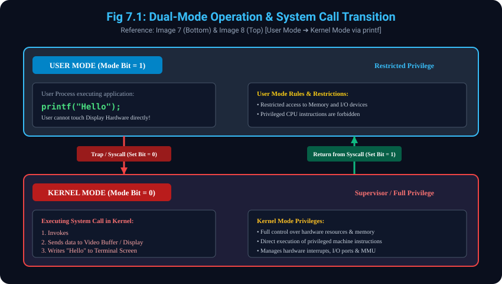

# 7. Dual-Mode Operation (User Mode vs Kernel Mode)

> **Reference to Previous Concepts:**
> - **Concept 3.1 & 3.2** mein humne User View aur System View ke alag-alag objectives dekhe the.
> - **Concept 4.1** mein dekha tha ki Kernel ek safe bridge hai jo application software aur hardware ke beech coordination karta hai.
> - Yeh topic aapki **Image 7 (bottom handwritten diagram)** aur **Image 8 (top slide)** par aadharit hai jisme **User Mode vs Kernel Mode**, **Privilege Levels**, aur handwritten code `printf("Hello");` ka execution trace explain kiya gaya hai.

---

## 7.1 Dual-Mode Operation ki Zaroorat Kyun Hai?
- **System Protection & Security:**
  - Agar kisi user program (jaise game ya web browser) ko computer ke hardware, physical RAM ya disk par direct control de diya jaye, toh ek galat code ya virus poore system ko crash kar sakta hai ya doosre user ke secret files ko delete kar sakta hai.
  - Isliye hardware aur OS milkar do alag privilege levels provide karte hain jise **Dual-Mode Operation** kehte hain.

---

## 7.2 User Mode vs Kernel Mode (Privilege Levels)

- **7.2.1 User Mode (Restricted Mode - Mode Bit = 1):**
  - User processes (jaise Chrome, MS Word, Python scripts) User Mode mein execute hote hain.
  - Is mode mein hardware resources aur memory par **restricted (seemit) access** hota hai.
  - Privileged instructions (jaise direct I/O execution, halt instruction, MMU mapping change) User Mode mein run karna strictly prohibited hota hai.
- **7.2.2 Kernel Mode (Supervisor / System Mode - Mode Bit = 0):**
  - Is mode mein sirf Operating System ka **Kernel** execute hota hai.
  - Kernel Mode ke paas **Full Control & Full Access** hota hai. Yeh direct physical memory access kar sakta hai, hardware interrupts handle kar sakta hai, aur privileged machine instructions execute kar sakta hai.

---

## 7.3 Mode Bit & Mode Switching Mechanism
- CPU hardware ke andar ek special status register hota hai jisme **Mode Bit** store hoti hai:
  - `Mode Bit = 1` ➔ **User Mode**
  - `Mode Bit = 0` ➔ **Kernel Mode**
- Jab koi user program kisi privileged service (jaise file read karna, screen par print karna, network packet bhejna) ko chahta hai, toh woh ek **System Call** trigger karta hai.
- System call aane par CPU hardware ek **Trap (Software Interrupt)** generate karta hai jo Mode Bit ko `1` se badalkar `0` kar deta hai aur control Kernel ko de deta hai. Kaam poora hone par Mode Bit wapas `1` ban jati hai.

---

## 7.4 Handwritten Example & Step-by-Step Thought Process: `printf("Hello");`
*(Handwritten Reference from Image 7 bottom: `USER MODE -----> Kernel mode | printf("Hello");`)*

### Scenario:
User apne C code mein likhta hai:
```c
#include <stdio.h>
int main() {
    printf("Hello");
    return 0;
}
```
Lekin computer ki Monitor Display Screen ek hardware peripheral hai. User Mode process hardware video controller ko direct access nahi kar sakta!

### Step-by-Step Thought Process:
- **Step 1 - User Mode Execution (Mode Bit = 1):**
  - Program user space mein execute ho raha hota hai.
  - `printf("Hello")` standard library function call karta hai. Library pehchanti hai ki yeh display par write karne ka hardware operation hai.
- **Step 2 - Trap / System Call Trigger & Mode Switch (1 ➔ 0):**
  - Library `write()` / `sys_write()` system call invoke karti hai.
  - CPU ko hardware trap milta hai. CPU turant current user process ka state save karta hai aur **Mode Bit ko 1 se 0 (Kernel Mode)** mein switch kar deta hai.
- **Step 3 - Kernel Mode Privileged Execution (Mode Bit = 0):**
  - Control OS Kernel ke system call handler ke paas aata hai.
  - Kernel string `"Hello"` ko verify karta hai aur display controller / graphics adaptor ke video buffer mein data safely write karta hai.
  - Screen par `"Hello"` print ho jata hai.
- **Step 4 - Return to User Mode (Mode Bit 0 ➔ 1):**
  - Privileged operation complete hote hi Kernel return instruction execute karta hai.
  - CPU Mode Bit ko wapas `0` se `1` (User Mode) par set karta hai aur control user program ke next instruction par return ho jata hai.

---

## 7.5 User Mode vs Kernel Mode Comparison Table

| Paimana / Property | User Mode | Kernel Mode (Supervisor Mode) |
| :--- | :--- | :--- |
| **Mode Bit** | `1` | `0` |
| **Privilege Level** | Restricted (Limited Access) | Unrestricted (Full Control) |
| **Executing Code** | User Applications (Chrome, Word, Code) | Operating System Kernel |
| **Hardware Access** | Direct access blocked (Needs System Call)| Direct access to CPU, RAM, &amp; I/O Peripherals |
| **System Crash Risk**| Process crash hone par sirf app band hoti hai | Crash hone par poora OS freeze / crash ho sakta hai |

---

## 7.6 Diagram Reference (Image 7 & 8)
### Visual Representation: Dual-Mode Architecture & System Call Transition


---
*Next Module: [8. Functions of Operating System - Memory Management](../08_Memory_Management_Functions/README.md)*
