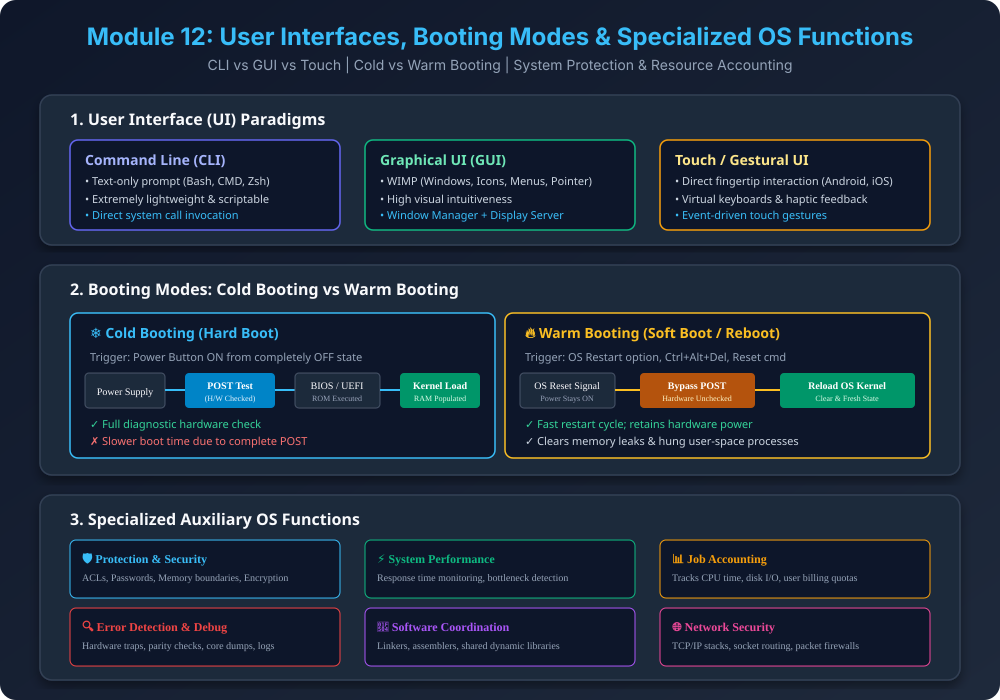

# Module 12: User Interfaces, Booting Modes & Specialized OS Functions

> **Reference Note:** Yeh module humare [Module 6: Bootstrap Program & Booting](../06_Bootstrap_Program_and_Booting/README.md) aur [Module 7: Dual-Mode Operation](../07_Dual_Mode_Operation/README.md) ke concepts ko aage extend karta hai.

---

## 1. User Interface (UI) ya Command Interpreter

User direct bare hardware se communicate nahi kar sakta (jaisa humne [Module 1](../01_Introduction_to_OS/README.md) mein dekha tha). OS user aur machine ke beech bridge banta hai through **User Interfaces**:

### 1.1 Command-Line Interface (CLI)
- **Concept:** Text-based interface jahan user keyboard se text commands enter karta hai (e.g., Linux Shell/Bash, MS-DOS `cmd`, PowerShell).
- **Working:** Shell command read karta hai, parse karta hai, aur corresponding binary program ya System Call execute karta hai (e.g., `mkdir test` $\rightarrow$ `sys_mkdir`).
- **Advantages:** 
  - Extremely lightweight (minimal RAM aur CPU usage).
  - Shell scripting ke through repetitive administrative tasks automate ho jate hain.
  - Remote servers (SSH) ke liye standard industry choice.

### 1.2 Graphical User Interface (GUI)
- **Concept:** WIMP model par based (*Windows, Icons, Menus, Pointer*). User mouse ya trackpad se visual icons par click karta hai (e.g., Windows 11, macOS Aqua, Ubuntu GNOME).
- **Internal Stack:** Desktop Manager $\rightarrow$ Window Server $\rightarrow$ GPU Display Driver $\rightarrow$ OS Kernel.
- **Trade-off:** High memory footprint aur GPU overhead, lekin non-technical users ke liye intuitive aur easy to use.

### 1.3 Touch-based & Gestural Interfaces
- **Concept:** Mobile aur tablet OS (Android, iOS) jahan physical buttons ki jagah capacitive touch screens aur gestures (swipe, pinch-to-zoom, long-press) use hote hain.
- **Handling:** OS touch controller se continuous interrupt signals generate karta hai aur virtual keyboard handle karta hai.

---

## 2. Booting Modes: Cold Booting vs Warm Booting

> **Concept Reference:** [Module 6](../06_Bootstrap_Program_and_Booting/README.md) mein humne dekha tha ki bootstrap loader ROM se POST run karke OS ko load karta hai.

### 2.1 Cold Booting (Hard Boot)
- **Definition:** Jab computer **completely OFF state** (Power zero) se start hota hai via physical Power Button.
- **Step-by-Step Flow:**
  1. Power supply turn on hoti hai aur motherboard par Power Good signal generate hota hai.
  2. CPU internal registers reset hote hain aur Program Counter (PC) ROM BIOS/UEFI ke first address par point karta hai.
  3. **POST (Power-On Self-Test):** Motherboard RAM, CPU caches, storage disks, aur keyboard controllers ko physically probe karta hai.
  4. MBR / GPT boot sector se Bootloader RAM mein execute hota hai.
  5. OS Kernel load hota hai aur drivers initialize hote hain.
- **Characteristics:** Slower startup, comprehensive hardware diagnostics.

### 2.2 Warm Booting (Soft Boot / Reboot)
- **Definition:** Jab machine already powered-on ho aur running state se bina power disconnect kiye system restart kiya jaye (e.g., OS Restart menu, `Ctrl + Alt + Del`, `sudo reboot`).
- **Key Difference:**
  - **POST Bypass:** Motherboard power continuously maintain rehti hai, isliye time-consuming hardware diagnostic (POST) skip ho jata hai.
  - **Cache & Memory Reset:** RAM ko flush karke fresh OS kernel state re-initialize ki jaati hai.
- **Interview Thought Process:**
  $$\text{Boot Time}_{\text{Cold}} = T_{\text{Power Stabilization}} + T_{\text{POST Diagnostic}} + T_{\text{Bootstrap}} + T_{\text{Kernel Init}}$$
  $$\text{Boot Time}_{\text{Warm}} = T_{\text{Bootstrap}} + T_{\text{Kernel Init}} \implies \text{Boot Time}_{\text{Warm}} \ll \text{Boot Time}_{\text{Cold}}$$

---

## 3. Specialized Auxiliary OS Functions

Operating system sirf CPU scheduling aur memory allocation hi nahi karta; production systems mein yeh 6 critical functions provide karta hai:

### 3.1 Protection & Security
- **Protection (Internal Boundary):** Ek process doosre process ke memory space ko tamper na kare (Base & Limit registers, Dual-mode kernel ring 0 vs ring 3).
- **Security (External Boundary):** Unauthorized external access ko rokna via User Authentication (passwords/biometrics), Access Control Lists (ACL permissions `chmod 755`), aur storage encryption (BitLocker/LUKS).

### 3.2 System Performance Monitoring & Optimization
- **Metrics Tracked:**
  - **Response Time:** Request submission se first response tak ka time ($T_{\text{response}} = T_{\text{first\_output}} - T_{\text{arrival}}$).
  - **Throughput:** Number of jobs completed per unit time ($\text{Throughput} = \frac{N}{\Delta t}$).
  - **CPU Utilization:** Percentage of time CPU active compute state mein rehta hai.
- **Action:** Agar CPU thrashing ya I/O bottleneck detect ho, to OS process priority adjust karta hai.

### 3.3 Job Accounting & Resource Billing
- **Definition:** Kaunsa user ya container kitne resources consume kar raha hai uska detailed log maintain karna.
- **Tracked Parameters:**
  - Total CPU cycles used.
  - Peak RAM footprint in Megabytes.
  - Disk Read/Write operations and network bandwidth.
- **Use Case:** Multi-tenant Cloud environments (AWS, Azure) jahan pay-per-use billing models chalte hain.

### 3.4 Error Detection and Handling (Debugging Support)
- **Hardware Level:** Parity errors, power failure interrupts, memory fault detection.
- **Software Level:** Division by zero (`SIGFPE`), segmentation fault (`SIGSEGV`), buffer overflow.
- **OS Action:** Process dump generate karna (Core Dump), system log record karna (`/var/log/syslog` ya Windows Event Viewer), aur fatal crashes ke time BSOD (Blue Screen of Death) display karna taaki hardware damage na ho.

### 3.5 Software & User Coordination
- **Inter-Software Binding:** OS compilers, linkers, assemblers, aur runtime engines (JVM, Python interpreter) ko shared libraries (`.so`, `.dll`) distribute karta hai.
- Multiple users ke simultaneous program requests ko serialize karta hai bina mutual conflict ke.

### 3.6 Network Security & Management
- **Networking Stack:** Built-in TCP/IP protocol suite implement karta hai.
- **Socket Interface:** Network packets ko user applications tak route karta hai via network socket APIs.
- **Packet Filtering:** Software firewalls (e.g., `iptables`, Windows Defender Firewall) provide karta hai to inspect and block malicious network traffic.

---

## 4. Architectural Summary Diagram

---

## 5. Quick Revision & Interview Q&A

| Question | Short High-Yield Answer |
| :--- | :--- |
| **Q1: Cold booting aur Warm booting mein main difference kya hai?** | Cold boot completely powered-off state se hota hai aur full hardware POST check run karta hai. Warm boot running state se bina power drop kiye hota hai aur POST skip kar deta hai, isliye faster hota hai. |
| **Q2: CLI aur GUI mein memory aur performance ka kya difference hai?** | CLI only text buffer use karta hai aur extremely fast/lightweight hota hai. GUI window managers, visual assets, aur GPU rendering pipeline use karta hai, isliye heavier hota hai. |
| **Q3: Job Accounting cloud computing ke liye kyun critical hai?** | Multi-tenant clouds (AWS, GCP) mein billing CPU-time, RAM allocation, aur I/O bandwidth consumption par hoti hai; yeh metrics OS job accounting subsystem measure karta hai. |

---

## 6. PDF Notes
📄 **[Download Module 12 Notes (PDF)](./12_User_Interface_and_Specialized_OS_Functions.pdf)**
