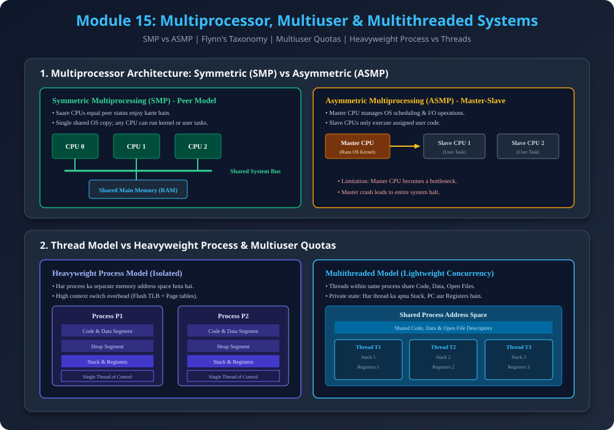

# Module 15: Multiprocessor, Multiuser & Multithreaded Systems

> **Reference Note:** Yeh module [Module 5: Computer System Organization](../05_Computer_System_Organization/README.md) aur [Module 10: Processor Management](../10_Processor_Management_and_Scheduling/README.md) ke multi-core CPU architecture par build karta hai.

---

## 1. Multiprocessor Systems (Parallel / Tightly Coupled)

### 1.1 Core Definition & Advantages
- **Definition:** Ek aisa computer system jisme **do ya do se zyada physical CPUs / Execution Cores** hote hain jo close communication mein rehte hain aur common system bus, clock, memory, aur peripheral devices share karte hain.
- **Key Advantages:**
  1. **Increased Throughput:** Zyada processors hone se per-unit time mein zyada jobs complete hote hain (Speedup).
  2. **Economy of Scale:** Separate computers kharidne ke bajaye ek hi system mein power supplies, motherboards, aur disks share hoti hain.
  3. **Graceful Degradation (Fault Tolerance / Reliability):** Agar 10 processors mein se 1 processor physically fail ho jaye, to poora system halt nahi hota; system bache hue 9 processors par chalte hue $10\%$ slower perform karega (*Fail-soft*).

### 1.2 Flynn's Computer Architecture Taxonomy
Michael J. Flynn ne computer systems ko instruction stream aur data stream ke basis par 4 classes mein divide kiya:
1. **SISD (Single Instruction, Single Data):** Traditional uniprocessor CPU (e.g., standard single-core PC).
2. **SIMD (Single Instruction, Multiple Data):** Single instruction multiple data elements par parallel operate karta hai (e.g., Vector processors, Modern GPUs rendering pixels).
3. **MISD (Multiple Instruction, Single Data):** Theoretical stream (fault-tolerant flight computers).
4. **MIMD (Multiple Instruction, Multiple Data):** Modern multi-core processors aur clusters jahan multiple CPUs independent instructions aur independent data streams handle karte hain.

---

## 2. SMP (Symmetric Multiprocessing) vs ASMP (Asymmetric Multiprocessing)

### 2.1 Symmetric Multiprocessing (SMP)
- **Concept:** Saare processors **peer** (barabar) hote hain. Koi master-slave hierarchy nahi hoti.
- **Execution:** Har processor user program aur kernel code dono execute kar sakta hai.
- **Load Balancing:** Ready Queue se koi bhi available idle CPU next process utha kar execute karne lagta hai.
- **Modern Example:** Modern Linux, Windows Server, macOS (All modern desktop/server OS are SMP).

### 2.2 Asymmetric Multiprocessing (ASMP)
- **Concept:** **Master-Slave** architecture follow karta hai.
- **Execution:** 
  - Master CPU Operating System kernel code, system calls, aur I/O interrupt handling run karta hai.
  - Slave CPUs sirf user-space programs execute karte hain jo Master unhe assign karta hai.
- **Limitations:** Master processor bottleneck ban jata hai; agar Master fail ho jaye to poora system crash ho jata hai.

---

## 3. Mathematical Thought Process: Amdahl's Law (Speedup Limits)

Jab hum multiprocessor system mein cores add karte hain, to kya performance infinitely increase hoti hai? **Gene Amdahl** ne iska theoretical formula diya:

$$\text{Speedup } S = \frac{1}{(1 - P) + \frac{P}{N}}$$

- $P$: Program ka parallelizable fraction ($0 \le P \le 1$).
- $(1 - P)$: Strictly serial fraction (jo sirf single core par chal sakta hai).
- $N$: Number of CPU cores.

#### Numerical Thought Process:
Maan lo kisi program ka $80\%$ code parallelize ho sakta hai ($P = 0.80$), aur $20\%$ serial hai:
- **With 4 Cores ($N = 4$):**
  $$S = \frac{1}{0.20 + \frac{0.80}{4}} = \frac{1}{0.20 + 0.20} = \frac{1}{0.40} = \mathbf{2.5\times}$$
- **With 16 Cores ($N = 16$):**
  $$S = \frac{1}{0.20 + \frac{0.80}{16}} = \frac{1}{0.20 + 0.05} = \frac{1}{0.25} = \mathbf{4.0\times}$$
- **With Infinite Cores ($N \to \infty$):**
  $$S_{\max} = \frac{1}{1 - P} = \frac{1}{0.20} = \mathbf{5.0\times}$$
> **Interview Insight:** Serial fraction $(1 - P)$ speedup par hard ceiling laga deta hai. Chahe 1000 cores laga do, $20\%$ serial code hone par speedup 5x se zyada kabhi nahi ho sakta!

---

## 4. Multiuser Operating Systems

- **Definition:** Ek aisa OS jo multiple independent human users ko simultaneously system hardware access karne deta hai via separate terminals/SSH sessions (e.g., Linux, UNIX).
- **Critical OS Requirements:**
  1. **User Authentication & Quotas:** Resource consumption limits (disk quota, CPU time cap).
  2. **Memory Protection:** User A ka program User B ke process memory space ko read/write na kar sake.
  3. **File Ownership & Access Matrix:** File permissions (`rwx` for User, Group, Others).

---

## 5. Single-Threaded vs Multi-threaded Operating Systems

### 5.1 Heavyweight Process vs Lightweight Thread
- **Process:** Ek running program jiska apna independent address space (Code, Data, Heap, Stack, Page Table) hota hai. Do processes ke beech context switch bohot costly hota hai (Cache flushing + TLB invalidation).
- **Thread:** Process ke andar ek independent execution stream (Lightweight Process - LWP). 
- **Resource Sharing in Threads:**
  - **Shared:** Code Segment, Data Segment, Heap Memory, Open File Descriptors, Network Sockets.
  - **Private per Thread:** Program Counter (PC), CPU Registers, Thread Private Stack.

### 5.2 Benefits of Multithreading
- **High Responsiveness:** GUI applications mein agar background thread network file download kar raha ho, tab bhi UI thread user clicks ko smoothly handle karta rehta hai.
- **Resource Economy:** Thread creation process creation se $\approx 10\times$ faster aur lightweight hoti hai.
- **Multiprocessor Utilization:** Multiple threads different CPU cores par simultaneously parallel execute ho sakte hain.

---

## 6. Architectural Diagram

---

## 7. PDF Notes
📄 **[Download Module 15 Notes (PDF)](./15_Multiprocessor_and_Distributed_Systems.pdf)**
