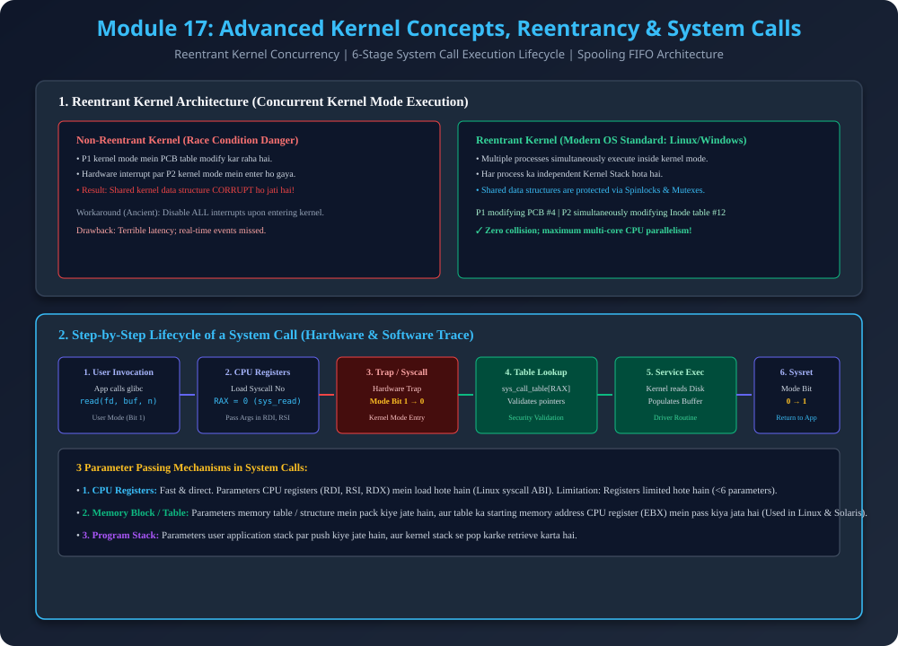

# Module 17: Advanced Kernel Concepts, Reentrancy & System Calls

> **Reference Note:** Yeh module [Module 7: Dual-Mode Operation](../07_Dual_Mode_Operation/README.md) aur [Module 16: OS Structures](../16_Operating_System_Structures_and_Architectures/README.md) ke foundation par deep-dive execute karta hai.

---

## 1. Monolithic Kernel vs Microkernel: The Core Architectural Duel

Modern OS engineering mein yeh sabse famous debate hai (*Tanenbaum-Torvalds Debate*):

| Parameter | Monolithic Kernel (Linux) | Microkernel (Mach, QNX, Minix) |
| :--- | :--- | :--- |
| **Philosophy** | "Sab kuch ek sath chalao maximum speed ke liye" | "Sirf minimal primitives kernel mein rakho maximum safety ke liye" |
| **Address Space** | Single large kernel address space | Multiple isolated user-mode server spaces |
| **Driver Execution** | Privileged Kernel Mode (Ring 0) | Unprivileged User Space (Ring 3) |
| **Communication Mechanism** | Direct high-speed function calls | Inter-Process Communication (IPC Message Passing) |
| **Crash Blast Radius** | High (Driver crash = Kernel panic) | Minimal (Driver crash = Restart single user process) |
| **Performance Overhead** | Minimal (Zero IPC latency) | Moderate ($10\%-20\%$ IPC context-switch latency) |

---

## 2. Reentrant Kernel Architecture

### 2.1 Problem in Non-Reentrant Kernels
- **Definition:** Non-reentrant kernel mein agar Process $P_1$ system call execute karte hue kernel mode mein hai, to kisi doosre process ya interrupt ko kernel data structures modify karne ki permission nahi hoti thi.
- **Race Condition Vulnerability:** Agar CPU context switch kar de jab kernel data structures (e.g., Process Table, Inode Table) half-updated hain, to internal data structure corrupt ho jati hai.
- **Old Solution:** Har system call ke entrance par CPU hardware interrupts disable kar deta tha. Iska nuksan yeh tha ki timer interrupts aur critical hardware events drop ho jate the.

### 2.2 Modern Reentrant Kernel Solution (Linux / Windows)
- **Concept:** Reentrant kernel permits **multiple processes to execute concurrently in kernel mode** without encountering inconsistencies or race conditions.
- **How it Works:**
  1. **Private Kernel Stacks:** Har process ka apna independent kernel-mode stack hota hai jo local variables aur return addresses store karta hai.
  2. **Fine-Grained Locking:** Global data structures par coarse-grained locks lagane ke bajaye fine-grained **Spinlocks** aur **Mutexes** use hote hain.
  3. Example: Process $P_1$ process table ke slot 4 ko update kar raha hai, jabki Process $P_2$ disk driver ke buffer ko update kar raha hai; dono parallel execute ho sakte hain bina lock conflict ke!

---

## 3. Spooling Deep Dive (Simultaneous Peripheral Operation On-Line)

- **Mechanics:** Spooling disk buffer ko use karke multiple processes ke simultaneous requests ko absorb karta hai.
- **Printer Spooling Example:**
  - Jab 5 alag users simultaneously 5 documents print karte hain, to agar direct printing hoti to pages mix ho jate (User A ki 1 line, User B ki 2 line).
  - Spooler har document ko disk par separate spool file ke roop mein store karta hai aur print daemon unhe serial FIFO (First In, First Out) order mein complete print karta hai.

---

## 4. Execution Lifecycle of a System Call (Hardware & Software Trace)

Jab user application C code mein `read(fd, buffer, 1024)` execute karti hai, to hardware aur kernel mein yeh 6 stages execute hoti hain:

### Stage 1: API Call Wrapper (User Space - Mode Bit = 1)
User program standard C library (`glibc`) ke wrapper function ko invoke karta hai. Library wrapper high-level C arguments ko CPU architecture registers mein convert karta hai.

### Stage 2: Register Setup (Syscall Number Mapping)
CPU registers populate kiye jate hain:
- `RAX / EAX`: System Call Number (e.g., `sys_read` has ID `0` in Linux x86_64).
- `RDI`: First argument (File descriptor `fd`).
- `RSI`: Second argument (Buffer pointer).
- `RDX`: Third argument (Byte count `1024`).

### Stage 3: Hardware Trap Instruction (Mode Bit Switch $1 \to 0$)
CPU special assembly instruction execute karta hai:
- On x86_64: `syscall`
- On legacy 32-bit x86: `int 0x80`
- **Hardware Action:** CPU current Program Counter aur Flags ko kernel stack par save karta hai, Mode Bit ko **$1$ (User Mode) se $0$ (Kernel Mode)** mein flip karta hai, aur CPU execution interrupt descriptor table (IDT) ke predefined kernel address par jump karta hai.

### Stage 4: Kernel Dispatcher & `sys_call_table` Lookup
Kernel entry point function (`system_call`) `RAX` register ke index se `sys_call_table` array mein jump karta hai:
```c
// Conceptual Kernel Dispatcher
if (syscall_nr < NR_syscalls) {
    syscall_handler = sys_call_table[syscall_nr];
    result = syscall_handler(arg1, arg2, arg3);
}
```
Kernel user-supplied buffer pointer ko validate karta hai taaki user program kisi privileged kernel memory ko read/overwrite na kar sake (`access_ok()` check).

### Stage 5: Execution of Kernel Service
Kernel subsystem (e.g., VFS / ext4 file system) physical disk controller se data read karta hai aur user buffer memory mein copy karta hai (`copy_to_user`).

### Stage 6: Return from System Call (Mode Bit Switch $0 \to 1$)
Kernel return value `RAX` register mein store karta hai (bytes read ya negative error code jaise `-EFAULT`), registers restore karta hai, aur `sysret` / `iret` instruction execute karta hai. Mode Bit wapas **$0 \to 1$** switch ho jati hai aur user application normally resume hoti hai.

---

## 5. Architectural Diagram



---

## 6. PDF Notes
📄 **[Download Module 17 Notes (PDF)](./17_Advanced_Kernel_and_System_Calls.pdf)**
