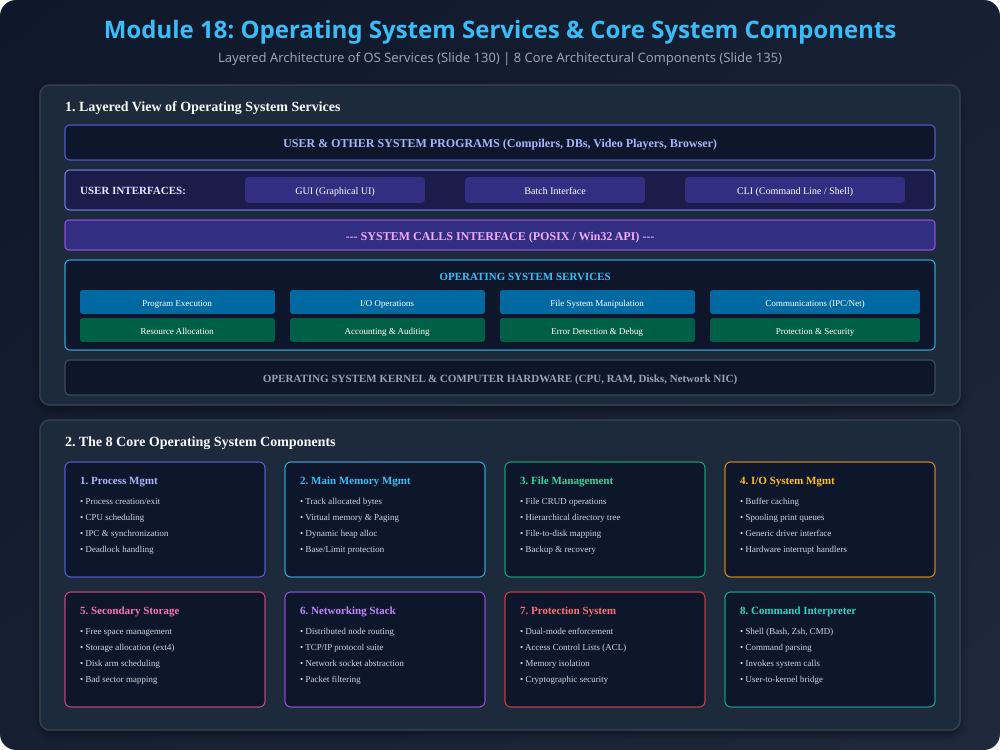

# Module 18: Operating System Services & Core System Components

> **Reference Note:** Yeh module [Module 2: Components & Abstract View](../02_Components_and_Abstract_View/README.md) aur [Module 11: Device & File Management](../11_Device_and_File_Management/README.md) ke individual modules ko ek integrated overall view provide karta hai.

---

## 1. Architectural View of Operating System Services

Operating System hardware ke upar ek abstraction layer create karta hai jisse user programs efficiently run kar sakein. Services ko do broad categories mein divide kiya jata hai:

### 1.1 User-Oriented Services (Programmer Convenience)
1. **Program Execution:** Program ko secondary storage se RAM mein load karna, execution context initialize karna, aur end hone par resources clean up karna.
2. **I/O Operations:** User applications ko hardware complexity (disk sectors, printer registers) se protect karke simple read/write interface dena.
3. **File System Manipulation:** Files aur directories create, read, write, delete, search, aur file permissions set karna.
4. **Communications:** Same computer par running processes ke beech (Shared Memory, Pipes) ya network ke across (Sockets, RPC) data exchange karna.
5. **Error Detection:** Hardware (memory parity error) ya software level (division by zero, missing file) par error detect karke meaningful recovery action lena.

### 1.2 System-Oriented Services (Resource Efficiency & Integrity)
1. **Resource Allocation:** Multiple concurrent jobs chalte waqt CPU scheduling, main memory partitioning, aur I/O channel bandwidth distribute karna.
2. **Accounting:** Resource usage statistics track karna (billing, cloud multi-tenancy, capacity planning).
3. **Protection & Security:** Resource boundaries enforce karna taaki koi process unauthorized access na kar sake.

---

## 2. The 8 Core Operating System Components

Production operating systems 8 foundational subsystems mein divided hote hain:

### 2.1 Process Management Subsystem
- Process aur threads create/delete karna.
- CPU Scheduling algorithms (Round Robin, Priority, FCFS) implement karna.
- Inter-Process Communication (IPC) aur process synchronization (Mutexes, Semaphores) provide karna.
- Deadlock detection aur recovery.

### 2.2 Main Memory Management Subsystem
- Primary memory (RAM) ke har byte ka status track karna (allocated vs free).
- Virtual Memory paging aur page replacement policies (LRU, FIFO) implement karna.
- Memory protection enforce karna via Base aur Limit registers.

### 2.3 File Management Subsystem
- Hierarchical file directory tree maintain karna (`/home/user/document.txt`).
- Logical files ko physical disk blocks (Sectors/Clusters) par map karna.
- Inodes, FAT tables, aur file metadata maintain karna.

### 2.4 I/O System Management Subsystem
- **Buffer Caching:** Fast memory buffer use karke device speed mismatch minimize karna.
- **Spooling:** Print jobs aur slow peripheral queues manage karna.
- **Uniform Device Driver Interface:** Naye hardware device ke liye specific driver code provide karna bina core kernel ko alter kiye.

### 2.5 Secondary Storage Management Subsystem
- Hard Disks aur SSDs par Free Space Management (Bitmaps, Linked Free Lists).
- Disk scheduling algorithms (SSTF, SCAN, C-SCAN) run karke disk head seek time minimize karna.

### 2.6 Networking & Distributed System Subsystem
- Multiple distributed machines ke resources ko unified system ki tarah present karna.
- TCP/IP protocol suite implement karna.

### 2.7 Protection & Security Subsystem
- Dual-mode (User vs Kernel Mode) enforce karna.
- User authentication (passwords, biometrics) aur access control policies (ACLs).

### 2.8 Command-Interpreter System (Shell)
- User input commands parse karke appropriate system calls trigger karna.
- Examples: Linux Bash/Zsh, Windows PowerShell, MS-DOS `cmd.exe`.

---

## 3. Architectural Diagram

---

## 4. PDF Notes
📄 **[Download Module 18 Notes (PDF)](./18_OS_Services_and_System_Components.pdf)**
