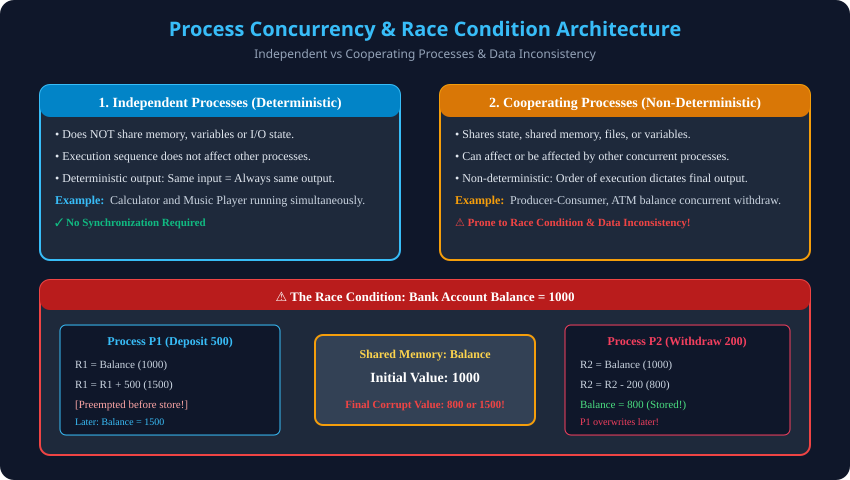

# 1. Process Concept, Principles of Concurrency & Race Conditions

> **Unit 2 Module 1 Reference:** Gateway Classes Slides 3–15. Concurrency ke basic principles, Independent vs Cooperating processes ka antar, aur Race Conditions ki complete mathematical aur execution trace analysis.

---

## 1.1 Process Concept (Process kya hai?)
- **Program in Execution:** Ek program hard disk par saved ek passive entity (file) hota hai, jabki **Process ek active entity** hai jo RAM mein load hokar CPU dwara execute ho raha hota hai.
- **Process ke 4 Core Memory Segments:**
  1. **Text Section:** Compiled binary machine instructions (code).
  2. **Data Section:** Global aur static variables.
  3. **Heap Section:** Dynamically allocated memory (via `malloc()` in C ya `new` in C++/Java).
  4. **Stack Section:** Local variables, function parameters, aur return memory addresses.
- **Process Control Block (PCB):** Operating System har process ki state, Process ID (PID), Program Counter (PC), CPU registers, memory limits aur open I/O files ko manage karne ke liye ek data structure banata hai jise **PCB (Task Control Block)** kehte hain.

---

## 1.2 Independent vs Cooperating Processes
Operating system mein concurrent processes do prakar ke hote hain:

| Parameter | Independent Process | Cooperating (Communicating) Process |
| :--- | :--- | :--- |
| **Shared State** | Koi bhi shared memory, variables ya files share nahi karta. | Shared variables, memory buffer, files ya code share karta hai. |
| **Execution Impact** | Iska execution kisi doosre process ko affect nahi karta. | Ek process ka execution doosre process ke execution ko directly affect kar sakta hai. |
| **Determinism** | **Deterministic:** Har bar same input dene par 100% same output milega. | **Non-Deterministic:** Execution sequence par output depend karta hai. |
| **Data Consistency** | Kabhi bhi data inconsistency ka khatra nahi hota. | Agar synchronization na ho, toh **Data Inconsistency** paida hoti hai. |
| **Real-World Example** | MS Word aur Calculator ka parallel run hona. | Producer-Consumer buffer, banking system transactions. |

---

## 1.3 Concurrency ke Principles (What is Concurrency?)
- **Concurrency vs Parallelism:**
  - **Concurrency:** Single-core CPU par time-slicing ke through multiple tasks ko rapidly switch (interleave) karna, jisse lage ki sab ek saath chal rahe hain.
  - **Parallelism:** Multi-core hardware par physical hardware cores par multiple tasks ka sach me exact same nanosecond par simultaneously run hona.
- **Concurrency ke Fayde:**
  1. **Resource Sharing:** Files aur databases ko multiple users efficiently access kar sakte hain.
  2. **Computation Speedup:** Ek bade task ko sub-tasks mein baant kar parallel execution kiya ja sakta hai.
  3. **Modularity:** System functions ko modular processes mein divide kiya ja sakta hai.
  4. **Convenience:** User ek saath music sun sakta hai, downloading kar sakta hai aur document type kar sakta hai.

---

## 1.4 Race Condition (The Root of All Synchronization Bugs)
- **Definition:** Jab do ya do se zyada processes kisi shared variable ya resource ko ek saath access aur modify karte hain, aur **final result is baat par depend karta hai ki kaun sa process pehle ya baad me execute hua**, toh is situation ko **Race Condition** kehte hain.
- **Thought Process Example (Banking Transaction):**
  - Maan lo shared variable `Balance = 1000`.
  - Process $P_1$ deposits `500` (`Balance = Balance + 500`).
  - Process $P_2$ withdraws `200` (`Balance = Balance - 200`).
  - Sahi logical output hona chahiye: `1000 + 500 - 200 = 1300`.

### Machine-Level Execution Trace:
High-level code CPU mein direct single step mein execute nahi hota, balki register load/store instructions mein break hota hai:

```assembly
; Process P1 (Deposit 500)
1. LOAD R1, Balance    ; R1 = 1000
2. ADD  R1, 500        ; R1 = 1500
; === [CONTEXT SWITCH / PREEMPTION HAPPENS HERE!] ===

; Process P2 (Withdraw 200)
3. LOAD R2, Balance    ; R2 = 1000 (Purana balance read hua!)
4. SUB  R2, 200        ; R2 = 800
5. STORE Balance, R2   ; Balance RAM mein update ho gaya 800!

; === [CONTEXT SWITCH BACK TO P1] ===
6. STORE Balance, R1   ; P1 apna purana calculated R1 (1500) RAM mein likh deta hai!
```

> **Final Outcome:** `Balance = 1500`! $P_2$ ka 200 rupaye ka withdrawal hawa mein gayab ho gaya (Lost Update Problem). Agar context switch dusri timing par hota, toh Balance `800` bhi ho sakta tha.
> Isi non-deterministic data corruption ko rokne ke liye hume **Process Synchronization** aur **Critical Section Protocols** ki zarurat hoti hai.

---

## 1.5 Architectural Diagram


---

## 1.6 Key Exam Takeaways
1. Cooperating processes data sharing ke bina high throughput nahi de sakte, lekin sharing bina sync ke **Race Condition** create karti hai.
2. Race condition ka primary reason **preemption at arbitrary instruction boundaries** hota hai.
3. Solution: Shared variable ko access karne wale code segment ko atomic protection provide karna.
