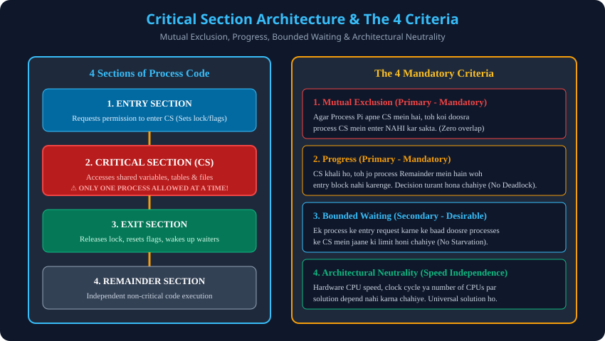

# 2. Critical Section Problem & Solution Criteria

> **Unit 2 Module 2 Reference:** Gateway Classes Slides 16–24. Critical Section ka internal structure aur kisi bhi Synchronization Solution ko satisfy karne ke liye required **4 Criteria (2 Primary + 2 Secondary)**.

---

## 2.1 Critical Section (CS) kya hota hai?
- **Definition:** Code ka woh critical hissa jisme process kisi shared resource (jaise shared memory variable, database record, file table, hardware printer buffer) ko read ya write karta hai.
- **The Core Golden Rule:** Kisi bhi given time instance par, **sirf aur sirf ek process** hi Critical Section ke andar execute kar sakta hai.
- **Process Code ke 4 Sections:**
  1. **Entry Section:** CS mein ghusne se pehle permission mangne ka code. Yahan process check karta hai ki kya CS khali hai aur lock acquire karta hai.
  2. **Critical Section (CS):** Actual shared resource manipulation code.
  3. **Exit Section:** CS se bahar aane ke baad lock release karne aur waiting processes ko signal dene ka code.
  4. **Remainder Section:** Process ka baki normal independent code (e.g., local computations, UI render).

```c
do {
    // 1. Entry Section (Acquire Lock / Check Permission)
    entry_section();

    // 2. Critical Section (Shared Resource Access)
    /* Access shared memory / variable / file */

    // 3. Exit Section (Release Lock / Signal Waiting Processes)
    exit_section();

    // 4. Remainder Section (Independent local execution)
    remainder_section();
} while (true);
```

---

## 2.2 The 4 Solution Criteria (AKTU 10-Marks Favorite Question)
Kisi bhi Critical Section Solution ko valid tabhi mana jata hai jab woh neeche diye gaye criteria ko satisfy kare:

### 1. Mutual Exclusion (Primary Condition - Mandatory)
- **Concept:** Agar Process $P_i$ apne Critical Section ke andar execute kar raha hai, toh koi bhi doosra process $P_j$ us samay Critical Section ke andar ghus nahi sakta.
- **Physical Analogy:** Single washroom with a bolt lock. Jab tak andar wala person bahar aakar kundi nahi kholta, koi doosra andar nahi ja sakta.

### 2. Progress (Primary Condition - Mandatory)
- **Concept:** Agar Critical Section bilkul khali hai aur kuch processes andar jaana chahte hain, toh:
  - Sirf wahi processes jo **Remainder Section mein NAHI hain** (yaani jo actually CS mein ghusne ke liye interested hain), wahi decide karne mein hissa le sakte hain ki agla process kaun enter karega.
  - Yeh decision **indefinitely postpone nahi ho sakta** (yaani system Deadlock ya Livelock mein nahi fasna chahiye).
- **Physical Analogy:** Agar washroom khali hai, toh baahar baitha koi spectator (jo washroom jaana hi nahi chahta) aage aane wale logo ko rok nahi sakta.

### 3. Bounded Waiting (Secondary Condition - Starvation Prevention)
- **Concept:** Jab ek process $P_i$ ne Entry Section mein request daal di, tab se lekar uske CS mein enter hone tak, doosre processes ko CS mein ghusne ki ek **fixed bound / limit ($k$)** honi chahiye.
- Aisa nahi hona chahiye ki baaki processes baar-baar CS mein aate jaate rahein aur bechara $P_i$ hamesha wait hi karta rahe (**Starvation / Indefinite Postponement Prevention**).

### 4. Architectural Neutrality / Speed Independence (Secondary Condition)
- **Concept:** Solution kisi particular CPU speed, processor clock frequency ya hardware architecture par assume karke nahi chalna chahiye.
- Yeh assume nahi kiya ja sakta ki Process A hamesha Process B se tez execute hoga. Solution purely logical aur hardware-independent hona chahiye.

---

## 2.3 Criteria Summary Matrix

| Criterion | Type | Kya Rokta Hai? | Satisfy Na Hone Par Parinaam |
| :--- | :--- | :--- | :--- |
| **Mutual Exclusion** | Primary | Data Inconsistency | Corrupted shared variables, race conditions. |
| **Progress** | Primary | Deadlock / Livelock | System freeze, koi bhi process aage nahi badhega. |
| **Bounded Waiting** | Secondary | Starvation | Ek process infinite loop mein bhooka mar jayega. |
| **Speed Neutrality** | Secondary | Architecture Fragility | Hardware badalne par code crash ho jayega. |

---

## 2.4 Architectural Diagram


---

## 2.5 AKTU Exam Tip (2 Marks & 10 Marks)
- **2 Marks:** "Define Critical Section Problem." $	o$ State definition and the 4 sections.
- **10 Marks:** "Explain the requirements of a solution to the critical section problem." $	o$ Explain Mutual Exclusion, Progress, Bounded Waiting and Hardware Neutrality with clear examples and drawings.
