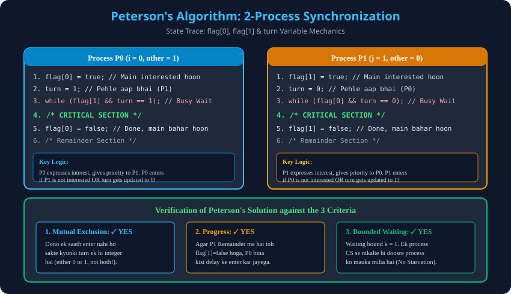

# 3. Peterson's Algorithm (2-Process Synchronization)

> **Unit 2 Module 3 Reference:** Gateway Classes Slides 25–39. Gary Peterson (1981) dwara diya gaya classic software solution jo 2 processes ke liye **Mutual Exclusion, Progress, aur Bounded Waiting** teeno ko 100% mathematically prove karta hai.

---

## 3.1 Peterson's Algorithm ka Concept
- **Kiske liye banaya gaya?** Do concurrent processes ($P_0$ aur $P_1$) ke Critical Section synchronization ke liye.
- **Shared Variables:**
  1. `boolean flag[2];` (Initialized to `false, false`):
     - `flag[i] = true` ka matlab hai ki Process $P_i$ Critical Section mein enter hone ke liye **interested / ready** hai.
  2. `int turn;` (Initialized to `0` ya `1`):
     - Yeh decide karta hai ki agar dono processes ek saath demand karein, toh **pehle kiski baari** aayegi.

---

## 3.2 Algorithm Code Structure
Dono processes ($P_i$ and $P_j$, where $j = 1 - i$) ka code structure:

```c
// =======================================================
// Process P_i Code (i = 0, j = 1 OR i = 1, j = 0)
// =======================================================
do {
    // 1. Entry Section
    flag[i] = true;              // (Step 1): P_i declares its intention to enter CS
    turn = j;                    // (Step 2): P_i politely gives turn to other process P_j
    while (flag[j] && turn == j); // (Step 3): Busy wait if P_j is interested AND it's P_j's turn

    // 2. Critical Section
    /* Shared Resources access / manipulation */

    // 3. Exit Section
    flag[i] = false;             // (Step 4): P_i releases interest from CS

    // 4. Remainder Section
    /* Normal independent execution */
} while (true);
```

---

## 3.3 Execution Trace & Scenarios (Thought Process Analysis)

### Scenario 1: Sirf Process $P_0$ enter hona chahta hai ($P_1$ Remainder mein hai)
1. $P_0$ executes `flag[0] = true`.
2. $P_0$ executes `turn = 1`.
3. $P_0$ evaluates while condition: `while (flag[1] && turn == 1)`.
   - `flag[1]` is `false` (kyunki $P_1$ interested hi nahi hai).
   - Condition: `false && true` $
ightarrow$ **`false`**.
4. Loop terminate! $P_0$ bina kisi rukawat ke seedhe **Critical Section mein enter ho jata hai**.

### Scenario 2: Dono Processes ($P_0$ aur $P_1$) ek saath enter hona chahte hain
1. Dono ne apni intention flag set ki: `flag[0] = true` aur `flag[1] = true`.
2. Ab dono ne `turn` assign kiya:
   - Maan lo $P_0$ ne pehle `turn = 1` likha.
   - Uske turant baad $P_1$ ne `turn = 0` likha (overwriting previous value).
   - Ab memory mein `turn = 0` set hai!
3. Ab dono while condition check karte hain:
   - For $P_0$: `while (flag[1] && turn == 1)` $
ightarrow$ `true && false` $
ightarrow$ **`false`!** $\implies$ **$P_0$ enters Critical Section!**
   - For $P_1$: `while (flag[0] && turn == 0)` $
ightarrow$ `true && true` $
ightarrow$ **`true`!** $\implies$ **$P_1$ busy-waits on while loop!**
4. Jab $P_0$ CS finish karke `flag[0] = false` karega, tab $P_1$ ka loop break hoga aur $P_1$ enter karega.

---

## 3.4 Mathematical Proof of 3 Criteria

### 1. Proof of Mutual Exclusion
- Agar dono processes simultaneously CS mein enter ho sakte, toh dono ka while loop condition `false` hona chahiye tha:
  - $P_0$ entered $\implies$ ya toh `flag[1] == false` ya `turn == 0`.
  - $P_1$ entered $\implies$ ya toh `flag[0] == false` ya `turn == 1`.
- Lekin agar dono CS mein hain, toh dono ne Step 1 execute kiya hai, isliye `flag[0] == true` aur `flag[1] == true`.
- Matlab condition tabhi false ho sakti hai jab `turn == 0` aur `turn == 1` **dono simultaneously true ho**.
- Lekin `turn` ek single memory integer hai, iski value ek samay par sirf `0` ya `1` ho sakti hai, dono ek saath possible nahi hai!
- **Hence, Mutual Exclusion is 100% Guaranteed!**

### 2. Proof of Progress
- Agar koi process (jaise $P_1$) Remainder section mein hai aur CS mein nahi jaana chahta, toh uska `flag[1] = false` hoga.
- Is situation mein jab $P_0$ enter hona chahega, toh `flag[1]` false milne ki wajah se $P_0$ ka loop turant break ho jayega.
- Koi bhi inactive process kisi active process ko block nahi kar raha. **Progress is Guaranteed!**

### 3. Proof of Bounded Waiting
- Jab $P_0$ CS se bahar aata hai, toh woh `flag[0] = false` karta hai.
- Agar $P_0$ turant dubara enter hona chahe, toh woh fir se `turn = 1` set karega.
- Jaise hi woh `turn = 1` set karega, waiting mein khada $P_1$ turant enter ho jayega.
- Iska matlab koi bhi process maximum **1 turn ($k=1$)** se zyada wait nahi karega. **Zero Starvation!**

---

## 3.5 Architectural Diagram


---

## 3.6 Limitations of Peterson's Algorithm
1. **Limited to 2 Processes:** N-process ke liye Bakery Algorithm ya Lamport algorithm chahiye.
2. **Busy Waiting (Spinlock):** Waiting process continuously CPU cycles waste karta hai (`while` loop spinning).
3. **Modern Out-of-Order CPUs:** Modern superscalar processors memory instructions ko reorder kar dete hain (Store-Load reordering), jisse bina memory fences (`mfence`) ke yeh hardware level par fail ho sakta hai.
