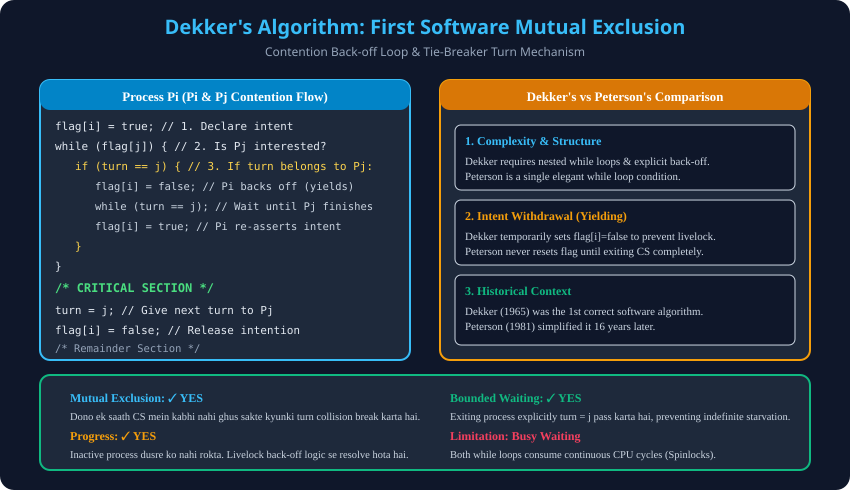

# 4. Software Solutions: Dekker's Algorithm

> **Unit 2 Module 4 Reference:** Gateway Classes Slides 108–120. Computer Science itihaas ka sabse pehla correct 2-Process Software Synchronization Solution (Theodorus Dekker, 1965).

---

## 4.1 Dekker's Algorithm ka Background
- **Itihaas:** 1965 mein Dutch mathematician Theodorus Dekker ne is algorithm ko design kiya tha, jise Edsger Dijkstra ne publish kiya.
- **Problem Solved:** Bina kisi special hardware instruction ke, sirf ordinary RAM read/write variables ka use karke 2 processes ke beech **Mutual Exclusion, Progress, aur Bounded Waiting** achieve karna.
- **Shared Variables:**
  1. `boolean flag[2];` (Initialized to `{false, false}`): Process ka CS mein jaane ka irada (intention).
  2. `int turn;` (Initialized to `0` ya `1`): Kaun sa process CS mein jaane ka haqdar hai agar dono ek saath request karein.

---

## 4.2 Algorithm Code Structure
Dono processes ($P_i$ and $P_j$, where $j = 1 - i$) ka detailed code:

```c
// Initial Shared State
boolean flag[2] = {false, false};
int turn = 0; // or 1

// Process P_i Code
do {
    // =======================================================
    // 1. ENTRY SECTION
    // =======================================================
    flag[i] = true; // Pi announces intention to enter CS

    while (flag[j]) { // While Pj also wants to enter (Contention!)
        if (turn == j) { // If it is Pj's turn, Pi must be polite and back off
            flag[i] = false; // Pi withdraws its intention to let Pj pass
            while (turn == j); // Pi waits until Pj exits and updates turn
            flag[i] = true; // Pi re-asserts its intention
        }
    }

    // =======================================================
    // 2. CRITICAL SECTION
    // =======================================================
    /* Access and modify shared resources */

    // =======================================================
    // 3. EXIT SECTION
    // =======================================================
    turn = j; // Pass the turn to Pj
    flag[i] = false; // Pi signals that it has left CS

    // =======================================================
    // 4. REMAINDER SECTION
    // =======================================================
    /* Independent local code */

} while (true);
```

---

## 4.3 Dekker's Algorithm ki Working Mechanics (Thought Process)

### Step 1: Intention Announcement (`flag[i] = true`)
- Jab Process $P_i$ CS mein jaana chahta hai, toh sabse pehle apna jhanda (`flag[i] = true`) khada karta hai.

### Step 2: Conflict Detection (`while (flag[j])`)
- Phir woh check karta hai ki kya doosra process $P_j$ bhi CS mein jaana chahta hai?
- Agar `flag[j] == false` hai, toh koi ladayi nahi! $P_i$ seedhe Critical Section mein chala jata hai.

### Step 3: Collision Resolution & Polite Back-off (`if (turn == j)`)
- Agar dono ne ek saath intention dikhai (`flag[i] == true` aur `flag[j] == true`), toh deadlock ya livelock se bachne ke liye `turn` variable check hota hai:
  - Agar `turn == j` hai, toh $P_i$ samajh jata hai ki pehli priority $P_j$ ki hai.
  - $P_i$ apna jhanda gira deta hai (`flag[i] = false`). Yeh **Livelock Prevention** ka masterstroke hai!
  - $P_i$ wait karta hai jab tak $P_j$ apna kaam khatam karke `turn` ko badal nahi deta.
  - Jaise hi $P_j$ bahar nikalta hai aur `turn = i` hota hai, $P_i$ dobara apna jhanda khada karta hai (`flag[i] = true`) aur CS mein enter ho jata hai.

---

## 4.4 Verification of the 3 Criteria

| Criterion | Satisfied? | Explanation |
| :--- | :--- | :--- |
| **Mutual Exclusion** | **✓ YES** | Dono processes ek saath CS mein enter nahi ho sakte kyunki jab tak ek process CS mein hai, uska `flag` true rehta hai aur `turn` uske paas hota hai. |
| **Progress** | **✓ YES** | Agar $P_j$ remainder section mein hai, toh uska `flag[j] = false` hoga, isliye $P_i$ bina kisi delay ke turant CS mein chala jayega. |
| **Bounded Waiting** | **✓ YES** | Exit section mein exiting process explicitly `turn = j` set karta hai. Is wajah se waiting process ko bounded time mein CS milna guarantee hota hai. |

---

## 4.5 Dekker's vs Peterson's Algorithm: Complete Comparison

| Feature | Dekker's Algorithm (1965) | Peterson's Algorithm (1981) |
| :--- | :--- | :--- |
| **Simplicity** | Complex (Nested loops aur conditional back-offs). | Extremely Simple (Single elegant while condition). |
| **Back-off Mechanism** | Ha, `flag[i] = false` karke intention temporarily withdraw karta hai. | Nahi, flag ko kabhi withdraw nahi karta, sirf `turn` ko dusre process par set karta hai. |
| **Code Lines** | Lagbhag 12-14 lines of code entry section mein. | Sirf 3 lines of code entry section mein. |
| **Overhead** | Zyaada instruction cycles consume karta hai. | Minimum instruction cycles. |

---

## 4.6 Architectural Diagram


---

## 4.7 AKTU PYQ (2014-15, 10 Marks & 2016-17, 5 Marks)
- **Question:** "Give the principles of mutual exclusion in critical section problem. Also discuss how well these principles are followed in Dekker's solution."
- **Model Answer Structure:**
  1. Define 4 criteria (Mutual Exclusion, Progress, Bounded Waiting, Speed Independence).
  2. Write Dekker's C code with `flag` and `turn`.
  3. Explain step-by-step conflict resolution with polite back-off.
  4. Prove how all 3 criteria are strictly satisfied.
