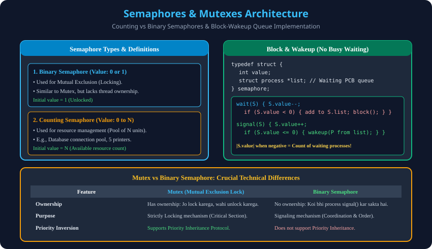

# 6. Semaphores and Mutexes

> **Unit 2 Module 6 Reference:** Gateway Classes Slides 60–75. Edsger Dijkstra (1965) dwara design kiya gaya Semaphore synchronization tool, Counting vs Binary Semaphores, Block-Wakeup queue implementation, aur Mutex vs Semaphore comparison.

---

## 6.1 Semaphore kya hota hai?
- **Definition:** Semaphore ek protected integer variable hota hai jise sirf do standard atomic functions ke through access kiya ja sakta hai:
  1. `wait()` (Historical Dutch name: `P()` for *proberen* = test / down).
  2. `signal()` (Historical Dutch name: `V()` for *verhogen* = increment / up).
- **Core Working Rule:** Dono operations strictly **Atomic** hote hain, yaani execution ke dauran CPU unhe beech mein interrupt nahi kar sakta.

---

## 6.2 Classical Wait & Signal Operations (Busy-Waiting Version)

```c
// 1. wait(S) operation (Down / P)
void wait(semaphore S) {
    while (S <= 0); // Busy wait (Spinning)
    S--;
}

// 2. signal(S) operation (Up / V)
void signal(semaphore S) {
    S++;
}
```

---

## 6.3 Semaphores ke Do Mukhya Types

### 1. Binary Semaphore (Range: 0 or 1)
- **Value Range:** Iski value sirf `0` ya `1` ho sakti hai.
- **Primary Use Case:** **Mutual Exclusion** provide karne ke liye.
- **Initial Value:** `S = 1` (Free/Available).
- **Usage:**
  ```c
  semaphore mutex = 1;
  do {
      wait(mutex);
      /* Critical Section */
      signal(mutex);
      /* Remainder Section */
  } while (true);
  ```

### 2. Counting Semaphore (Range: 0 to N)
- **Value Range:** Iski value unrestricted hoti hai ($0$ se lekar system limit $N$ tak).
- **Primary Use Case:** **Resource Management** (Finite Resource Allocation).
- **Real-World Example:** Maan lo college lab mein **5 identical printers** hain.
  - Initial Semaphore value: `printers = 5`.
  - Har process jab print job mangta hai, toh `wait(printers)` call karta hai (`printers` decrement hota hai).
  - Jab 5 processes print kar rahe hote hain, toh `printers = 0` ho jata hai.
  - Ab 6th process jab aayega, toh woh wait karega jab tak koi process `signal(printers)` karke printer free na kar de.

---

## 6.4 Semaphore Implementation Without Busy Waiting (Block & Wakeup)
Continuous spinning (busy waiting) CPU cycles ko barbaad karti hai. Is problem ko overcome karne ke liye OS kernel **Sleep & Wakeup (Block & Wakeup)** queue mechanism use karta hai:

```c
typedef struct {
    int value;
    struct process *list; // Linked list of waiting PCBs
} semaphore;

void wait(semaphore *S) {
    S->value--;
    if (S->value < 0) {
        // Resource nahi hai, process ko waiting queue mein daalo
        add_to_queue(S->list, current_process);
        block(); // Puts process to SLEEP state, CPU switches to other ready task!
    }
}

void signal(semaphore *S) {
    S->value++;
    if (S->value <= 0) {
        // Queue mein processes wait kar rahe hain
        process *P = remove_from_queue(S->list);
        wakeup(P); // Moves P from Waiting state to Ready Queue!
    }
}
```

### Negative Semaphore Value ka Magic Formula:
> **Formula:** Agar `S.value < 0` hai, toh iska absolute value **`|S.value|`** yeh darshata hai ki **kitne processes is samay waiting queue mein so rahe hain!**
> E.g., agar `S.value = -3`, toh iska matlab hai ki 3 processes queue mein blocked hain.

---

## 6.5 Mutex vs Binary Semaphore (Tech Interview Trap)

| Feature | Mutex (Mutual Exclusion Lock) | Binary Semaphore |
| :--- | :--- | :--- |
| **Basic Concept** | Locking Mechanism. | Signaling Mechanism. |
| **Ownership** | **Has Ownership:** Jo thread lock acquire karta hai, **sirf wahi** unlock kar sakta hai. | **No Ownership:** Ek process wait() karke lock kar sakta hai, aur doosra process signal() karke release kar sakta hai. |
| **Initial State** | Unlocked (Free). | User defined (Usually 1 or 0). |
| **Priority Inversion** | Supports **Priority Inheritance Protocol** (PIP). | PIP support nahi karta. |
| **Best Use Case** | Critical section code ko race conditions se bachana. | Producer-Consumer coordination aur event notification. |

---

## 6.6 Architectural Diagram


---

## 6.7 AKTU PYQ (2016-17, 2 Marks & 2018-19, 7 Marks)
- **Q1:** "Define Busy Waiting? How to overcome busy waiting using Semaphore operations?" (2016-17, 2 Marks)
  - *Ans:* Busy waiting is continuous CPU spinning on a loop. It is overcome by implementing semaphores with `block()` and `wakeup()` primitives using a PCB waiting list.
- **Q2:** "Define Binary Semaphores and Mutex." (2017-18, 2 Marks)
- **Q3:** "Explain what semaphores are, their usage, and implementation given to avoid busy waiting." (2018-19, 7 Marks)
