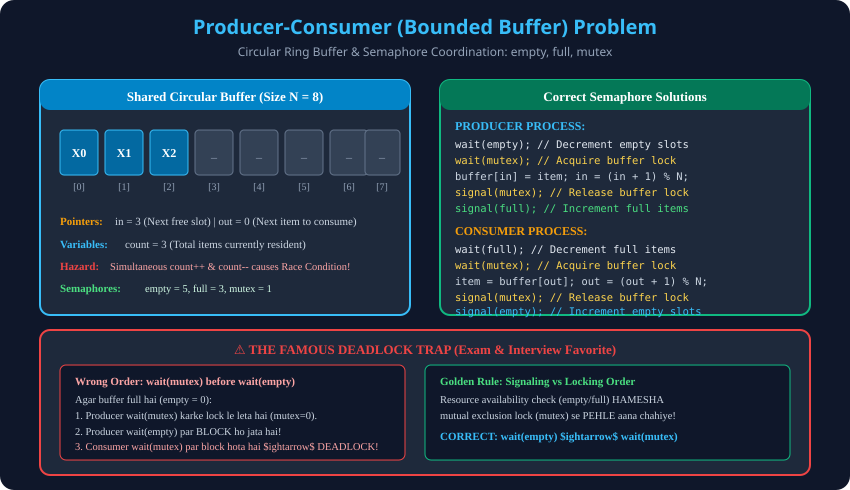

# 7. Classical Problems: Producer-Consumer (Bounded Buffer)

> **Unit 2 Module 7 Reference:** Gateway Classes Slides 65–75. Bounded Buffer Problem, Shared Variable `count` par Assembly Race Condition, aur Semaphore Solution (`empty`, `full`, `mutex`).

---

## 7.1 Problem Statement (The Bounded Buffer Problem)
- **Concept:** Do processes ek shared circular memory buffer ($N$ slots) ko share karte hain:
  - **Producer Process:** Naye data items create karta hai aur buffer ke khali slot mein write karta hai.
  - **Consumer Process:** Buffer se items remove karta hai aur unhe consume/process karta hai.
- **Constraints / Challenges:**
  1. **Buffer Overflow:** Agar buffer poori tarah bhar chuka hai, toh Producer naya item nahi daal sakta (usse wait karna hoga).
  2. **Buffer Underflow:** Agar buffer poori tarah khali hai, toh Consumer koi item read nahi kar sakta (usse wait karna hoga).
  3. **Mutual Exclusion:** Dono processes ek hi slot par ek saath write/read nahi kar sakte.

---

## 7.2 The Race Condition on Shared Variable `count`
Jab buffer mein kitne items hain yeh track karne ke liye ek shared variable `count` use kiya jata hai, toh race condition kaise aati hai:

```c
// Producer: count++
1. LOAD  Rp, count    // Rp = 3
2. INCR  Rp           // Rp = 4
// <--- PREEMPTION! --->

// Consumer: count--
3. LOAD  Rc, count    // Rc = 3 (Old count read!)
4. DECR  Rc           // Rc = 2
5. STORE count, Rc    // Memory mein count = 2 ho gaya!

// <--- SWITCH BACK TO PRODUCER --->
6. STORE count, Rp    // Memory mein count = 4 likh diya!
```
> **Result:** Sahi value 3 honi chahiye thi, lekin memory mein ya toh 4 ho jayegi ya 2! Buffer corrupt ho jata hai.

---

## 7.3 Complete Semaphore Solution
Is problem ko solve karne ke liye Dijkstra ke 3 Semaphores use kiye jaate hain:
1. `semaphore mutex = 1;` $	o$ Buffer ko access karne ke liye Binary Semaphore (Mutual Exclusion).
2. `semaphore empty = N;` $	o$ Counting Semaphore jo track karta hai kitne khali slots bache hain (Initially $N$).
3. `semaphore full = 0;` $	o$ Counting Semaphore jo track karta hai kitne bhare hue slots hain (Initially $0$).

### Producer Code:
```c
void Producer(void) {
    int itemp;
    while (true) {
        itemp = produce_item(); // Produce item in local memory

        wait(empty); // Check if empty slot available (decrements empty)
        wait(mutex); // Acquire exclusive lock to buffer

        // CRITICAL SECTION
        buffer[in] = itemp;
        in = (in + 1) % N;

        signal(mutex); // Release exclusive lock
        signal(full);  // Notify consumer that a new filled slot is ready!
    }
}
```

### Consumer Code:
```c
void Consumer(void) {
    int itemc;
    while (true) {
        wait(full);  // Check if filled item available (decrements full)
        wait(mutex); // Acquire exclusive lock to buffer

        // CRITICAL SECTION
        itemc = buffer[out];
        out = (out + 1) % N;

        signal(mutex); // Release exclusive lock
        signal(empty); // Notify producer that an empty slot is now free!

        consume_item(itemc); // Consume item locally
    }
}
```

---

## 7.4 The Deadlock Trap (Deadly Order of Waits!)
Interview aur exam mein aksar pucha jata hai: *"Kya hum `wait(empty)` aur `wait(mutex)` ka sequence aapas mein swap kar sakte hain?"*

```c
// DEADLOCK PRONE CODE (WRONG!)
wait(mutex); // (Step 1): Producer locks the buffer
wait(empty); // (Step 2): Producer checks for empty slot
```
### Why this causes Deadlock:
1. Maan lo buffer full hai (`empty == 0`).
2. Producer aata hai aur Step 1 execute karke `mutex` lock kar leta hai (`mutex = 0`).
3. Producer Step 2 par jata hai: `wait(empty)`. Kyunki `empty == 0`, Producer **sleep/block state mein chala jata hai!**
4. Ab Consumer buffer se item consume karke slot khali karne aata hai.
5. Consumer jaise hi `wait(mutex)` call karta hai, woh dekhta hai ki `mutex` toh pehle se Producer ke paas locked hai! Consumer bhi block ho jata hai!
6. **DEADLOCK:** Producer empty slot ka intezaar kar raha hai jise Consumer hi bana sakta hai, aur Consumer lock ka intezaar kar raha hai jo Producer ke paas hai!
> **Golden Rule:** Resource counting semaphore (`empty`/`full`) HAMESHA binary mutex se PEHLE call hona chahiye!

---

## 7.5 Architectural Diagram

