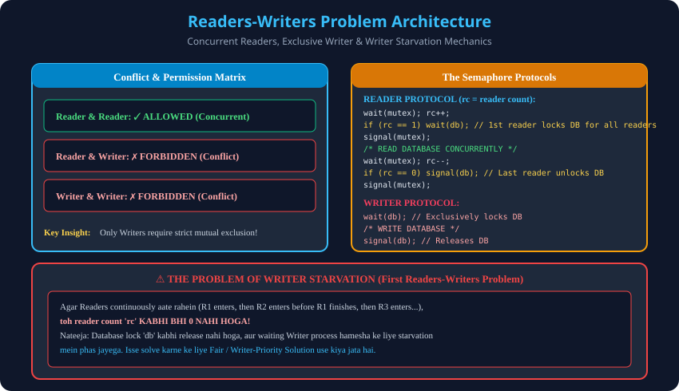

# 8. Classical Problems: Readers-Writers Problem

> **Unit 2 Module 8 Reference:** Gateway Classes Slides 76–92. Shared Database Access, First Readers-Writers Problem (Reader Priority), Mutex aur DB Semaphores, aur Writer Starvation issue.

---

## 8.1 Problem Statement
- **Concept:** Ek shared database / file ko do alag types ke concurrent processes access karte hain:
  1. **Readers:** Sirf data ko read karte hain (koi modification nahi).
  2. **Writers:** Data ko read aur update/overwrite karte hain.
- **Access Rules (Conflict Matrix):**
  - **Multiple Readers:** Ek saath database read kar sakte hain ($\checkmark$ Allowed, koi race condition nahi hoti).
  - **Reader aur Writer:** Ek saath allow nahi ho sakte ($	imes$ Forbidden, data inconsistency).
  - **Multiple Writers:** Ek saath allow nahi ho sakte ($	imes$ Forbidden, concurrent overwrite collision).

---

## 8.2 Shared Variables & Semaphores
1. `int rc = 0;` $	o$ Reader Count (Kitne readers is samay database read kar rahe hain).
2. `semaphore mutex = 1;` $	o$ Binary Semaphore jo `rc` variable ko race condition se bachata hai.
3. `semaphore db = 1;` (ya `wrt = 1;`) $	o$ Binary Semaphore jo database ko exclusively lock karta hai.

---

## 8.3 The Reader & Writer Protocols

### Reader Process Code:
```c
void Reader(void) {
    while (true) {
        // --- Entry Section for Reader ---
        wait(mutex); // Lock reader count variable
        rc = rc + 1;
        if (rc == 1) {
            wait(db); // First reader locks the entire database for all readers!
        }
        signal(mutex); // Release reader count lock

        // --- CRITICAL SECTION ---
        read_database(); // Multiple readers read concurrently!

        // --- Exit Section for Reader ---
        wait(mutex); // Lock reader count variable
        rc = rc - 1;
        if (rc == 0) {
            signal(db); // Last reader releases the database lock for writers!
        }
        signal(mutex); // Release reader count lock

        process_data(); // Remainder section
    }
}
```

### Writer Process Code:
```c
void Writer(void) {
    while (true) {
        // --- Entry Section for Writer ---
        wait(db); // Exclusively locks the database (blocks all readers and other writers)

        // --- CRITICAL SECTION ---
        write_database(); // Modify records

        // --- Exit Section for Writer ---
        signal(db); // Release database lock

        remainder_section();
    }
}
```

---

## 8.4 Execution Trace & Step-by-Step Logic

### Case 1: First Reader $R_1$ aata hai
- Initial: `rc = 0, mutex = 1, db = 1`.
- $R_1$ executes `wait(mutex)`. `rc` ban jata hai `1`.
- Condition check: `if (rc == 1)` $\implies$ **True!**
- $R_1$ executes `wait(db)` $\implies$ `db` ban jata hai `0`! Database lock ho gaya!
- $R_1$ executes `signal(mutex)` aur database read karne lagta hai.

### Case 2: Dusra Reader $R_2$ aata hai jab $R_1$ padh raha hai
- $R_2$ executes `wait(mutex)`. `rc` ban jata hai `2`.
- Condition check: `if (rc == 1)` $\implies$ **False!** (Kyunki `rc` 2 hai, 1 nahi).
- $R_2$ ko `wait(db)` call karne ki zarurat hi nahi padi!
- $R_2$ seedhe Critical Section mein ghus jata hai aur $R_1$ ke saath parallel padhta hai!

### Case 3: Writer $W_1$ aata hai jab Readers padh rahe hain
- $W_1$ executes `wait(db)`. Lekin `db == 0` hai (kyunki $R_1$ ne lock kiya tha).
- $W_1$ **blocked state mein chala jata hai!**

### Case 4: Readers nikalte hain
- $R_2$ pehle nikalta hai: `rc` ban jata hai `1`. `if (rc == 0)` is False. DB lock rehta hai.
- $R_1$ nikalta hai: `rc` ban jata hai `0`. `if (rc == 0)` is **True!**
- $R_1$ execute karta hai `signal(db)` $\implies$ `db` ban jata hai `1`!
- Ab blocked Writer $W_1$ jaagta hai aur database write karta hai!

---

## 8.5 The Writer Starvation Problem
- **Problem:** Agar readers ka flow continuous ho (e.g., $R_1$ padh raha tha, $R_2$ aaya, $R_1$ gaya lekin $R_3$ aa gaya, fir $R_4$ aa gaya...), toh `rc` kabhi `0` nahi hota!
- Nateeja: Database lock `db` kabhi release nahi hota aur bechara Writer hamesha ke liye starving rehta hai (**Indefinite Postponement**).
- **Solution:** Second Readers-Writers Problem (Writer Preference) ya Fair FIFO queue implement karna jisme Writer ke request karte hi naye readers ko entry dena band kar diya jata hai.

---

## 8.6 Architectural Diagram

