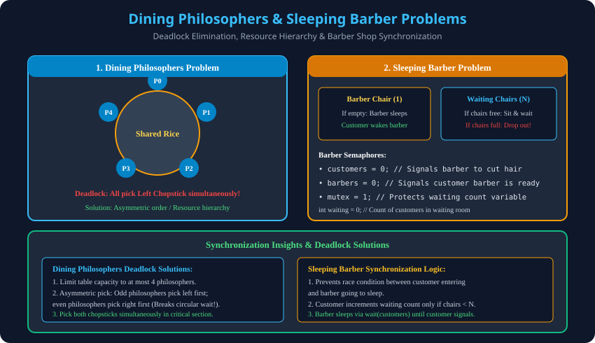

# 9. Classical Problems: Dining Philosophers & Sleeping Barber

> **Unit 2 Module 9 Reference:** Gateway Classes Slides 93–107 & AKTU Syllabus. Classical Concurrency Problems: Dining Philosophers Problem, Deadlock Prevention, aur Sleeping Barber Problem Semaphore Solution.

---

## 9.1 Dining Philosophers Problem
- **Problem Formulation (Edsger Dijkstra, 1965):**
  - 5 Philosophers ek circular dining table par baithe hain jiske center mein rice ka bowl hai.
  - Table par kul **5 chopsticks (forks)** hain, har do philosophers ke beech ek chopstick.
  - Har philosopher ke do states hote hain: **Thinking** aur **Eating**.
  - **Khana khane ke liye do chopsticks chahiye** (left chopstick aur right chopstick).
- **Semaphores Used:**
  - `semaphore chopstick[5] = {1, 1, 1, 1, 1};`

### Naive Implementation (Deadlock Prone):
```c
void Philosopher(int i) {
    while (true) {
        thinking();
        wait(chopstick[i]);                 // Pick left chopstick
        wait(chopstick[(i + 1) % 5]);       // Pick right chopstick

        eat(); // Critical Section

        signal(chopstick[i]);               // Put down left chopstick
        signal(chopstick[(i + 1) % 5]);     // Put down right chopstick
    }
}
```

### The Deadlock Scenario:
- Agar sabhi 5 philosophers ek hi samay par bhookhe ho jayein aur sabhi apna **left chopstick utha lein**, toh sabhi ke paas 1-1 chopstick hoga.
- Ab sabhi apne **right chopstick ka intezaar** karenge jo unke neighbor ke haath mein hai.
- **Circular Wait Condition ban gayi! Sabhi hamesha ke liye block ho jayenge $	o$ DEADLOCK!**

### Deadlock Elimination Strategies:
1. **Limit Table Capacity:** Table par ek samay mein zyada se zyada 4 philosophers ko baithne ki ijazat di jaye ($N-1$ rule).
2. **Asymmetric Solution (Resource Hierarchy):**
   - Odd philosophers (1, 3) pehle left chopstick uthayenge, phir right.
   - Even philosophers (0, 2, 4) pehle right chopstick uthayenge, phir left.
   - Yeh rule circular wait condition ko instantly break kar deta hai!
3. **Pick Both Simultaneously:** Philosopher chopstick tabhi uthayega jab uske dono chopsticks available hon (via Monitor ya Mutex).

---

## 9.2 Sleeping Barber Problem
- **Problem Formulation:**
  - Ek barber shop mein 1 barber chair hoti hai (jahan haircut hota hai) aur $N$ waiting chairs hoti hain.
  - Agar shop mein koi customer nahi hai, toh barber apni chair par so jata hai (**Sleeps**).
  - Jab koi naya customer aata hai:
    - Agar barber so raha hai, toh customer barber ko jagata hai aur haircut karwata hai.
    - Agar barber busy hai aur waiting chairs khali hain, toh customer waiting chair par baith jata hai.
    - Agar saari $N$ chairs full hain, toh customer bina baal katwaye wapas laut jata hai (**Customer Dropout**).

### Semaphores & Variables:
```c
semaphore customers = 0; // Tracks waiting customers ready for haircut
semaphore barbers = 0;   // 1 if barber is ready to cut hair
semaphore mutex = 1;     // Protects shared 'waiting' variable
int waiting = 0;         // Number of customers currently in waiting chairs
#define CHAIRS 5         // Total waiting chairs
```

### Barber Process Code:
```c
void Barber(void) {
    while (true) {
        wait(customers); // Sleep if no customers; wake up when customer arrives

        wait(mutex);     // Lock waiting variable
        waiting--;       // Customer leaves waiting room to sit in barber chair
        signal(barbers); // Barber signals that he is ready to cut hair
        signal(mutex);   // Unlock waiting variable

        cut_hair();      // Critical Section: Haircut in progress
    }
}
```

### Customer Process Code:
```c
void Customer(void) {
    wait(mutex); // Lock waiting variable
    if (waiting < CHAIRS) {
        waiting++;          // Sit in waiting room chair
        signal(customers);  // Wake up barber (or increment customer count)
        signal(mutex);      // Unlock waiting variable

        wait(barbers);      // Wait until barber chair is ready
        get_haircut();      // Critical Section: Getting haircut
    } else {
        signal(mutex);      // Shop is full, release lock and leave (Dropout)
    }
}
```

---

## 9.3 Architectural Diagram

