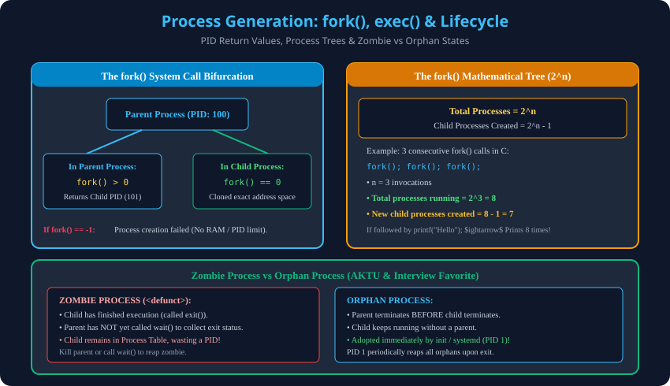

# 10. Process Generation, Forking & Lifecycle

> **Unit 2 Module 10 Reference:** Gateway Classes Slides 121–128. Process Creation (Forking vs Spawning), `fork()`, `exec()`, `wait()`, `exit()` System Calls, $2^n$ Mathematical Calculation, aur Zombie vs Orphan Process comparison.

---

## 10.1 Process Creation: Forking vs Spawning
Operating system mein ek naya process do tareeqon se generate hota hai:
1. **Forking:**
   - Parent process apni khud ki **exact duplicate copy (clone)** banata hai jise Child Process kehte hain.
   - Child process parent ki memory image, environment variables aur open file descriptors ko inherit karta hai.
   - Example: Unix/Linux `fork()` system call.
2. **Spawning:**
   - Parent process OS ko explicitly request karta hai ki ek bilkul naya, fresh process banaya jaye jo parent ka copy nahi hota.
   - Example: Windows `CreateProcess()`.

---

## 10.2 The `fork()` System Call & Return Values
Unix-based systems mein `fork()` system call ek single line of execution se do processes paida kar deta hai:

```c
#include <stdio.h>
#include <unistd.h>
#include <sys/types.h>

int main() {
    pid_t pid = fork();

    if (pid < 0) {
        // Fork Failed! (Insufficient RAM or process limit reached)
        perror("Fork failed");
    } else if (pid == 0) {
        // Child Process
        printf("I am Child Process! My PID: %d, Parent PID: %d\n", getpid(), getppid());
    } else {
        // Parent Process
        printf("I am Parent Process! My PID: %d, Created Child PID: %d\n", getpid(), pid);
    }
    return 0;
}
```

### The 3 Return Values of `fork()`:
1. **`pid == 0` (In Child):** Child process ko return value `0` milti hai taaki woh identify kar sake ki woh child hai.
2. **`pid > 0` (In Parent):** Parent process ko naye banaye gaye child ka **actual Process ID (PID)** milta hai.
3. **`pid == -1`:** Process creation fail ho gaya (due to system limits or low RAM).

---

## 10.3 The $2^n$ Mathematical Tree Formula
Jab multiple `fork()` calls ek ke baad ek execute hote hain, toh processes exponential tree ki tarah grow karte hain:

$$	ext{Total Processes Running} = 2^n$$
$$	ext{New Child Processes Created} = 2^n - 1$$
*(where $n$ = number of consecutive `fork()` system call invocations)*

### Step-by-Step Trace for $n = 3$:
```c
int main() {
    fork(); // 1 process becomes 2^1 = 2 processes
    fork(); // 2 processes become 2^2 = 4 processes
    fork(); // 4 processes become 2^3 = 8 processes
    printf("AKTU OS Exam\n");
    return 0;
}
```
- **Total processes after 3rd fork:** $2^3 = \mathbf{8}$.
- **Child processes created:** $8 - 1 = \mathbf{7}$.
- **"AKTU OS Exam" string kitni baar print hoga?** Exactly **8 baar**!

---

## 10.4 Key Process Lifecycle System Calls
- **`exec()` Family (`execl`, `execvp`):** Current running process ke text, data, aur stack ko hard disk par rakhi nayi executable file se **completely replace** kar deta hai. PID same rehta hai!
- **`wait()` / `waitpid()`:** Parent process ko suspend (block) kar deta hai jab tak koi child process execute hokar terminate na ho jaye. Child ka exit status return karta hai.
- **`exit()`:** Process apna execution successfully ya error ke saath terminate karta hai aur kernel resources free karta hai.

---

## 10.5 Zombie vs Orphan Process (AKTU 2 Marks & 5 Marks Favorite)

| Parameter | Zombie Process (`<defunct>`) | Orphan Process |
| :--- | :--- | :--- |
| **Kaun Pehle Mara?** | **Child** pehle terminate ho chuka hai. | **Parent** pehle terminate ho chuka hai. |
| **Kaun Abhi Zinda Hai?** | Parent abhi zinda hai lekin usne `wait()` call nahi kiya. | Child abhi actively execute ho raha hai. |
| **Memory State** | Code/Stack release ho chuka hai, lekin **PCB Process Table mein bacha hua hai** (PID waste kar raha hai). | Child process normal RAM memory mein actively execute ho raha hai. |
| **Naya Guardian** | Koi nahi (Parent zinda hai). | **Adopted by `init` (PID 1) / `systemd`**! |
| **Kaise Khatam Karein?** | Parent ko `wait()` call karna hoga, ya Parent ko kill karne par orphan bankar `init` usse reap karega. | Jaise hi child terminate hoga, uska adoptive parent `init` turant `wait()` karke usse cleanly reap kar lega. |

---

## 10.6 Architectural Diagram

