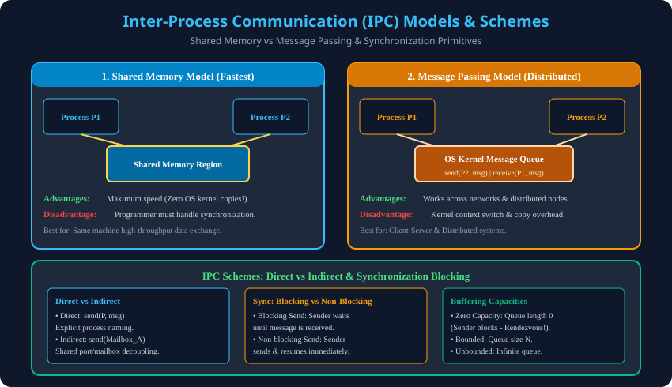

# 11. Inter-Process Communication (IPC) Models & Schemes

> **Unit 2 Module 11 Reference:** Gateway Classes Slides 129–137. Inter-Process Communication (IPC) ki zaroorat, Shared Memory vs Message Passing models, Direct vs Indirect schemes, Buffering capacities, aur Unix IPC primitives.

---

## 11.1 Inter-Process Communication (IPC) kya hai?
- **Definition:** Jab do ya do se zyada concurrent processes aapas mein data, information ya signals exchange karte hain, toh is mechanism ko **Inter-Process Communication (IPC)** kehte hain.
- **IPC ki Zaroorat (Why IPC?):**
  1. **Information Sharing:** Multiple processes ko common data (jaise database records ya shared text) access karna hota hai.
  2. **Computation Speedup:** Ek complex task ko parallel subtasks mein divide karke multi-core CPU par run karna.
  3. **Modularity:** System functions ko independent communicating modules mein divide karna (e.g., Microkernel design).
  4. **Convenience:** User pipeline commands (e.g., `cat file.txt | grep "error" | wc -l`).

---

## 11.2 The Two Fundamental IPC Models

### 1. Shared Memory Model
- **Concept:** Communicating processes ek shared memory segment establish karte hain physical RAM mein jo dono processes ke virtual address space mein map hota hai.
- **Speed:** **Fastest IPC mechanism!** Kyunki ek bar shared memory banne ke baad communication direct RAM read/write instructions se hoti hai, bina kisi Kernel intervention ke.
- **Responsibility:** OS kernel synchronization provide nahi karta! Programmer ko khud Semaphores ya Mutexes implement karke race condition se bachna hota hai.

### 2. Message Passing Model
- **Concept:** Processes messages exchange karke communicate karte hain standard OS kernel primitives ke through:
  - `send(message, destination)`
  - `receive(message, host)`
- **Speed:** Slower (kyunki har message exchange mein Kernel System Call, Context Switch aur memory copying hoti hai).
- **Advantage:** Distributed Systems aur Networked Computers mein bina kisi shared RAM ke easily kaam karta hai (e.g., Socket programming, Microservices).

---

## 11.3 Comparison Table: Shared Memory vs Message Passing

| Parameter | Shared Memory Model | Message Passing Model |
| :--- | :--- | :--- |
| **Data Flow** | Direct memory read/write. | OS Kernel message queue via system calls. |
| **Speed** | Very Fast (Memory bus speed). | Slower (System call & copying overhead). |
| **Synchronization** | Programmer ki responsibility. | OS Kernel handles synchronization. |
| **Distributed Systems** | Multi-computer network par work nahi karta. | **Networked / Distributed systems ke liye best!** |
| **Hardware Suitability** | Shared RAM / Multi-core systems. | Distributed clusters / Cloud servers. |

---

## 11.4 Communication Schemes & Primitives

### 1. Direct vs Indirect Communication
- **Direct Communication:**
  - Sender aur Receiver ko explicitly ek dusre ka naam (PID) dena padta hai:
    - `send(P, message)` $	o$ Send a message to Process P.
    - `receive(Q, message)` $	o$ Receive a message from Process Q.
  - *Limitation:* Tight coupling. Agar PID badal jaye, toh code update karna padega.
- **Indirect Communication:**
  - Messages ko ek shared **Mailbox ya Port** mein bheja jata hai:
    - `send(mailbox_A, message)`
    - `receive(mailbox_A, message)`
  - *Advantage:* Decoupled architecture. Ek mailbox se multiple processes message exchange kar sakte hain.

### 2. Synchronization Semantics (Blocking vs Non-Blocking)
- **Blocking (Synchronous):**
  - *Blocking Send:* Sender tab tak freeze (block) rehta hai jab tak receiver message receive na kar le.
  - *Blocking Receive:* Receiver tab tak wait karta hai jab tak koi message available na ho.
- **Non-blocking (Asynchronous):**
  - *Non-blocking Send:* Sender message bhej kar turant aage badh jata hai.
  - *Non-blocking Receive:* Receiver ya toh valid message retrieve karta hai ya `null` lekar turant continue karta hai.

### 3. Buffering Schemes (Capacity of the Link)
1. **Zero Capacity (Rendezvous):** Queue length $0$. Sender tab tak aage nahi badh sakta jab tak receiver exact usi moment par receive na kare (Meeting point / Rendezvous).
2. **Bounded Capacity:** Queue size finite ($N$). Sender tabhi block hota hai jab queue ke sabhi $N$ slots full ho jayein.
3. **Unbounded Capacity:** Queue size infinite. Sender kabhi block nahi hota!

---

## 11.5 Architectural Diagram

