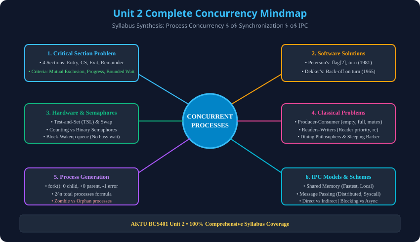

# 12. Unit 2: AKTU PYQs & Tech Interview Cheatsheet

> **Unit 2 Module 12 Reference:** Gateway Classes Slides 40, 60, 92, 106, 120, 136. AKTU Previous Year Questions (2014–2023) Solved, Top Tech Interview Traps, aur Concurrency Mindmap.

---

## 12.1 AKTU Solved Question Bank (2014–2023)

### Q1. Define Critical Section Problem? What are the basic requirements to solve it? (2016-17, 5 Marks | 2018-19, 7 Marks)
- **Answer:**
  1. **Definition:** Critical Section program ka woh block hai jisme shared variables ya resources access hote hain aur ek samay mein sirf ek process execute ho sakta hai.
  2. **Requirements:**
     - **Mutual Exclusion (Primary):** Only one process in CS at any time.
     - **Progress (Primary):** Selection of next process cannot be blocked by processes in remainder section or delayed indefinitely.
     - **Bounded Waiting (Secondary):** Limit on number of times other processes enter CS after a request, preventing starvation.

---

### Q2. Explain Peterson's solution for 2-process synchronization with proof. (2017-18, 10 Marks | 2021-22, 10 Marks)
- **Answer:**
  - Shared variables: `boolean flag[2]; int turn;`.
  - Process $P_i$ code:
    ```c
    flag[i] = true;
    turn = j;
    while (flag[j] && turn == j);
    /* Critical Section */
    flag[i] = false;
    ```
  - **Proof of Mutual Exclusion:** `turn` simultaneously 0 aur 1 nahi ho sakta.
  - **Proof of Progress:** Remainder process ka flag false hota hai, active process ko nahi rokta.
  - **Proof of Bounded Waiting:** Turn dusre process ko de di jaati hai, bound $k=1$.

---

### Q3. Define Busy Waiting? How do Semaphores overcome Busy Waiting? (2016-17, 2 Marks | 2018-19, 7 Marks)
- **Answer:**
  - **Busy Waiting:** CPU cycles ko uselessly waste karte hue continuous loop condition check karna (Spinlock).
  - **Overcoming via Semaphores:** Semaphores **`block()` and `wakeup()`** system calls use karte hain. Jab resource available nahi hota, toh process ko CPU se hata kar waiting queue mein sleep state mein daal diya jata hai (`block()`), jisse CPU kisi doosre ready task ko mil sake.

---

### Q4. Differentiate between Binary Semaphore and Mutex. (2017-18, 2 Marks)
- **Answer:**
  - **Ownership:** Mutex mein ownership hoti hai (sirf locked thread hi unlock kar sakta hai); Semaphore mein koi ownership nahi hoti (koi bhi thread signal kar sakta hai).
  - **Purpose:** Mutex strictly locking ke liye hai; Semaphore signaling aur coordination ke liye hai.
  - **Priority Inheritance:** Mutex priority inversion se bachne ke liye Priority Inheritance support karta hai; Semaphore nahi.

---

### Q5. Formulate and solve the Producer-Consumer problem using Semaphores. (2015-16, 10 Marks | 2020-21, 10 Marks)
- **Answer:**
  - 3 Semaphores: `mutex = 1` (Mutual exclusion), `empty = N` (Empty slots count), `full = 0` (Filled items count).
  - Producer: `wait(empty) -> wait(mutex) -> write -> signal(mutex) -> signal(full)`.
  - Consumer: `wait(full) -> wait(mutex) -> read -> signal(mutex) -> signal(empty)`.
  - Trap: `wait(mutex)` ko pehle call karne par full/empty buffer par **Deadlock** ho jata hai.

---

### Q6. Discuss Dekker's Algorithm for two-process mutual exclusion. (2014-15, 10 Marks | 2016-17, 5 Marks)
- **Answer:**
  - First software mutual exclusion solution (1965).
  - Intent conflict hone par process polite back-off karta hai (`flag[i] = false`), `turn == i` ka wait karta hai aur re-assert karta hai.
  - Satisfies Mutual Exclusion, Progress aur Bounded Waiting.

---

### Q7. Explain `fork()` system call. Calculate total processes generated by: (2017-18, 5 Marks)
```c
fork(); fork(); fork();
```
- **Answer:**
  - `fork()` parent process ka identical duplicate child clone banata hai. Return values: Child mein `0`, Parent mein `PID > 0`, Failure par `-1`.
  - Formula: $	ext{Total Processes} = 2^n$. Yahan $n = 3$, toh $2^3 = \mathbf{8}$ processes.
  - New child processes created = $2^3 - 1 = \mathbf{7}$.

---

### Q8. Differentiate between Zombie Process and Orphan Process. (2018-19, 2 Marks | 2021-22, 5 Marks)
- **Zombie:** Child process execute hokar terminate ho chuka hai, lekin parent ne `wait()` call nahi kiya. PCB process table mein rehta hai.
- **Orphan:** Parent process pehle terminate ho gaya jabki child abhi chal raha hai. Isse turant **`init` / `systemd` (PID 1)** adopt kar leta hai.

---

## 12.2 Top Tech Interview Concurrency Traps
1. **Priority Inversion Problem (Mars Pathfinder Disaster, 1997):**
   - High priority task (Information Bus) low priority task (Meteorological task) dwara held mutex lock par block ho gaya. Medium priority task ne low priority ko preempt kar diya, jisse High priority task hamesha wait karta raha!
   - *Fix:* **Priority Inheritance Protocol (PIP)** — Low priority process ko temporarily High priority boost diya jata hai jab tak woh mutex release na kar de.
2. **Deadlock vs Livelock vs Starvation:**
   - *Deadlock:* Processes are blocked waiting for each other (0% CPU usage, frozen).
   - *Livelock:* Processes actively change state in response to each other without making progress (100% CPU usage, spinning back-off).
   - *Starvation:* Process is ready to run but perpetually denied resource allocation.

---

## 12.3 Complete Unit 2 Mindmap

