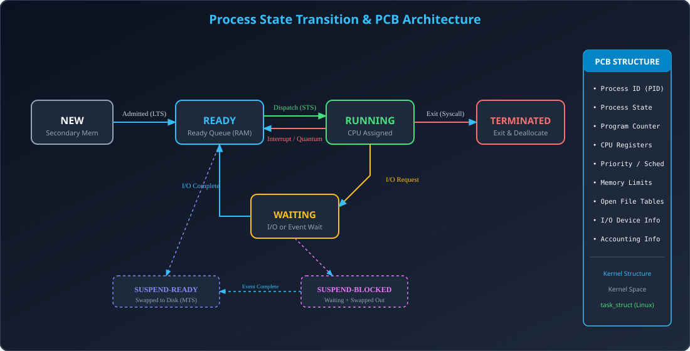

# Module 01: Process Concepts, Process States & PCB (Process Control Block)

> **Unit 3: CPU Scheduling & Deadlock** | *B.Tech CS/IT/Allied (AKTU BCS401)*

---

## 1. Process Concept: Program vs Process

### 1.1 Fundamental Definition
- **Program (Passive Entity):** Hard disk par stored static code ya executable binary file (e.g., `a.out`, `chrome.exe`). Ye tab tak inactive rehta hai jab tak execute na kiya jaye.
- **Process (Active Entity):** Program in execution. Jab program ko memory (RAM) me load karke CPU allocation aur OS resources assign hote hain, to wo **Process** ban jata hai.
- **Real-World Analogy:** Recipe book me likhi recipe ek **Program** hai, jabki chef dwara kitchen me khana banane ka live action ek **Process** hai.

### 1.2 Process Memory Address Space Layout
Ek standard process virtual address space 4 mukhya segments me banta hota hai:
1. **Text Section:** Compiled machine code instructions (Read-Only).
2. **Data Section:** Global aur static variables. Initialized (`.data`) aur uninitialized BSS (`.bss`) me partitioned.
3. **Heap Section:** Dynamically allocated memory at runtime (C language me `malloc()`, `calloc()` ya C++ me `new`). Memory addresses grow **upwards** (low memory to high memory).
4. **Stack Section:** Local variables, function parameters, return addresses, aur activation records. Addresses grow **downwards** (high memory to low memory).

---

## 2. Process States & State Transition Architecture

### 2.1 The Standard 5-State Life Cycle Model
OS me ek process apni poori zindagi me nimn 5 states se guzarta hai:
1. **NEW:** Process abhi create ho raha hai (Secondary memory/Disk par).
2. **READY:** Process RAM ke **Ready Queue** me aa chuka hai aur CPU execution ke liye ready hai.
3. **RUNNING:** CPU scheduler ne process ko CPU assign kar diya hai, machine instructions execute ho rahi hain. Single core CPU me ek samay par strictly ek process RUNNING ho sakta hai.
4. **WAITING / BLOCKED:** Process I/O operation (e.g., keyboard input, disk read) ya kisi synchronization event (semaphore wait) ke complete hone ka intezar kar raha hai.
5. **TERMINATED:** Process ka execution complete ho gaya ya OS ne kill kar diya. Iske resources release ho jaate hain.

### 2.2 Extended 7-State Model (Swapping & Suspended States)
Jab RAM full ho jati hai, OS degree of multiprogramming control karne ke liye **Medium-Term Scheduler (MTS)** ke zariye processes ko swap-out kar deta hai:
- **SUSPENDED READY:** Process ready tha par RAM me jagah na hone ki wajah se disk ke swap space me shift kar diya gaya.
- **SUSPENDED BLOCKED:** Process kisi I/O ka wait kar raha tha aur disk par swapped-out hai. I/O complete hone par ye **SUSPENDED READY** me convert ho jata hai.

---

## 3. PCB (Process Control Block): Kernel Data Structure

### 3.1 PCB Kya Hai?
- PCB (Process Control Block) ek OS kernel-level data structure hai (Linux me ise `struct task_struct` kehte hain).
- Har ek process ke liye kernel memory space me ek unique PCB exist karta hai. Ye process ki "Identity Card" aur "Passport" hai.

### 3.2 PCB ke Core Components & Fields
| Field Name | Description & Role |
| :--- | :--- |
| **Process ID (PID)** | Unique integer identifier (e.g., PID 1 = `init`/`systemd`). |
| **Process State** | Current state: `TASK_RUNNING`, `TASK_INTERRUPTIBLE`, `TASK_ZOMBIE`, etc. |
| **Program Counter (PC)** | Agle execute hone wale machine instruction ka 64-bit memory address. |
| **CPU Registers** | Accumulators, Index registers, Stack Pointers, General Purpose Registers ($R_0 - R_n$), Flags. |
| **CPU Scheduling Info** | Process priority, pointers to scheduling queues, dynamic nice value. |
| **Memory Management Info** | Page tables, segment tables, base and limit registers. |
| **Accounting Information** | CPU time used, clock time elapsed, time limits, user ID. |
| **I/O Status Information** | Allocated I/O devices list, list of open file descriptors (`fd_table`). |

---

## 4. Architectural Diagram

  

---

## 5. AKTU Exam & Interview Highlights

> **AKTU Frequently Asked Question (10 Marks):**
> *"Explain the process state transition diagram with 5 and 7 states. Detail the internal structure of PCB and its role in context switching."*
>
> **Top Tech Interview Insight:**
> *"What happens to PCB when a process terminates but parent doesn't call wait()?"*
> **Answer:** Process ban jata hai **Zombie Process**. Iska memory release ho jata hai lekin PCB process table me entry PID ke saath rehti hai taaki exit status preserve rahe. Agar parent exit ho jaye to `init`/`systemd` adopts it and reaps the PCB.
