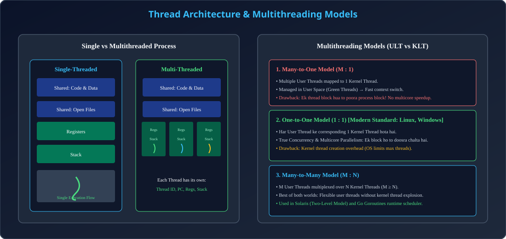

# Module 03: Threads, Thread Management & Multithreading Models

> **Unit 3: CPU Scheduling & Deadlock** | *B.Tech CS/IT/Allied (AKTU BCS401)*

---

## 1. Thread: Lightweight Process (LWP)

### 1.1 Process vs Thread
- **Process:** Heavyweight entity with independent address space, page tables, open file descriptors, and PCB. Process creation (`fork()`) is expensive.
- **Thread:** Basic unit of CPU utilization (Lightweight Process). Ek process ke multiple threads usi process ka address space aur resources share karte hain.

### 1.2 Thread Shared vs Private Components
| Component Type | Included Elements |
| :--- | :--- |
| **Shared Among Threads of Same Process** | Code Segment (Text), Data Segment (Globals), Heap Memory, Open File Descriptors, Sockets, Signals. |
| **Private to Each Thread (Non-Shared)** | **Thread ID (TID)**, **Program Counter (PC)**, **CPU Registers State**, **Private Call Stack** (Local variables). |

---

## 2. User-Level Threads (ULT) vs Kernel-Level Threads (KLT)

| Comparison Metric | User-Level Threads (ULT) | Kernel-Level Threads (KLT) |
| :--- | :--- | :--- |
| **Management** | User-space Thread Library (e.g., POSIX `pthreads` user-level, Java Green threads). | Direct Operating System Kernel support. |
| **Kernel Awareness** | OS kernel ko threads ke baare me koi jankari nahi hoti (Kernel sees 1 single process). | Kernel manages Thread Control Blocks (TCB) for each thread. |
| **Switching Speed** | **Ultra-Fast:** Pure user-mode context switch, no trap to kernel mode needed. | **Slower:** Requires kernel privilege trap (`Ring 3` to `Ring 0`). |
| **Blocking Problem** | Agar ek thread blocking system call kare, to **poora process block** ho jata hai! | Agar ek thread block hota hai, to kernel doosre thread ko schedule kar deta hai. |
| **Multicore Speedup** | Cannot run on multiple CPU cores simultaneously. | True multicore parallel execution supported. |

---

## 3. Multithreading Models

### 3.1 Many-to-One Model ($M : 1$)
- Saare user threads ek single kernel thread par mapped hote hain.
- **Pros:** Fast management in user space.
- **Cons:** Ek thread ke block hone par entire process blocks. Multi-processor hardware ka koi advantage nahi milta.

### 3.2 One-to-One Model ($1 : 1$)
- Har user thread ke corresponding ek dedicated kernel thread create hota hai.
- **Standard Implementation:** Modern Linux (`NPTL` - Native POSIX Thread Library), Windows, macOS.
- **Pros:** Excellent concurrency, multicore support, independent blocking.
- **Cons:** Thread creation overhead high rehta hai (isiliye application levels par *Thread Pools* use kiye jaate hain).

### 3.3 Many-to-Many Model ($M : N$)
- $M$ user threads ko $N$ kernel threads par multiplex kiya jata hai ($M \ge N$).
- System jitne chahe user threads create kar sakta hai jabki kernel bounded pool of kernel threads schedule karta hai.
- Go language ka **Goroutine scheduler** ($M:N$) iska best real-world example hai.

---

## 4. Architectural Diagram

  

---

## 5. AKTU Exam & Interview Highlights

> **AKTU PYQ (10 Marks):**
> *"Differentiate between process and thread. Explain User Level Threads vs Kernel Level Threads with their multithreading models."*
>
> **Top Tech Interview Insight:**
> *"Why does multi-threading improve performance in Web Servers (like Nginx / Apache)?"*
> **Answer:** Ek thread client request par database/disk I/O ke liye block hota hai to doosra thread dusre incoming client connection ko immediately serve karta hai, maximizing CPU throughput and minimizing latency.
