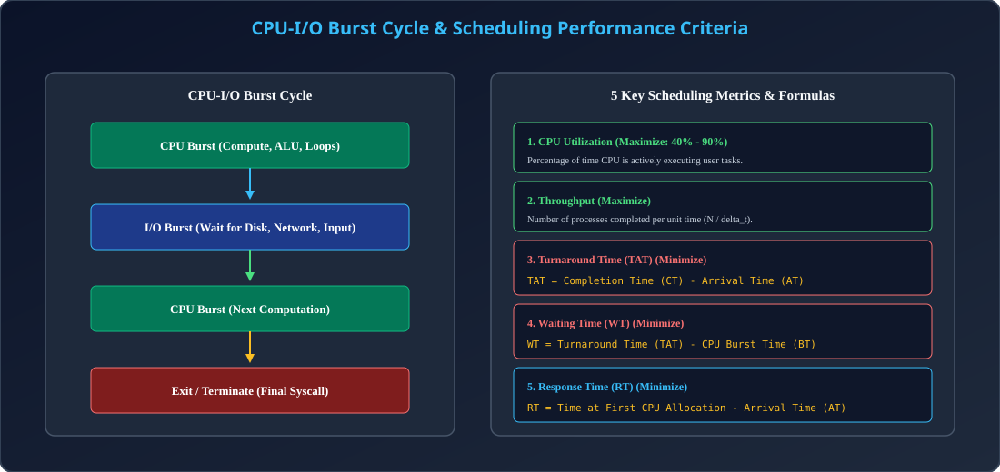

# Module 04: CPU Scheduling Concepts, Burst Cycle & Performance Criteria

> **Unit 3: CPU Scheduling & Deadlock** | *B.Tech CS/IT/Allied (AKTU BCS401)*

---

## 1. CPU-I/O Burst Cycle Principle

### 1.1 Process Execution Alternation
Process execution ek alternating cycle hota hai jisme process:
1. **CPU Burst:** CPU par computation, arithmetic logic, and control flow karta hai.
2. **I/O Burst:** File read/write, keyboard interaction ya network socket par wait karta hai.
- Process execution hamesha ek **CPU burst** se start hota hai aur final CPU burst ke baad terminate hota hai.

### 1.2 CPU Burst Duration Distribution
Empirical studies dikhati hain ki computer systems me:
- **Short CPU bursts ki frequency bahut high hoti hai** (majority processes thodi der CPU lete hain aur fir I/O block ho jate hain).
- **Long CPU bursts ki frequency bahut kam hoti hai** (scientific number-crunching simulations).
- CPU scheduler ka primary target short bursts ko jaldi finish karake system throughput aur responsiveness badhana hota hai.

---

## 2. Preemptive vs Non-Preemptive Scheduling

Scheduling decision 4 circumstances me liya ja sakta hai:
1. Jab process **Running &rarr; Waiting** state me jata hai (e.g. I/O request).
2. Jab process **Running &rarr; Ready** state me jata hai (e.g. Timer interrupt).
3. Jab process **Waiting &rarr; Ready** state me jata hai (e.g. I/O completion).
4. Jab process **Terminates**.

| Scheduling Type | Criteria | Characteristics |
| :--- | :--- | :--- |
| **Non-Preemptive** | Circumstances 1 aur 4 me scheduling hoti hai. | Ek baar CPU mil gaya to process tabhi chhodega jab ya to I/O par jaye ya voluntarily exit kare. Simple, zero race-conditions, but poor response time for short jobs. |
| **Preemptive** | Circumstances 2 aur 3 me bhi CPU chheena ja sakta hai. | Higher priority process aane par current running process ko suspend karke ready queue me bhej diya jata hai. Responsive, but requires synchronization primitives (Locks/Semaphores) to protect shared data. |

---

## 3. The 5 Core Scheduling Performance Criteria

### 3.1 Formulas & Maximization / Minimization Goals

| Metric | Symbol / Formula | Goal | Practical Meaning |
| :--- | :--- | :--- | :--- |
| **CPU Utilization** | $\frac{T_{\text{busy}}}{T_{\text{total}}} \times 100\%$ | **Maximize** (40% - 90%) | CPU ko continuously busy rakhna taaki silicon waste na ho. |
| **Throughput** | $\frac{N}{\Delta t}$ (Processes per unit time) | **Maximize** | Ek ghante me kitne processes successfully complete huye. |
| **Turnaround Time (TAT)** | $\text{TAT} = \text{CT} - \text{AT}$ | **Minimize** | Process submit hone se lekar finish hone tak ka total span. |
| **Waiting Time (WT)** | $\text{WT} = \text{TAT} - \text{BT}$ | **Minimize** | Process ne Ready Queue me kitna samay intezar me bitaya. |
| **Response Time (RT)** | $\text{RT} = T_{\text{first CPU}} - \text{AT}$ | **Minimize** | Request submit hone ke baad pehla response aane tak ka delay. |

> **Crucial Observation for Non-Preemptive Algorithms:**
> Non-preemptive scheduling me pehli baar CPU milne par process complete hone tak chalta hai, isiliye **Response Time = Waiting Time** hota hai! Preemptive scheduling me RT and WT alag-alag hote hain.

---

## 4. Architectural Diagram

  

---

## 5. AKTU Exam & Interview Highlights

> **AKTU PYQ (10 Marks):**
> *"Define Turnaround time, Waiting time, and Response time. Compare preemptive and non-preemptive scheduling with practical examples."*
>
> **Top Tech Interview Insight:**
> *"Why is minimizing Average Waiting Time considered the standard benchmark for CPU scheduling algorithms?"*
> **Answer:** Waiting time purely scheduler ki quality reflect karta hai (CPU Burst time program ke logic par depend karta hai jise scheduler change nahi kar sakta). Minimum average waiting time mathematically maximum user satisfaction aur system responsiveness ensure karta hai.
