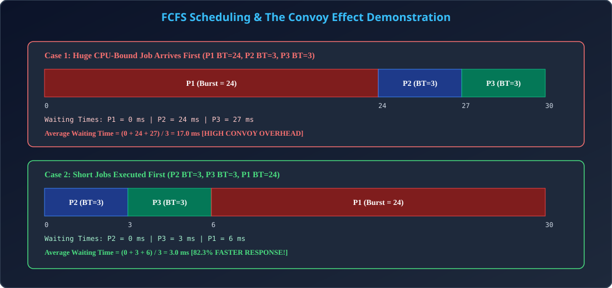

# Module 05: FCFS (First-Come, First-Served) & The Convoy Effect

> **Unit 3: CPU Scheduling & Deadlock** | *B.Tech CS/IT/Allied (AKTU BCS401)*

---

## 1. FCFS Scheduling Algorithm Principle

### 1.1 Working Mechanism
- **Rule:** Jo process Ready Queue me pehle aata hai (FIFO order based on Arrival Time), CPU usi ko sabse pehle assign hota hai.
- **Queue Implementation:** Standard FIFO queue. Naye processes tail (rear) par insert hote hain, aur CPU scheduler head (front) se process pick karta hai.
- **Scheduling Nature:** Purely **Non-Preemptive**. Ek baar process ko CPU mil gaya, to wo tabhi chhodega jab poora execution finish ho jaye ya process I/O block ho.

---

## 2. The Convoy Effect (AKTU Core Question)

### 2.1 Convoy Effect Kya Hai?
Jab ek bahut bada CPU-bound process (badi bus ya truck) CPU par run kar raha hota hai, to uske peeche kayi chhote I/O-bound processes (chhote scooters/cars) Ready Queue me fans jate hain. 
Iske parinaam-swaroop:
1. I/O devices idle baithe rehte hain (Kyunki processes Ready Queue me block hain).
2. Average Waiting Time dramatically badh jata hai.
3. System responsiveness bekar ho jati hai.

### 2.2 Numerical Demonstration (Step-by-Step)
Maan lijiye 3 processes $P_1, P_2, P_3$ time $0$ par arrive hote hain:
- $P_1$ Burst Time = $24\text{ ms}$
- $P_2$ Burst Time = $3\text{ ms}$
- $P_3$ Burst Time = $3\text{ ms}$

#### Order 1: $P_1 \to P_2 \to P_3$ (Convoy Effect Active)
- Gantt Chart: `[P1: 0 to 24] [P2: 24 to 27] [P3: 27 to 30]`
- $WT(P_1) = 0\text{ ms}$
- $WT(P_2) = 24 - 0 = 24\text{ ms}$
- $WT(P_3) = 27 - 0 = 27\text{ ms}$
- **Average Waiting Time:**
  $$\text{Avg } WT = \frac{0 + 24 + 27}{3} = \frac{51}{3} = 17.0\text{ ms}$$

#### Order 2: $P_2 \to P_3 \to P_1$ (Optimal Order)
- Gantt Chart: `[P2: 0 to 3] [P3: 3 to 6] [P1: 6 to 30]`
- $WT(P_2) = 0\text{ ms}$
- $WT(P_3) = 3\text{ ms}$
- $WT(P_1) = 6\text{ ms}$
- **Average Waiting Time:**
  $$\text{Avg } WT = \frac{0 + 3 + 6}{3} = \frac{9}{3} = 3.0\text{ ms}$$
- **Reduction in Waiting Time:** $17.0 \to 3.0$ ($82.35\%$ improvement!).

---

## 3. Comprehensive AKTU Solved Numerical with Non-Zero Arrival Times

| Process | Arrival Time (AT) | Burst Time (BT) | Completion Time (CT) | TAT = CT - AT | WT = TAT - BT |
| :---: | :---: | :---: | :---: | :---: | :---: |
| **P1** | 0 | 4 | 4 | 4 | 0 |
| **P2** | 1 | 3 | 7 | 6 | 3 |
| **P3** | 2 | 1 | 8 | 6 | 5 |
| **P4** | 3 | 2 | 10 | 7 | 5 |
| **P5** | 4 | 5 | 15 | 11 | 6 |

- **Average Turnaround Time:** $\frac{4 + 6 + 6 + 7 + 11}{5} = \frac{34}{5} = 6.8\text{ ms}$
- **Average Waiting Time:** $\frac{0 + 3 + 5 + 5 + 6}{5} = \frac{19}{5} = 3.8\text{ ms}$

---

## 4. Architectural Diagram

  

---

## 5. AKTU Exam & Interview Highlights

> **AKTU PYQ (10 Marks):**
> *"What is FCFS scheduling algorithm? Explain the Convoy Effect with a suitable Gantt chart and numerical example."*
>
> **Top Tech Interview Insight:**
> *"Is FCFS used anywhere in modern production operating systems?"*
> **Answer:** Pure FCFS CPU scheduling me use nahi hota, lekin batch job queues, network packet FIFO buffers, aur print spoolers me FCFS hi primary standard hota hai.
