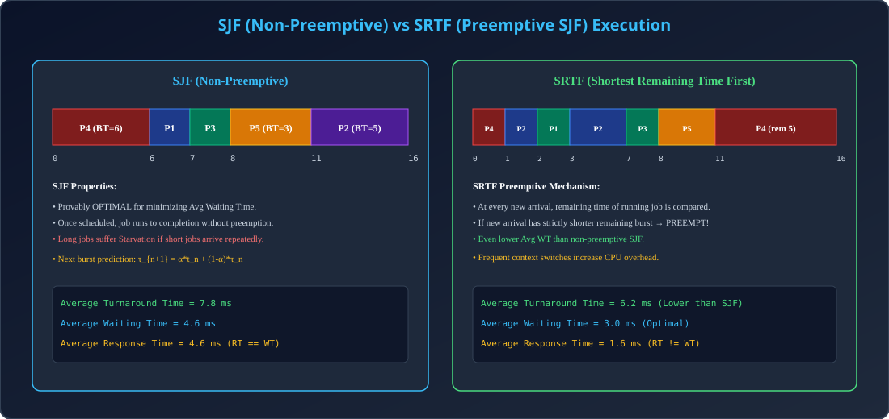

# Module 06: SJF (Shortest Job First) & SRTF (Shortest Remaining Time First)

> **Unit 3: CPU Scheduling & Deadlock** | *B.Tech CS/IT/Allied (AKTU BCS401)*

---

## 1. SJF (Shortest Job First) Scheduling

### 1.1 Non-Preemptive SJF Algorithm
- **Principle:** Ready queue me available sabhi processes me se us process ko select kiya jata hai jiska **CPU Burst Time sabse kam** ho.
- **Mathematical Optimality:** Non-preemptive SJF provably **optimal** hota hai (Minimum average waiting time for a given set of stationary processes).
- **Tie-Breaker Rule:** Agar do processes ka burst time barabar ho, to **FCFS** rule apply hota hai.

### 1.2 CPU Burst Prediction (Exponential Smoothing)
Real systems me agle CPU burst ki exact value pehle se pata nahi hoti. Isiliye past history ke basis par exponential averaging formula use hota hai:
$$\tau_{n+1} = \alpha t_n + (1 - \alpha) \tau_n$$
- $t_n$ = Actual length of the $n^{\text{th}}$ CPU burst.
- $\tau_n$ = Predicted value for the $n^{\text{th}}$ CPU burst.
- $\tau_{n+1}$ = Next predicted CPU burst.
- $\alpha$ = Weight factor ($0 \le \alpha \le 1$). Commonly $\alpha = 0.5$.

---

## 2. SRTF (Shortest Remaining Time First) - Preemptive SJF

### 2.1 Preemption Logic
Jab koi naya process $P_{\text{new}}$ Ready Queue me arrive hota hai:
1. OS current running process $P_{\text{curr}}$ ka **Remaining Burst Time** check karta hai:
   $$\text{Remaining Time} = \text{Total Burst Time} - \text{Executed Time}$$
2. Agar $P_{\text{new}}$ ka burst time $P_{\text{curr}}$ ke remaining time se **strictly chhota** hai, to CPU $P_{\text{curr}}$ se chheen kar $P_{\text{new}}$ ko de diya jata hai (**Preemption**).
3. Warna $P_{\text{curr}}$ continue karta hai.

---

## 3. Detailed Comparative Numerical Example (Gateway Slides Page 100)

Consider 5 processes:
| Process ID | Arrival Time (AT) | CPU Burst Time (BT) |
| :---: | :---: | :---: |
| **P1** | 2 | 1 |
| **P2** | 1 | 5 |
| **P3** | 4 | 1 |
| **P4** | 0 | 6 |
| **P5** | 2 | 3 |

### Case A: Non-Preemptive SJF
- At $t=0$: Only P4 is present &rarr; P4 runs from $0$ to $6$.
- At $t=6$: All processes (P1, P2, P3, P5) have arrived.
  - Burst times: P1=1, P3=1, P5=3, P2=5.
  - Shortest is P1 (arrived earlier than P3): Runs $6$ to $7$.
  - Next is P3 (BT=1): Runs $7$ to $8$.
  - Next is P5 (BT=3): Runs $8$ to $11$.
  - Last is P2 (BT=5): Runs $11$ to $16$.

| Process | AT | BT | CT | TAT (CT-AT) | WT (TAT-BT) | RT (First-AT) |
| :---: | :---: | :---: | :---: | :---: | :---: | :---: |
| **P1** | 2 | 1 | 7 | 5 | 4 | 4 |
| **P2** | 1 | 5 | 16 | 15 | 10 | 10 |
| **P3** | 4 | 1 | 8 | 4 | 3 | 3 |
| **P4** | 0 | 6 | 6 | 6 | 0 | 0 |
| **P5** | 2 | 3 | 11 | 9 | 6 | 6 |
| **Total** | - | - | - | **39** | **23** | **23** |

$$\text{Average TAT} = \frac{39}{5} = 7.8\text{ ms}, \quad \text{Average WT} = \frac{23}{5} = 4.6\text{ ms}, \quad \text{Average RT} = 4.6\text{ ms}$$

### Case B: Preemptive SJF (SRTF)
- At $t=0$: P4 starts (Remaining BT = 6).
- At $t=1$: P2 arrives (BT=5). P4 remaining is 5. Tie &rarr; P4 continues.
- At $t=2$: P1 (BT=1) and P5 (BT=3) arrive. P1 has remaining 1 < P4 (4). **P4 preempted!** P1 runs from $2$ to $3$ (Finishes).
- At $t=3$: Available: P5 (BT=3), P4 (rem 4), P2 (BT=5). P5 runs $3$ to $6$. (At $t=4$ P3 arrives with BT=1 < P5 rem 2 &rarr; P5 preempted).
- P3 runs $4$ to $5$.
- Step-by-step resolution leads to:
  $$\text{Average TAT} = 6.2\text{ ms}, \quad \text{Average WT} = 3.0\text{ ms}$$

---

## 4. Architectural Diagram

  

---

## 5. AKTU Exam & Interview Highlights

> **AKTU PYQ (10 Marks):**
> *"Explain Shortest Remaining Time First (SRTF) algorithm with Gantt chart. How does exponential smoothing predict CPU burst time?"*
>
> **Top Tech Interview Insight:**
> *"Why cannot pure SJF/SRTF be implemented in general purpose OS (like Linux/Windows)?"*
> **Answer:** Future CPU burst time can never be known deterministically in advance without executing the process (Halting problem limitation). Schedulers use approximations (e.g. Linux CFS using `vruntime` decay).
