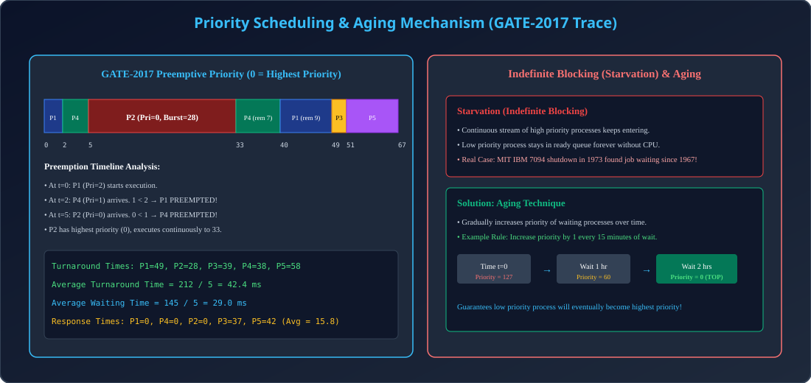

# Module 07: Priority Scheduling & Aging Technique

> **Unit 3: CPU Scheduling & Deadlock** | *B.Tech CS/IT/Allied (AKTU BCS401)*

---

## 1. Priority Scheduling Principle

### 1.1 Priority Definition & Conventions
- Har process ke sath ek integer **Priority Number** associate hota hai.
- CPU scheduler highest priority process ko CPU allocate karta hai.
- **Convention in AKTU & GATE:** Typically, **Smaller integer = Higher priority** (0 represents the highest possible priority).
- **Types:**
  1. **Non-Preemptive:** Running process ko disturb nahi kiya jata jab tak wo willingly CPU release na kare.
  2. **Preemptive:** Agar Ready Queue me current running process se higher priority ka process arrive hota hai, to running process ko immediately preempt kar diya jata hai.

---

## 2. GATE 2017 Solved Problem (Gateway Slide 130)

### 2.1 Problem Statement
Consider 5 processes with arrival time, burst time, and priority (where 0 is highest priority):
| Process ID | Priority No. | Arrival Time (AT) | CPU Burst Time (BT) |
| :---: | :---: | :---: | :---: |
| **P1** | 2 | 0 | 11 |
| **P2** | 0 (Highest) | 5 | 28 |
| **P3** | 3 | 12 | 2 |
| **P4** | 1 | 2 | 10 |
| **P5** | 4 (Lowest) | 9 | 16 |

### 2.2 Execution Step-by-Step Trace
- **$t=0$:** Only P1 is present. P1 runs.
- **$t=2$:** P4 arrives with Priority 1. Current P1 has Priority 2. Since $1 < 2$, **P1 is preempted** (P1 executed for 2 ms, remaining BT = 9). P4 begins.
- **$t=5$:** P2 arrives with Priority 0. P4 has Priority 1. Since $0 < 1$, **P4 is preempted** (P4 executed for 3 ms, remaining BT = 7). P2 begins.
- **$t=5$ to $33$:** P2 has highest priority in the whole system (0). It runs without interruption for its entire 28 ms burst. Terminates at $t=33$.
- **$t=33$:** Available processes: P4 (Pri 1, rem 7), P1 (Pri 2, rem 9), P3 (Pri 3, BT 2), P5 (Pri 4, BT 16). Highest is P4 (Pri 1). P4 runs from $33$ to $40$ (Terminates).
- **$t=40$:** Highest is P1 (Pri 2). P1 runs remaining 9 ms from $40$ to $49$ (Terminates).
- **$t=49$:** Highest is P3 (Pri 3). P3 runs 2 ms from $49$ to $51$ (Terminates).
- **$t=51$:** Last process P5 (Pri 4) runs 16 ms from $51$ to $67$ (Terminates).

### 2.3 Numerical Result Matrix
| Process | Priority | AT | BT | CT | TAT (CT-AT) | WT (TAT-BT) | RT (First CPU - AT) |
| :---: | :---: | :---: | :---: | :---: | :---: | :---: | :---: |
| **P1** | 2 | 0 | 11 | 49 | 49 | 38 | 0 - 0 = 0 |
| **P2** | 0 | 5 | 28 | 33 | 28 | 0 | 5 - 5 = 0 |
| **P3** | 3 | 12 | 2 | 51 | 39 | 37 | 49 - 12 = 37 |
| **P4** | 1 | 2 | 10 | 40 | 38 | 28 | 2 - 2 = 0 |
| **P5** | 4 | 9 | 16 | 67 | 58 | 42 | 51 - 9 = 42 |
| **Total** | - | - | - | - | **212** | **145** | **79** |

- **Average Turnaround Time:** $\frac{212}{5} = 42.4\text{ ms}$
- **Average Waiting Time:** $\frac{145}{5} = 29.0\text{ ms}$
- **Average Response Time:** $\frac{79}{5} = 15.8\text{ ms}$

---

## 3. The Starvation Problem & Aging Solution

### 3.1 Indefinite Blocking (Starvation)
Jab system me continuously higher-priority processes enter hote rehte hain, to low-priority processes ko CPU kabhi mil hi nahi pata. Ise **Starvation** kehte hain.

### 3.2 Aging Technique
- **Concept:** Waiting time ke badhne ke sath sath process ki priority ko dynamically increase karte jana.
- **Rule:** Har $\Delta t$ interval (e.g. 10 minutes) ke intezar par priority number 1 kam kar diya jata hai (meaning priority badha di jati hai).
- Eventually, sabse low priority process bhi highest priority ban jata hai aur guaranteed CPU access prapt karta hai.

---

## 4. Architectural Diagram

  

---

## 5. AKTU Exam & Interview Highlights

> **AKTU PYQ (10 Marks):**
> *"Explain Priority Scheduling algorithm with an example. What is Starvation? How does Aging solve it?"*
>
> **Top Tech Interview Insight:**
> *"What is Priority Inversion and how did it affect the NASA Mars Pathfinder mission?"*
> **Answer:** Priority Inversion tab hota hai jab low-priority process ek shared resource (mutex) hold karta hai, medium-priority process use preempt karta hai, aur high-priority process mutex ka wait karte reh jata hai! Solution: **Priority Inheritance Protocol**.
