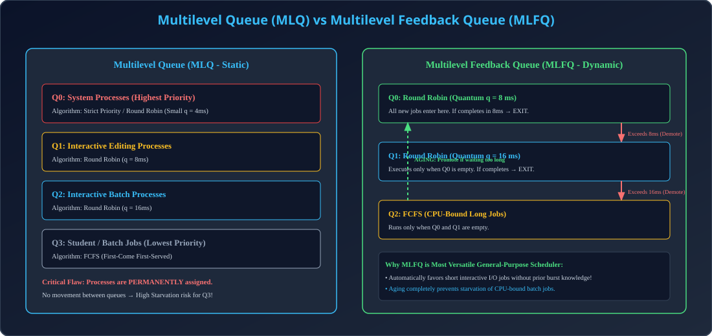

# Module 09: Multilevel Queue (MLQ) & Multilevel Feedback Queue (MLFQ)

> **Unit 3: CPU Scheduling & Deadlock** | *B.Tech CS/IT/Allied (AKTU BCS401)*

---

## 1. Multilevel Queue (MLQ) Scheduling

### 1.1 Fundamental Architecture
Jab system me alag-alag types ke processes hote hain (jaise System processes, Interactive GUI programs, aur Background batch jobs), to unke response requirements alag hote hain. 
MLQ me Ready Queue ko multiple alag-alag queues me partition kar diya jata hai:
1. **System Processes (Top Priority)**
2. **Interactive Editing Processes**
3. **Interactive Batch Processes**
4. **Student / Background Batch Processes (Lowest Priority)**

### 1.2 Two Levels of Scheduling in MLQ
- **Intra-Queue Scheduling:** Har queue ka apna independent scheduling algorithm ho sakta hai (e.g. Foreground queue uses Round Robin; Background queue uses FCFS).
- **Inter-Queue Scheduling:** Queues ke beech CPU distribution ke 2 tareeqe hote hain:
  1. *Fixed-Priority Preemptive:* Upper queue khali hone par hi lower queue chalegi (Heavy Starvation risk).
  2. *Time-Slice:* CPU time queues me divide hota hai (e.g., 80% foreground, 20% background).

### 1.3 Limitation of MLQ
Processes ko statically aur permanently ek queue me assign kar diya jata hai. Ek process kabhi doosri queue me move nahi kar sakta (Inflexible nature).

---

## 2. Multilevel Feedback Queue (MLFQ) Scheduling

### 2.1 Dynamic Priority Adjustment
MLFQ me processes queues ke beech **dynamically move** kar sakte hain based on their CPU-burst behavior:
1. Naya process sabse top queue ($Q_0$) me enter hota hai ($q = 8\text{ ms}$).
2. Agar process apna burst 8 ms ke andar khatam kar le (I/O burst), to wo exit ho jata hai.
3. Agar process continuous compute karta rahe aur 8 ms quantum expire ho jaye, to use punish karke lower queue ($Q_1$) me **Demote** kar diya jata hai ($q = 16\text{ ms}$).
4. Agar $Q_1$ me bhi quantum khatam ho jaye, to use $Q_2$ (FCFS) me demote kar diya jata hai.

### 2.2 Aging in MLFQ
Low-priority batch jobs ko starve hone se bachane ke liye **Aging** implement ki jati hai:
- Agar koi process lower queue me bahut der tak wait kare, to use dynamically upper queue me **Promote** kar diya jata hai.

### 2.3 Parameters That Define an MLFQ Scheduler
1. Number of queues.
2. Scheduling algorithm for each queue.
3. Method used to determine when to upgrade/promote a process.
4. Method used to determine when to demote a process.
5. Method used to determine which queue a process enters when service is requested.

---

## 3. Architectural Diagram

  

---

## 4. AKTU Exam & Interview Highlights

> **AKTU PYQ (10 Marks):**
> *"Explain Multilevel Feedback Queue scheduling. What parameters define its configuration? How does it prevent starvation?"*
>
> **Top Tech Interview Insight:**
> *"How does MLFQ approximate Shortest Job First (SJF) without knowing future CPU burst lengths?"*
> **Answer:** All processes start at top queue ($Q_0$). Short jobs finish immediately in the first small quantum, achieving minimal waiting time (like SJF). Long jobs get filtered down to lower queues automatically!
