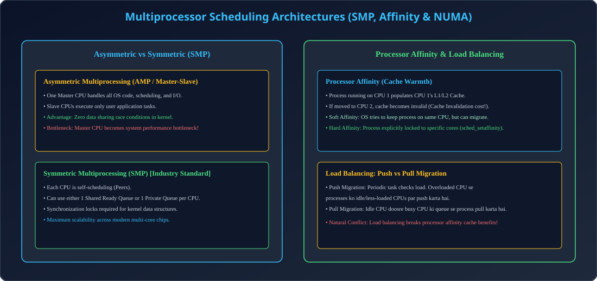

# Module 10: Multiprocessor Scheduling, Processor Affinity & Load Balancing

> **Unit 3: CPU Scheduling & Deadlock** | *B.Tech CS/IT/Allied (AKTU BCS401)*

---

## 1. Multiprocessor Scheduling Architectures

Multiple CPUs ya Multicore systems me scheduling complexity significantly badh jati hai:

### 1.1 Asymmetric Multiprocessing (AMP / Master-Slave)
- System ka ek dedicated **Master Processor** hota hai jo OS kernel, scheduling queues, aur saare I/O system calls execute karta hai.
- Baaki saare **Slave Processors** sirf user programs execute karte hain.
- **Pros:** Kernel structures ko lock karne ki zaroorat nahi hoti (No race conditions).
- **Cons:** Master processor single-point-of-failure aur major performance bottleneck ban jata hai.

### 1.2 Symmetric Multiprocessing (SMP)
- Har processor peer hota hai aur khud apna scheduling execute karta hai (**Self-scheduling**).
- Modern computing ka standard architecture (Linux, Windows Server).
- Two queue models:
  1. *Common Ready Queue:* Saare CPUs ek shared queue se process pick karte hain (Lock contention on ready queue).
  2. *Per-Core Private Queue:* Har CPU ki apni dedicated ready queue hoti hai (Higher scalability).

---

## 2. Processor Affinity & NUMA

### 2.1 Cache Warmth Principle
Jab process CPU 1 par run karta hai, to uski frequently accessed memory lines CPU 1 ke **L1/L2 hardware cache** me load ho jati hain ("Warm Cache"). Agar scheduler process ko CPU 2 par move kar de, to CPU 1 ka cache waste ho jata hai aur CPU 2 par heavy cache misses hote hain. 
Isiliye scheduler process ko usi processor par rakhne ki koshish karta hai—ise **Processor Affinity** kehte hain.

- **Soft Affinity:** OS process ko usi CPU par rakhne ki koshish karta hai par guaranteed nahi hota.
- **Hard Affinity:** Process explicitly system call ke zariye specific CPU cores par lock ho jata hai (Linux me `sched_setaffinity()`).

### 2.2 NUMA (Non-Uniform Memory Access)
NUMA systems me har CPU core ke paas apni dedicated local memory hoti hai jo fast hoti hai, jabki dusre CPU ki remote memory access slow hoti hai. NUMA-aware schedulers process ko usi CPU par schedule karte hain jiske local memory me uske pages allocated hote hain.

---

## 3. Load Balancing: Push vs Pull Migration

1. **Push Migration:** Ek periodic kernel daemon saare processors ka load check karta hai. Agar koi CPU overloaded hai aur koi idle hai, to overloaded CPU se processes ko idle CPU par *push* kar diya jata hai.
2. **Pull Migration:** Jab koi CPU idle hota hai, to wo busy CPUs ki run-queues se waiting process ko apne paas *pull* kar leta hai.

---

## 4. Architectural Diagram

  

---

## 5. AKTU Exam & Interview Highlights

> **AKTU PYQ (7.5 Marks):**
> *"Differentiate between Symmetric and Asymmetric multiprocessing. Explain processor affinity and load balancing techniques."*
>
> **Top Tech Interview Insight:**
> *"Why do Load Balancing and Processor Affinity work in direct opposition to each other?"*
> **Answer:** Processor affinity process ko usi CPU par rakhna chahti hai taaki cache warm rahe. Load balancing process ko dusre idle CPU par migrate karna chahti hai jisse cache completely invalidate ho jata hai. Modern OS dono ke beech threshold-based tradeoff maintain karte hain.
