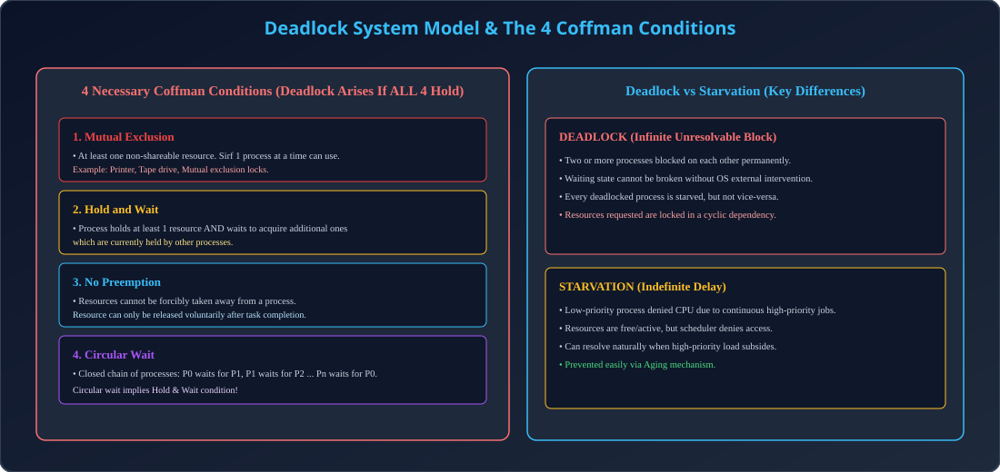

# Module 11: Deadlock Definition, System Model & 4 Coffman Conditions

> **Unit 3: CPU Scheduling & Deadlock** | *B.Tech CS/IT/Allied (AKTU BCS401)*

---

## 1. Deadlock Definition & System Model

### 1.1 Deadlock Kya Hai?
Deadlock ek aisi permanent blocking situation hoti hai jisme processes ka ek set aapas me ek doosre dwara hold kiye gaye resources ka intezar kar raha hota hai. 
Koi bhi process aage proceed nahi kar sakta, aur bina kisi external intervention (OS dwara process kill karna ya reboot) ke ye situation kabhi resolve nahi ho sakti.

- **Real-World Analogy:** Traffic intersection par chaaro taraf se aane wali gaadiyan aapas me aamne-saamne aakar fas gayi hain. Har car aage badhne ke liye dusri car ke peeche hatne ka wait kar rahi hai.

### 1.2 System Resource Model
System me $m$ types ke resources hote hain ($R_1, R_2, \dots, R_m$). Har resource type ki ek ya zyada identical instances ho sakti hain (e.g. 2 Printers, 4 CPU Cores).
Process resource ko 3-step sequence me access karta hai:
1. **Request:** Resource request karna (Agar available nahi hai to process wait karega).
2. **Use:** Resource par operation perform karna.
3. **Release:** Task complete hone par resource free karna.

---

## 2. The 4 Necessary Coffman Conditions

Deadlock tabhi aur sirf tabhi arise ho sakta hai jab nimn **chaaro (4) conditions simultaneously satisfy hon**:

### 2.1 Mutual Exclusion (Non-Shareable Resources)
- Kam se kam ek resource aisa hona chahiye jo non-shareable ho. Ek samay par sirf ek hi process use use kar sakta hai (e.g. Printer).

### 2.2 Hold and Wait
- Ek process ne kam se kam ek resource hold kiya hua hai aur wo doosre resources ke liye wait kar raha hai jo kisi doosre process ke paas held hain.

### 2.3 No Preemption
- Resources ko forcibly kisi process se chheena nahi ja sakta. Resource tabhi release hoga jab process willingly apna task complete karke release kare.

### 2.4 Circular Wait
- Processes ka ek closed cyclic chain exist karta hai:
  $$\{P_0, P_1, P_2, \dots, P_n\}$$
  jisme $P_0$ wait kar raha hai $P_1$ ke resource ka, $P_1$ wait kar raha hai $P_2$ ka, aur $P_n$ wait kar raha hai $P_0$ ke resource ka!

---

## 3. Deadlock vs Starvation (Comparative Breakdown)

| Comparison Metric | Deadlock | Starvation (Indefinite Blocking) |
| :--- | :--- | :--- |
| **Definition** | Cycle of processes blocked on each other permanently. | Low priority process waiting indefinitely due to bias. |
| **Resource State** | Resources held by deadlocked processes are locked idle. | Resources are active and continuously in use by higher priority jobs. |
| **Resolution** | Requires external OS intervention (Abort/Kill). | Resolves automatically when high priority load finishes or via Aging. |
| **Condition** | 4 Coffman conditions must hold simultaneously. | Arises from greedy priority scheduling. |

---

## 4. Architectural Diagram

  

---

## 5. AKTU Exam & Interview Highlights

> **AKTU PYQ (10 Marks):**
> *"What is a deadlock? Discuss the 4 necessary conditions for deadlock with suitable examples. Differentiate between deadlock and starvation."*
>
> **Top Tech Interview Insight:**
> *"Is Circular Wait independently sufficient to cause deadlock?"*
> **Answer:** Circular Wait single-instance resources me deadlock ke liye sufficient hai, lekin multiple-instance resources me cycle hone ke bawajood deadlock nahi bhi ho sakta (if outside processes can release instances).
