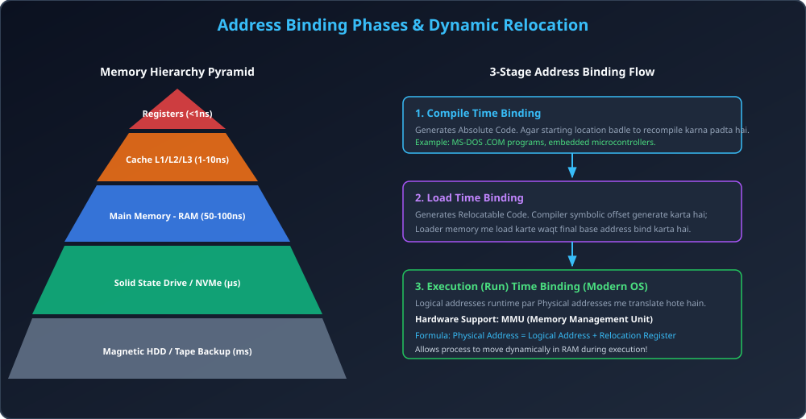

# Module 01: Memory Hierarchy and Address Binding

> **Unit 4: Memory Management** | *B.Tech CS/IT/Allied (AKTU BCS401)*

---

## 1. Memory Hierarchy: Architecture & Performance Tradeoffs

### 1.1 Memory Hierarchy Concept
Computer system me CPU execution speed (Gigahertz / sub-nanosecond) aur secondary memory speed (Milliseconds) ke beech ek vishal speed gap hota hai jise **Von Neumann Bottleneck** kehte hain. Is gap ko bridge karne ke liye memory ko hierarchy me organize kiya jata hai:

1. **CPU Registers:** Fastest access time (< 1 ns), direct CPU datapath me integrated, extremely expensive, lowest capacity (64 - 512 bytes).
2. **L1 / L2 / L3 Cache:** On-chip SRAM (Static RAM), access time 1 - 10 ns, hardware managed.
3. **Main Memory (RAM):** DRAM (Dynamic RAM), access time 50 - 100 ns, OS dwara managed address space.
4. **Secondary Storage (SSD/NVMe):** Non-volatile flash storage, access time 10 - 50 µs, blocks me data access.
5. **Magnetic Hard Disk (HDD):** Mechanical seek latency 5 - 15 ms, sequential access optimized.

> **Key Rule of Hierarchy:** Upar se neeche jane par Access Time badhta hai, Cost per Bit ghat ti hai, aur Capacity dher saari badh jaati hai.

---

## 2. Bare Machine vs Resident Monitor

### 2.1 Bare Machine (Early Systems)
- Shuruati computers (First Generation) me koi Operating System nahi hota tha.
- User direct hardware switch, punched card ya paper tape se machine instructions load karta tha.
- CPU memory ke kisi bhi location ko directly overwrite kar sakta tha (Zero Protection).

### 2.2 Resident Monitor (First Prototype of OS)
- Batch Processing systems me jobs ke continuous execution ke liye memory ke bottom ya top par ek program hamesha reside karta tha jise **Resident Monitor** kaha gaya.
- **Fence Register (Boundary Protection):** Memory ko do hisso me baanta gaya:
  1. *Monitor Space:* OS code and interrupt vectors.
  2. *User Space:* Running batch application.
- Fence register ensure karta tha ki koi bhi user program resident monitor ke memory space me read/write karke crash na kar sake.

---

## 3. Logical vs Physical Address Space

| Feature | Logical (Virtual) Address | Physical (Real) Address |
| :--- | :--- | :--- |
| **Generator** | CPU dwara program execution ke dauran generate hota hai | Memory unit (RAM) dwara directly sense kiya jata hai |
| **User View** | Programmer ko lagta hai ki uske paas $0$ se lekar $MAX$ tak continuous memory hai | RAM ke actual hardware chip pin addresses |
| **Hardware** | Software program reference ke roop me dekhta hai | Memory bus par signal ke roop me flow hota hai |
| **Translation** | MMU (Memory Management Unit) hardware dwara translate hota hai | Direct RAM memory controller me pass hota hai |

---

## 4. Address Binding: The 3 Crucial Phases

Address binding ka matlab hai program ke symbolic variables (e.g., `int x;`) aur instruction labels ko computer memory ke physical addresses me map karna.

### 4.1 Compile Time Binding
- Agar program likhte ya compile karte waqt ye pehle se pata ho ki program RAM me exactly kis physical memory location par load hoga, to compiler direct **Absolute Addresses** generate karta hai.
- **Khami (Drawback):** Agar starting location zara si bhi badal jaye, to pure code ko scratch se recompile karna padta hai.
- **Example:** Early MS-DOS `.COM` files jo hamesha offset `0x0100` par load hoti thi.

### 4.2 Load Time Binding
- Agar compile time par location unknown ho, to compiler **Relocatable Code** generate karta hai (Addresses relative to $0$).
- Jab program RAM me load hota hai, loader actual base address add karke binding complete karta hai.
- **Khami:** Ek baar memory me load hone ke baad process ko execute hote samay kisi doosre memory slot me shift nahi kiya ja sakta.

### 4.3 Execution Time (Run Time) Binding
- Modern multitasking operating systems (Linux, Windows, macOS) execution time binding use karte hain.
- Process execution ke dauran memory ke ek hisse se doosre hisse me swap-in ya relocate ho sakta hai.
- **Hardware Requirement:** Iske liye CPU me dedicated hardware **MMU (Memory Management Unit)** aur **Relocation Register** (Base Register) ki zaroorat hoti hai.
$$	ext{Physical Address} = 	ext{Logical Address} + 	ext{Base (Relocation) Register}$$

---

## 5. Dynamic Loading vs Dynamic Linking

### 5.1 Dynamic Loading
- Poore program ke saare routines ko ek saath RAM me load nahi kiya jata.
- Koi routine ya function tabhi memory me load hota hai jab usko actually call kiya jaye (`on-demand loading`).
- Unused routines (jaise rare error handling routines ya crash recovery modules) kabhi RAM me load hi nahi hote, jisse precious memory waste nahi hoti.
- OS assistance optional hoti hai; programmer program design me modularity use karta hai.

### 5.2 Dynamic Linking & Shared Libraries (`.so` / `.dll`)
- **Static Linking:** Linker system library routines (e.g., C library `printf()`) ki exact copy binary executable file me embed kar deta hai. Har process ke binary file ka size bada ho jata hai aur RAM me duplicate copies banti hain.
- **Dynamic Linking:** Executable me actual code embed nahi hota, balki ek chhota pointer ya code stub (**Stub**) embed hota hai.
- Runtime par jab routine call hota hai, stub check karta hai ki shared library memory me already present hai ya nahi.
- Agar present hai to directly link ho jata hai; agar nahi hai to OS library ko load karta hai.
- Multiple processes ek hi shared library code (`libc.so` ya `kernel32.dll`) ko RAM me share karte hain.

---

## 6. Architectural Diagram

---

## 7. Solved Numerical & Concept Demonstration

### Problem:
Ek system me base (relocation) register ki value `14000` set hai. Limit register ki value `2500` hai.
Determine kijiye:
1. Logical address `1240` ka physical address kya hoga?
2. Logical address `2750` par access karne par system kya karega?

### Solution & Thought Process:
1. **Rule:** Valid access tabhi hota hai jab:
   $$0 \le 	ext{Logical Address} < 	ext{Limit Register}$$
2. **Case 1:** Logical address = `1240`.
   - Check: $1240 < 2500$ $	o$ **Valid!**
   - Physical Address Calculation:
     $$	ext{Physical Address} = 	ext{Logical Address} + 	ext{Base Register} = 1240 + 14000 = 15240$$
   - Result: Memory location `15240` successfully access hoga.
3. **Case 2:** Logical address = `2750`.
   - Check: $2750 \ge 2500$ $	o$ **Limit Exceeded!**
   - Result: Hardware MMU ek internal interrupt (**Trap to OS: Segmentation Fault / Access Violation**) trigger karega aur process ko terminate kar diya jayega.
