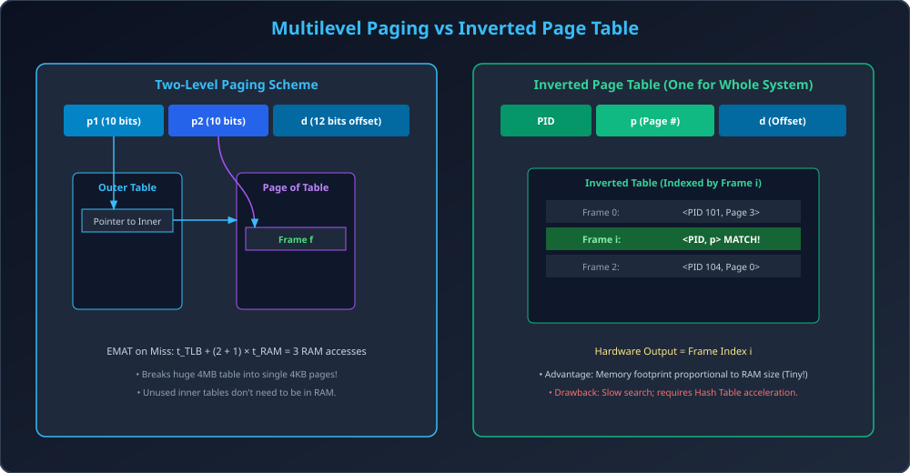

# Module 06: Multilevel and Inverted Page Tables

> **Unit 4: Memory Management** | *B.Tech CS/IT/Allied (AKTU BCS401)*

---

## 1. Large Page Table ki Samasya (The Page Table Scaling Problem)

Consider a standard 32-bit logical address space with 4 KB ($2^{12}$ bytes) page size:
- Number of pages $= rac{2^{32}}{2^{12}} = 2^{20} = 1,048,576 	ext{ pages}$.
- Agar har Page Table Entry (PTE) $4	ext{ bytes}$ ki ho, to single process ka page table size:
  $$	ext{Page Table Size} = 2^{20} 	imes 4	ext{ bytes} = 4	ext{ MB per process!}$$
- Agar system me 100 processes running hain, to sirf Page Tables store karne ke liye $400	ext{ MB}$ physical RAM chahiye!
- Isse bhi bada issue: Page table ko RAM me store karne ke liye **4 MB contiguous memory** chahiye hoti hai.
- 64-bit systems me to single flat page table banana mathematically impossible hai.

---

## 2. Hierarchical / Multilevel Paging

Is samasya ko solve karne ke liye hum Page Table ko khud pages me divide kar dete hain (**Paging the Page Table**).

### 2.1 Two-Level Paging Architecture (32-bit system)
Logical address 3 hisso me split hota hai:
1. **$p_1$ (Outer Page Table Index):** 10 bits ($2^{10} = 1024$ entries).
2. **$p_2$ (Inner Page Table Index / Page of Page Table):** 10 bits ($2^{10} = 1024$ entries).
3. **$d$ (Page Offset):** 12 bits ($2^{12} = 4096$ bytes).

$$	ext{Logical Address (32 bits)} = [p_1 : 10	ext{ bits}] \,||\, [p_2 : 10	ext{ bits}] \,||\, [d : 12	ext{ bits}]$$

### 2.2 Fayda (Advantage):
- Outer Page table ka size $= 1024 	imes 4	ext{ bytes} = 4	ext{ KB}$ (Exactly 1 page frame me fit ho jata hai!).
- Unused virtual address spaces ke liye inner page tables ko create ya RAM me allocate karne ki zaroorat nahi hoti. RAM ki huge bachat hoti hai.

### 2.3 Khami (Drawback - Latency Penalty):
- $k$-level paging me agar TLB Miss ho jaye, to actual data access karne ke liye RAM ko **$(k + 1)$ baar** access karna padta hai!
  - Two-level paging: 1 access for Outer table + 1 for Inner table + 1 for actual data = **3 RAM accesses**.
  - Four-level paging (e.g., x86-64): **5 RAM accesses per miss**!

---

## 3. Inverted Page Table Architecture

Traditional paging me har process ka alag page table hota hai jo logical pages ke hisaab se index hota hai.
**Inverted Page Table** me poore operating system me **sirf ek single table** hoti hai jo **Physical Memory Frames** ke hisaab se index hoti hai!

### 3.1 Structure:
- Table entries count $=$ Total Number of Physical Frames in RAM.
- Har entry me do fields hote hain:
  $$\langle 	ext{Process ID } (PID), 	ext{ Page Number } (p) 
angle$$

### 3.2 Address Translation:
1. CPU generates $\langle PID, p, d 
angle$.
2. Inverted Page Table me $\langle PID, p 
angle$ search kiya jata hai.
3. Agar index $i$ par match mil jaye, to Frame Number $= i$.
4. Physical Address $= (i 	imes 	ext{FrameSize}) + d$.

### 3.3 Pros & Cons:
- **Advantage:** Table ka memory size physical RAM ke size par depend karta hai, process ke virtual address space par nahi. Extreme memory saving!
- **Disadvantage:** Lookup slow hota hai (Linear search). Isko fast karne ke liye hardware **Hash Table** use karni padti hai. Shared memory implement karna complex hota hai.

---

## 4. Architectural Diagram

---

## 5. Solved Numerical: Multi-level Address Bits Calculation

### Problem:
Ek 32-bit virtual memory system me page size 2 KB ($2^{11}$ bytes) hai. Har page table entry 2 bytes ki hai.
Agar hum Two-level paging use karte hain aur inner page table exactly 1 frame me fit honi chahiye, to $p_1, p_2,$ aur $d$ ke bit sizes calculate kijiye.

### Solution:
1. **Offset Bits ($d$):**
   $$	ext{Page Size} = 2	ext{ KB} = 2^{11}	ext{ bytes} \implies d = 11	ext{ bits}$$
2. **Inner Page Table ($p_2$):**
   Inner page table exactly 1 page frame (2 KB) me fit honi chahiye.
   $$	ext{Entries in 1 Page} = rac{	ext{Page Size}}{	ext{PTE Size}} = rac{2	ext{ KB}}{2	ext{ bytes}} = rac{2048}{2} = 1024 = 2^{10} \implies p_2 = 10	ext{ bits}$$
3. **Outer Page Table ($p_1$):**
   $$	ext{Total Address Bits} = 32$$
   $$p_1 = 32 - p_2 - d = 32 - 10 - 11 = 11	ext{ bits}$$
- **Final Address Partition:** $p_1 = 11	ext{ bits}, \quad p_2 = 10	ext{ bits}, \quad d = 11	ext{ bits}$.
