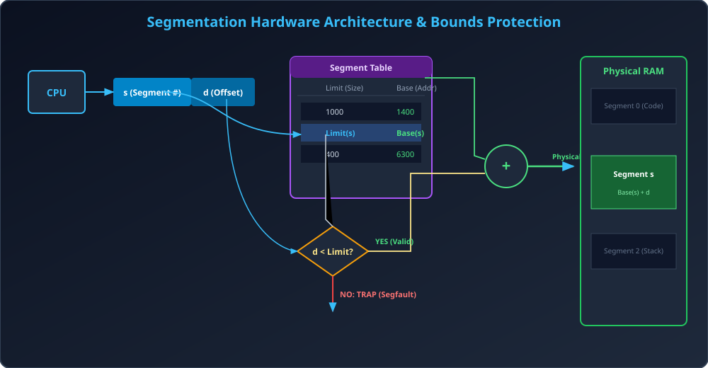

# Module 07: Segmentation and Paged Segmentation

> **Unit 4: Memory Management** | *B.Tech CS/IT/Allied (AKTU BCS401)*

---

## 1. User's View of Memory vs OS View

- **Paging (OS / Hardware View):** Memory ko fixed mathematical blocks (4 KB pages) me baanta jata hai. Programmer ke source code ke functions, objects, aur variables beech me se kat kar do alag pages me divide ho sakte hain.
- **Segmentation (User / Programmer View):** Memory ko logical variable-sized modules me dekha jata hai jaise Programmer code likhta hai:
  - Main program
  - Functions / Subroutines
  - Global variable segment
  - Stack (Local variables)
  - Heap (Dynamic data)
  - Symbol table

---

## 2. Segmentation Architecture & Address Translation

CPU dwara generate kiya gaya Logical Address ek 2-tuple hota hai:
$$\langle 	ext{Segment Number } (s), 	ext{ Offset } (d) 
angle$$

### 2.1 Segment Table
Har process ke paas ek **Segment Table** hota hai. Segment table ke har entry me 2 crucial values hoti hain:
1. **Base (Relocation):** Segment ka physical RAM me starting address.
2. **Limit:** Segment ki exact total length (in bytes).

### 2.2 Hardware Translation & Protection Algorithm:
1. CPU generates $\langle s, d 
angle$.
2. Segment Table ke row $s$ ko inspect kiya jata hai.
3. **Bounds Check:**
   $$	ext{IF } (d \ge 	ext{Limit}(s)) \implies 	extbf{TRAP to OS: Segmentation Fault (Core Dumped)!}$$
4. **Valid Address Generation:**
   $$	ext{IF } (d < 	ext{Limit}(s)) \implies 	extbf{Physical Address} = 	ext{Base}(s) + d$$

---

## 3. Comprehensive Comparison: Paging vs Segmentation

| Comparison Parameter | Paging | Segmentation |
| :--- | :--- | :--- |
| **Block Size** | Fixed size ($2^n$ bytes, typically 4 KB) | Variable size (program logic ke according) |
| **Partition Defined By** | Hardware / Operating System | Programmer / Compiler |
| **User Visibility** | Completely Invisible to Programmer | Visible to Programmer / Compiler |
| **Address Representation** | Single 1D linear integer address | 2D address $\langle s, d 
angle$ |
| **Internal Fragmentation** | **Hoti hai** (last page me, avg $P/2$) | **Zero (Nahi hoti)** |
| **External Fragmentation** | **Zero (Nahi hoti)** | **Hoti hai** (variable holes bante hain) |
| **Memory Protection / Sharing**| Difficult (code aur data mix ho sakte hain) | Natural & easy (poora segment share hota hai)|
| **Address Calculation** | Concatenation $[f \,||\, d]$ (Zero adder delay)| Addition $	ext{Base} + d$ (Requires adder circuit) |

---

## 4. Paged Segmentation (Hybrid Architecture)

Paging aur Segmentation dono ke best features ko combine karne ke liye modern architectures (jaise Intel x86, MULTICS) **Paged Segmentation** use karte hain:
- Programmer ko **Segmentation** ka logical view milta hai (Easy protection, code sharing).
- Har Segment ko internally fixed-size **Pages** me divide kar diya jata hai.
- **Advantage:** Segmentation ki vajah se **External Fragmentation khatam** ho jati hai (kyunki actual physical memory allocation fixed page frames me hota hai)!

---

## 5. Architectural Diagram

---

## 6. Solved Numerical Masterclass

### Problem:
Neeche diye gaye Segment Table ke aadhar par:
| Segment ($s$) | Base | Limit |
| :---: | :---: | :---: |
| 0 | 219 | 600 |
| 1 | 2300 | 14 |
| 2 | 90 | 100 |
| 3 | 1327 | 580 |
| 4 | 1952 | 96 |

Nimn Logical Addresses $\langle s, d 
angle$ ke physical addresses nikaaliye:
1. $\langle 0, 430 
angle$
2. $\langle 1, 10 
angle$
3. $\langle 2, 500 
angle$
4. $\langle 3, 400 
angle$
5. $\langle 4, 112 
angle$

---

### Step-by-Step Thought Process:
1. **$\langle 0, 430 
angle$:**
   - Limit = 600. Check: $430 < 600$ $	o$ **Valid!**
   - Physical Address $= 219 + 430 = \mathbf{649}$.
2. **$\langle 1, 10 
angle$:**
   - Limit = 14. Check: $10 < 14$ $	o$ **Valid!**
   - Physical Address $= 2300 + 10 = \mathbf{2310}$.
3. **$\langle 2, 500 
angle$:**
   - Limit = 100. Check: $500 \ge 100$ $	o$ **Invalid!**
   - Result: **Trap to OS: Addressing Error (Segmentation Fault)**.
4. **$\langle 3, 400 
angle$:**
   - Limit = 580. Check: $400 < 580$ $	o$ **Valid!**
   - Physical Address $= 1327 + 400 = \mathbf{1727}$.
5. **$\langle 4, 112 
angle$:**
   - Limit = 96. Check: $112 \ge 96$ $	o$ **Invalid!**
   - Result: **Trap to OS: Addressing Error (Segmentation Fault)**.
