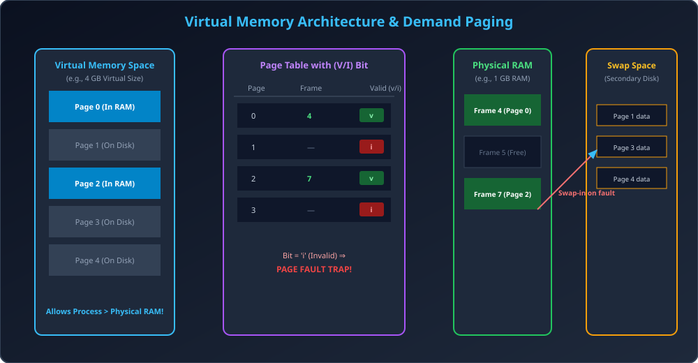

# Module 08: Virtual Memory and Demand Paging

> **Unit 4: Memory Management** | *B.Tech CS/IT/Allied (AKTU BCS401)*

---

## 1. Virtual Memory Concept

Virtual Memory ek aisi memory management technique hai jo user logical memory ko physical memory se completely alag (decouple) kar deti hai.
- Iska sabse bada fayda ye hai ki **Program ka size Physical RAM ke size se kafi bada ho sakta hai** (e.g., 16 GB ka software 4 GB RAM wale computer par successfully chal sakta hai).
- Program ke sirf wahi parts RAM me load hote hain jo currently execution ke liye zaroori hain.
- Unused code (jaise rarely used error routines, giant initialization arrays) RAM me jagah waste nahi karte.
- **Multiprogramming Degree badhti hai:** Ek hi samay par physical memory me zyada processes fit ho sakte hain.

---

## 2. Demand Paging Architecture (Lazy Swapper / Pager)

Demand Paging me kisi bhi page ko secondary storage (disk) se main memory (RAM) me **tabhi laya jata hai jab CPU uski demand kare** (during execution).

### 2.1 Lazy Swapper (Pager)
- Swapper poore process ko swap karta hai.
- Lekin **Pager** process ke individual pages par work karta hai. Pager kabhi bhi kisi page ko RAM me pehle se load nahi karta jab tak us page ki actual zaroorat na pade.

### 2.2 Pure Demand Paging
- Execution shuru hote waqt process ka **EK BHI PAGE RAM me load nahi hota**.
- CPU execution start karta hai with instruction pointer pointing to page 0.
- Pehle hi instruction par Page Fault occur hota hai. OS page 0 ko disk se lata hai aur restart karta hai.
- Aage badhne par jab bhi naye page ki requirement hoti hai, page fault ke zariye load hota hai.

---

## 3. Page Table me Valid-Invalid Bit Scheme

Demand paging ko hardware level par support karne ke liye Page Table ke har entry me ek **Valid-Invalid (V/I) Bit** add kiya jata hai:
- **`v` (Valid = 1):** Page currently physical RAM me present aur legal hai. Translation normal paging ki tarah proceed hoti hai.
- **`i` (Invalid = 0):**
  1. Ya to page illegal hai (process ke logical address range ke bahar hai).
  2. Ya fir page valid hai lekin **currently RAM me nahi hai balki secondary disk (swap space) par stored hai**.

### Hardware Action on Invalid Bit:
Jab CPU kisi aise page ko access karta hai jiska bit `i` set hai, to hardware MMU turant address translation abort kar deta hai aur operating system ko ek internal hardware trap bhejta hai jise **Page Fault** kehte hain!

---

## 4. Hardware Support Required for Demand Paging

Demand paging ko safely implement karne ke liye hardware me do critical features hone chahiye:
1. **Page Table with Valid-Invalid Bit:** Fast lookup bit check.
2. **Backing Store (Secondary Memory / Swap Space):** High-speed disk jaha process ke saare pages save rehte hain.
3. **Instruction Restartability:**
   - Page fault instruction ke execution ke dauran kisi bhi phase me (even micro-instruction level par) trigger ho sakta hai.
   - Fault service hone ke baad CPU ko instruction ko **wahi se dobara execute** karna aana chahiye jaise ki kuch hua hi na ho!

---

## 5. Architectural Diagram

