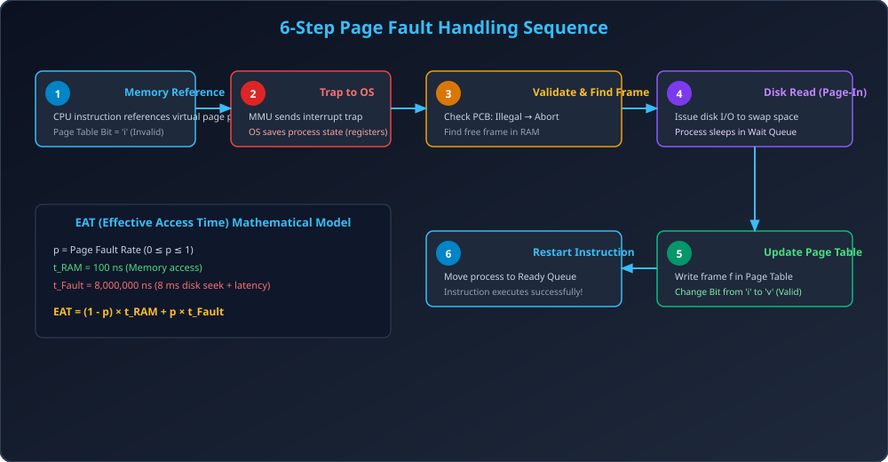

# Module 09: Page Fault Handling and EAT Performance

> **Unit 4: Memory Management** | *B.Tech CS/IT/Allied (AKTU BCS401)*

---

## 1. Page Fault: Definition & Anatomy

Jab CPU kisi aise virtual memory page ko access karne ki koshish karta hai jo currently physical RAM me present nahi hai (Page table entry me Valid-Invalid bit `i` set hai), to hardware MMU dwara CPU ko generate kiya gaya trap **Page Fault** kahlata hai.

---

## 2. Complete 6-Step Page Fault Handling Sequence

Jab page fault trigger hota hai, Operating System kernel nimn 6 steps execute karta hai:

1. **Step 1 (Internal Trap):** CPU hardware instruction address decode karta hai. MMU dekhta hai ki valid bit `0` hai, aur OS ko internal interrupt trap bhejta hai.
2. **Step 2 (Save State):** OS CPU ke registers aur process execution state (PC, SP) ko process ke PCB me save karta hai.
3. **Step 3 (Legality Check):** OS process ke internal table (PCB) ko check karta hai:
   - Agar address illegal hai $	o$ Process ko terminate kar do (Segmentation Fault).
   - Agar address legal hai par page missing hai $	o$ Physical memory me ek free frame dhoondho.
4. **Step 4 (Disk I/O Swap-In):** OS secondary storage (swap space) ko read command issue karta hai. Process ko Waiting state me daal diya jata hai aur CPU doosre process ko de diya jata hai.
5. **Step 5 (Update Page Table):** Disk read complete hone par I/O interrupt aata hai. OS newly brought page ko frame me place karta hai, Page Table me frame number likhta hai, aur Valid bit ko `v` kar deta hai.
6. **Step 6 (Restart Instruction):** OS process ko Ready queue me daalta hai. Jab process schedule hota hai, jo instruction page fault par atka tha, CPU usko **exact usi point se restart** karta hai. Ab translation hit ho jati hai!

---

## 3. Effective Access Time (EAT) under Demand Paging

$$	ext{EAT} = (1 - p) 	imes t_{	ext{RAM}} + p 	imes (	ext{Page Fault Service Time})$$
Jaha:
- $p$: Page fault probability / rate ($0 \le p \le 1$).
- $t_{	ext{RAM}}$: Normal memory access latency (typically $50 - 200	ext{ ns}$).
- $	ext{Page Fault Service Time}$: Disk seek, rotational latency, data transfer, context switch overhead (typically $8 - 10	ext{ ms} = 8,000,000 - 10,000,000	ext{ ns}$).

> **Critical Observation:** Disk access RAM access se **$100,000$ guna zyada slow** hoti hai! Isliye agar page fault rate $p$ zara sa bhi badha ($0.1\%$ bhi), to computer ki overall speed crash ho jayegi.

---

## 4. Architectural Diagram

---

## 5. Solved Numerical Masterclass (AKTU Frequent 10-Marker)

### Problem:
Ek Demand Paged system me:
- Memory Access Time ($t_{	ext{RAM}}$) = $200	ext{ ns}$.
- Average Page Fault Service Time = $8	ext{ ms} = 8,000,000	ext{ ns}$.
- Agar hum chahte hain ki overall performance degradation **$10\%$ se kam** ho (yaani Effective Access Time normal time se $10\%$ se zyada na badhe), to maximum allowable Page Fault Rate ($p$) kitna ho sakta hai?

---

### Step-by-Step Solution & Thought Process:
1. **Target EAT Calculation:**
   $$	ext{Allowed Degradation} = 10\% \implies 	ext{Target EAT} \le 1.10 	imes 200	ext{ ns} = 220	ext{ ns}$$
2. **Setup EAT Equation:**
   $$	ext{EAT} = (1 - p) 	imes 200 + p 	imes 8,000,000 \le 220$$
   $$200 - 200p + 8,000,000p \le 220$$
   $$7,999,800p \le 20$$
   $$p \le rac{20}{7,999,800} pprox rac{20}{8,000,000} = rac{1}{400,000}$$
   $$p \le 0.0000025 = 0.00025\%$$
3. **Conclusion:**
   Computer ko tez rakhne ke liye har $400,000$ memory accesses me se **maximum 1 page fault** afford kiya ja sakta hai! Agar isse zyada faults hue to system unacceptably slow ho jayega.
