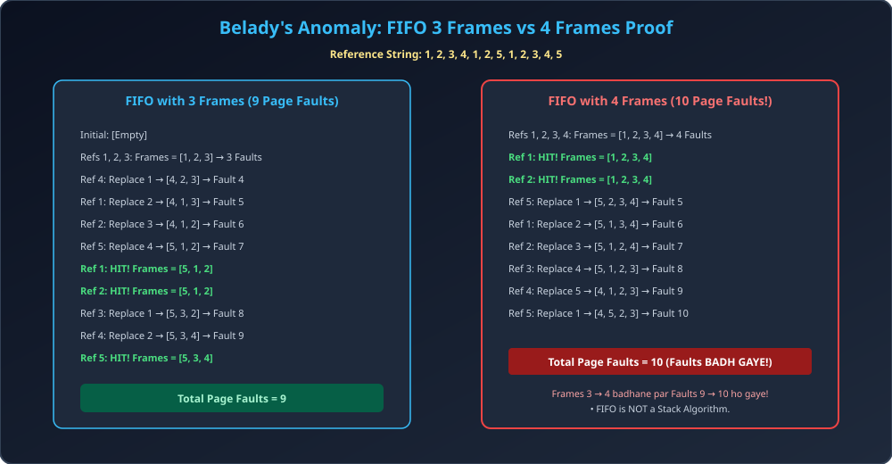

# Module 10: FIFO Page Replacement and Belady's Anomaly

> **Unit 4: Memory Management** | *B.Tech CS/IT/Allied (AKTU BCS401)*

---

## 1. Page Replacement ki Zaroorat & Dirty Bit

Jab system me saare physical memory frames occupied hote hain aur ek naya missing page load karna hota hai, to OS ko RAM me maujood kisi page ko swap-out (evict) karke space banana padta hai. Ise **Page Replacement** kehte hain.

### Dirty (Modify) Bit Optimization:
- Har page table entry me ek **Modify Bit (Dirty Bit)** hota hai:
  - `0 (Clean):` Page RAM me load hone ke baad modify nahi hua hai. Disk par already iski exact copy hai, isliye isko swap-out karte waqt **disk par write nahi karna padta** (overhead bachta hai!).
  - `1 (Dirty):` Page me memory write hui hai. Swap-out se pehle isko disk par sync karna mandatory hai.

---

## 2. FIFO (First-In, First-Out) Algorithm

- **Principle:** Sabse pehle RAM me aane wale page ko sabse pehle evict (replace) kiya jata hai.
- **Data Structure:** Circular FIFO Queue.
- **Advantage:** Sabse simple aur implement karne me aasan ($O(1)$ replacement).
- **Disadvantage:** Ye is baat ki parwah nahi karta ki page currently bar-bar access ho raha hai ya nahi. Aisa page jo poore program me use ho raha ho, wo bhi evict ho jata hai!

---

## 3. Belady's Anomaly (The Paradox of Increasing Frames)

Aamtaur par kisi bhi system me RAM (Frames) badhane par Page Faults ki sankhya kam honi chahiye.
Lekin 1969 me Laszlo Belady ne discover kiya ki FIFO algorithm me:
> **Frames ki sankhya badhane par bhi Page Faults badh sakte hain!** Is anomalous behavior ko **Belady's Anomaly** kaha jata hai.

### Root Cause: Why Belady Anomaly Occurs?
- FIFO ek **Stack Algorithm** nahi hai.
- Ek Stack Algorithm ki property hoti hai:
  $$S(n) \subseteq S(n+1)$$
  (Yaani $n$ frames me present pages ka set hamesha $(n+1)$ frames ke set ka subset hona chahiye).
- FIFO me ye property follow nahi hoti, isliye Belady's Anomaly occur hoti hai.

---

## 4. Architectural Diagram & Proof Trace

---

## 5. Complete Step-by-Step Numerical Proof

**Reference String:** `1, 2, 3, 4, 1, 2, 5, 1, 2, 3, 4, 5`

### Case 1: Frame Allocation = 3
- `1` $	o$ [1, -, -] (Fault 1)
- `2` $	o$ [1, 2, -] (Fault 2)
- `3` $	o$ [1, 2, 3] (Fault 3)
- `4` $	o$ Replace 1 $	o$ [4, 2, 3] (Fault 4)
- `1` $	o$ Replace 2 $	o$ [4, 1, 3] (Fault 5)
- `2` $	o$ Replace 3 $	o$ [4, 1, 2] (Fault 6)
- `5` $	o$ Replace 4 $	o$ [5, 1, 2] (Fault 7)
- `1` $	o$ [5, 1, 2] (**HIT**)
- `2` $	o$ [5, 1, 2] (**HIT**)
- `3` $	o$ Replace 1 $	o$ [5, 3, 2] (Fault 8)
- `4` $	o$ Replace 2 $	o$ [5, 3, 4] (Fault 9)
- `5` $	o$ [5, 3, 4] (**HIT**)
- **Total Faults (3 Frames) = 9 Page Faults**

### Case 2: Frame Allocation = 4 (Extra Frame Diya!)
- `1` $	o$ [1, -, -, -] (Fault 1)
- `2` $	o$ [1, 2, -, -] (Fault 2)
- `3` $	o$ [1, 2, 3, -] (Fault 3)
- `4` $	o$ [1, 2, 3, 4] (Fault 4)
- `1` $	o$ [1, 2, 3, 4] (**HIT**)
- `2` $	o$ [1, 2, 3, 4] (**HIT**)
- `5` $	o$ Replace 1 $	o$ [5, 2, 3, 4] (Fault 5)
- `1` $	o$ Replace 2 $	o$ [5, 1, 3, 4] (Fault 6)
- `2` $	o$ Replace 3 $	o$ [5, 1, 2, 4] (Fault 7)
- `3` $	o$ Replace 4 $	o$ [5, 1, 2, 3] (Fault 8)
- `4` $	o$ Replace 5 $	o$ [4, 1, 2, 3] (Fault 9)
- `5` $	o$ Replace 1 $	o$ [4, 5, 2, 3] (Fault 10)
- **Total Faults (4 Frames) = 10 Page Faults!**

**Conclusion:** 3 frames me 9 faults the, jabki 4 frames me 10 faults ho gaye. This conclusively proves Belady's Anomaly!
