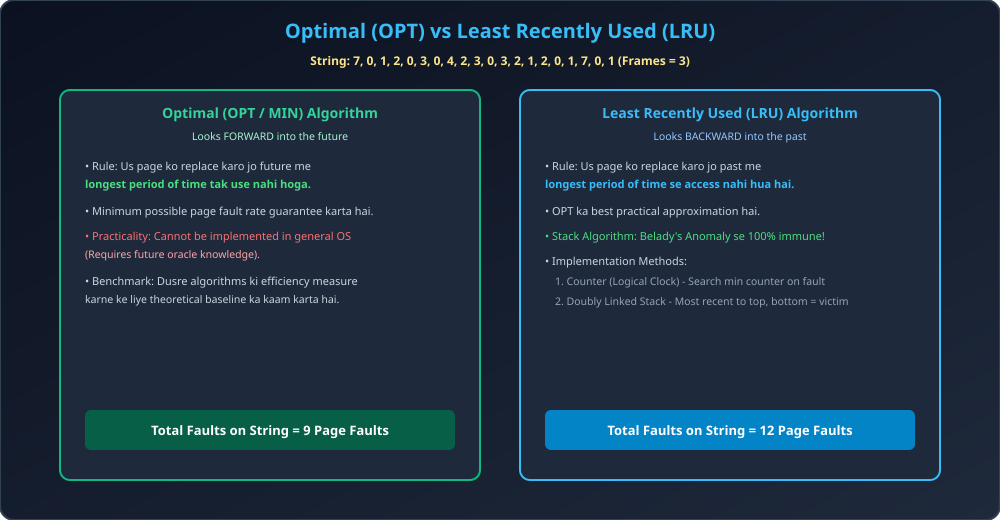

# Module 11: Optimal and LRU Page Replacement

> **Unit 4: Memory Management** | *B.Tech CS/IT/Allied (AKTU BCS401)*

---

## 1. Optimal Page Replacement (OPT / MIN)

Optimal Page Replacement algorithm (Belady dwara proposed) theoretical roop se sabse best algorithm hai.
- **Rule:** Us page ko replace karo jo future me **sabse der baad (longest period of time in future)** use hoga, ya fir kabhi use hi nahi hoga.
- **Advantage:** Diye gaye number of frames ke liye ye **lowest possible page fault rate** produce karta hai.
- **Khami:** Isko standard OS me implement nahi kiya ja sakta kyunki future me CPU kaunse memory address ko kab reference karega, ye pehle se jaan pana impossible hai.
- **Use Case:** Iska use doosre practical algorithms (jaise LRU, FIFO) ki efficiency evaluate karne ke benchmark ke roop me hota hai.

---

## 2. Least Recently Used (LRU) Page Replacement

Future ko predict na kar pane ki wajah se, LRU **recent past** ko future ka predictor maanta hai (Principle of Temporal Locality).
- **Rule:** Us page ko replace karo jo past me **sabse lambe samay se access nahi hua hai (Least Recently Used)**.
- **Stack Algorithm Property:** LRU ek verified stack algorithm hai:
  $$S_n \subseteq S_{n+1}$$
  Isliye LRU me **Belady's Anomaly KABHI BHI occur nahi hoti**. Frames badhane par page faults hamesha ghatenge ya barabar rahenge.

### 2.1 LRU Implementation Mechanisms:
1. **Counters (Logical Clock):**
   - Har page table entry me ek `time_of_use` counter hota hai.
   - Har memory access par CPU clock tick store hoti hai.
   - Replacement ke waqt OS poori table me se smallest counter value dhoondhta hai ($O(n)$ search).
2. **Doubly Linked Stack:**
   - Pages ko doubly linked list stack me maintain kiya jata hai.
   - Jab koi page reference hota hai, use list se nikal kar **Top** par move kar diya jata hai.
   - **Victim Page:** Stack ka **Bottom-most node** hamesha LRU page hota hai ($O(1)$ replacement).

---

## 3. Architectural Diagram

---

## 4. Solved Numerical Masterclass (AKTU Frequent 10-Marker)

**Reference String:** `7, 0, 1, 2, 0, 3, 0, 4, 2, 3, 0, 3, 2, 1, 2, 0, 1, 7, 0, 1`  
**Number of Frames:** `3`

---

### Step-by-Step Optimal Trace:
1. `7` $	o$ [7, -, -] (Fault 1)
2. `0` $	o$ [7, 0, -] (Fault 2)
3. `1` $	o$ [7, 0, 1] (Fault 3)
4. `2` $	o$ Future inspection: 0 (next), 1 (later), 7 (very late at end). Replace 7 $	o$ [2, 0, 1] (Fault 4)
5. `0` $	o$ [2, 0, 1] (**HIT**)
6. `3` $	o$ Future: 0 (next), 2 (soon), 1 (far). Replace 1 $	o$ [2, 0, 3] (Fault 5)
7. `0` $	o$ [2, 0, 3] (**HIT**)
8. `4` $	o$ Future: 2 (next), 3 (next), 0 (far). Replace 0 $	o$ [2, 4, 3] (Fault 6)
9. `2` $	o$ [2, 4, 3] (**HIT**)
10. `3` $	o$ [2, 4, 3] (**HIT**)
11. `0` $	o$ Future: 3, 2, 1... Replace 4 $	o$ [2, 0, 3] (Fault 7)
12. `3` $	o$ [2, 0, 3] (**HIT**)
13. `2` $	o$ [2, 0, 3] (**HIT**)
14. `1` $	o$ Future: 2, 0, 1... Replace 3 $	o$ [2, 0, 1] (Fault 8)
15. `2` $	o$ [2, 0, 1] (**HIT**)
16. `0` $	o$ [2, 0, 1] (**HIT**)
17. `1` $	o$ [2, 0, 1] (**HIT**)
18. `7` $	o$ Future: 0, 1. Replace 2 $	o$ [7, 0, 1] (Fault 9)
19. `0` $	o$ [7, 0, 1] (**HIT**)
20. `1` $	o$ [7, 0, 1] (**HIT**)
- **Optimal Total Page Faults = 9** (Hits = 11, Hit Ratio = 55%)

---

### Step-by-Step LRU Trace:
1. `7` $	o$ [7, -, -] (Fault 1)
2. `0` $	o$ [7, 0, -] (Fault 2)
3. `1` $	o$ [7, 0, 1] (Fault 3)
4. `2` $	o$ Past: 1, 0, 7(LRU). Replace 7 $	o$ [2, 0, 1] (Fault 4)
5. `0` $	o$ [2, 0, 1] (**HIT**) [Order: 0, 2, 1]
6. `3` $	o$ Past LRU is 1. Replace 1 $	o$ [2, 0, 3] (Fault 5)
7. `0` $	o$ [2, 0, 3] (**HIT**) [Order: 0, 3, 2]
8. `4` $	o$ Past LRU is 2. Replace 2 $	o$ [4, 0, 3] (Fault 6)
9. `2` $	o$ Past LRU is 3. Replace 3 $	o$ [4, 0, 2] (Fault 7)
10. `3` $	o$ Past LRU is 0. Replace 0 $	o$ [4, 3, 2] (Fault 8)
11. `0` $	o$ Past LRU is 4. Replace 4 $	o$ [0, 3, 2] (Fault 9)
12. `3` $	o$ [0, 3, 2] (**HIT**)
13. `2` $	o$ [0, 3, 2] (**HIT**)
14. `1` $	o$ Past LRU is 0. Replace 0 $	o$ [1, 3, 2] (Fault 10)
15. `2` $	o$ [1, 3, 2] (**HIT**)
16. `0` $	o$ Past LRU is 3. Replace 3 $	o$ [1, 0, 2] (Fault 11)
17. `1` $	o$ [1, 0, 2] (**HIT**)
18. `7` $	o$ Past LRU is 2. Replace 2 $	o$ [1, 0, 7] (Fault 12)
19. `0` $	o$ [1, 0, 7] (**HIT**)
20. `1` $	o$ [1, 0, 7] (**HIT**)
- **LRU Total Page Faults = 12** (Hits = 8, Hit Ratio = 40%)
