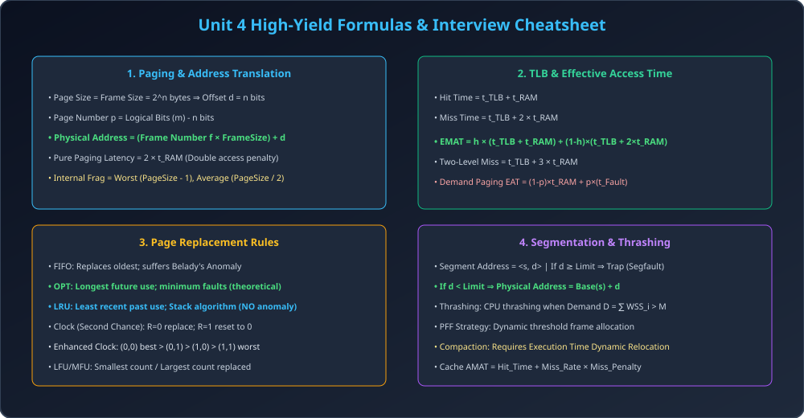

# Module 15: Unit 4 AKTU PYQs and Technical Interview Cheatsheet

> **Unit 4: Memory Management** | *B.Tech CS/IT/Allied (AKTU BCS401)*

---

## 1. AKTU Past Year Solved Questions (BCS401)

### Q1 (10 Marks): Explain Paging and Segmentation. Compare both with neat diagrams and examples.
**Answer Points:**
1. **Paging:** Hardware-driven non-contiguous scheme jisme RAM ko fixed **Frames** aur process ko fixed **Pages** ($2^n$ bytes) me baanta jata hai. Address $(p, d) 	o (f, d)$. Zero external fragmentation, internal fragmentation sirf aakhiri page me.
2. **Segmentation:** User/programmer view oriented variable-sized partitions (Code, Data, Stack). Address $\langle s, d 
angle$. Segment table me `Base` aur `Limit` hote hain. Bounds check $d < 	ext{Limit}$ mandatory hai. Zero internal fragmentation, external fragmentation hoti hai.
3. Include standard 8-parameter comparison table (dekhne ke liye Module 07 refer karein).

---

### Q2 (10 Marks): What is Belady's Anomaly? Prove with reference string why FIFO suffers from it while LRU does not.
**Answer Points:**
1. **Definition:** Increasing the number of page frames leads to an increase in page faults instead of decreasing.
2. **Numerical Proof:** Reference string `1, 2, 3, 4, 1, 2, 5, 1, 2, 3, 4, 5`.
   - 3 Frames $	o$ 9 Page Faults.
   - 4 Frames $	o$ 10 Page Faults.
3. **Theoretical Proof:** LRU satisfies Stack Algorithm inclusion property $S(n) \subseteq S(n+1)$, isliye LRU me kabhi Belady Anomaly nahi hoti. FIFO me inclusion property violate hoti hai.

---

### Q3 (10 Marks): Consider a demand paging system with 80% TLB hit ratio, RAM access time 100 ns, TLB access time 20 ns, and page fault rate 0.01. Page fault service time is 5 ms. Calculate Effective Access Time.
**Solution:**
1. **Memory Access with TLB (when page is in memory):**
   $$	ext{EMAT}_{	ext{mem}} = 0.8 	imes (20 + 100) + 0.2 	imes (20 + 200) = 0.8 	imes 120 + 0.2 	imes 220 = 96 + 44 = 140	ext{ ns}$$
2. **Effective Access Time with Page Fault Rate ($p = 0.01$):**
   $$	ext{EAT} = (1 - p) 	imes 	ext{EMAT}_{	ext{mem}} + p 	imes (	ext{Fault Service Time})$$
   $$	ext{EAT} = (1 - 0.01) 	imes 140	ext{ ns} + 0.01 	imes 5,000,000	ext{ ns}$$
   $$	ext{EAT} = 138.6 + 50,000 = \mathbf{50,138.6	ext{ ns}} pprox 50.14	ext{ }\mu	ext{s}$$

---

## 2. Top FAANG / Product Company Technical Interview Questions

### Q1: Context switch hone par TLB ka kya hota hai?
- **Answer:** Har process ka virtual address mapping alag hota hai. Agar context switch hua to puraane process ka TLB mapping naye process ke liye invalid ho jayega.
- OS do methods use karta hai:
  1. **TLB Flush:** Context switch par poore TLB ko invalidate (flush) kar diya jata hai. (Downside: Context switch ke baad initial TLB misses badhte hain).
  2. **ASID (Address Space Identifier) Tagging:** Har TLB entry me process ID (ASID) tag laga diya jata hai. MMU match karte waqt current process ke ASID ko check karta hai, jisse flush ki zaroorat nahi padti!

### Q2: Linux me `fork()` call hone par memory kaise allocate hoti hai?
- **Answer: Copy-On-Write (COW)!**
- `fork()` hone par child process ke liye parent ke poore memory pages ko copy nahi kiya jata.
- Dono processes initial stage me same physical frames share karte hain aur pages ko `Read-Only` mark kar diya jata hai.
- Jab dono me se koi ek process kisi page par write karta hai, tab hardware MMU trap generate karta hai aur OS sirf us **single modified page ki copy banata hai**. This makes `fork()` blazing fast!

---

## 3. Master Formula Cheatsheet

| Parameter | Formula |
| :--- | :--- |
| **Paging Address** | Physical Address $= (f 	imes 	ext{FrameSize}) + d$ |
| **Pure Paging EMAT** | $2 	imes t_{	ext{RAM}}$ |
| **TLB EMAT** | $h 	imes (t_{	ext{TLB}} + t_{	ext{RAM}}) + (1-h) 	imes (t_{	ext{TLB}} + 2 	imes t_{	ext{RAM}})$ |
| **Two-Level TLB Miss** | $t_{	ext{TLB}} + 3 	imes t_{	ext{RAM}}$ |
| **Demand Paging EAT** | $(1 - p) 	imes t_{	ext{RAM}} + p 	imes (	ext{Fault Service Time})$ |
| **Working-Set Thrashing** | If $D = \sum WSS_i > M \implies$ Thrashing |
| **Cache AMAT** | $t_{	ext{Hit}} + 	ext{Miss Rate} 	imes 	ext{Miss Penalty}$ |

---

## 4. Architectural Diagram

