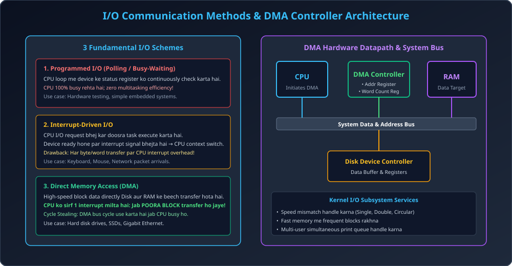

# Module 01: I/O Hardware and Kernel Subsystems

> **Unit 5: I/O Management, Disk Scheduling & File Systems** | *B.Tech CS/IT/Allied (AKTU BCS401)*

---

## 1. I/O Architecture & Device Interfaces

Computer system me CPU aur memory ke alawa hazaron type ke I/O devices (Keyboards, Disks, Monitors, Network Cards) connect hote hain. Inki speed, data transfer rate, aur behavior alag hota hai.
- **Port:** CPU aur device ke beech electrical connection point.
- **Bus:** Common set of wires jiske zariye signals transfer hote hain (PCIe, SATA, USB).
- **Device Controller:** Hardware chip jo physical device ko operate karti hai. Iske paas internal registers hote hain:
  1. *Data-in Register:* Read data hold karne ke liye.
  2. *Data-out Register:* Write data hold karne ke liye.
  3. *Status Register:* Device busy/ready/error state indicate karne ke liye.
  4. *Control Register:* Device command (read, write, seek) issue karne ke liye.
- **Device Driver:** OS kernel ka software module jo specific controller ke register level commands ko universal OS system calls me translate karta hai.

---

## 2. Memory-Mapped I/O vs Port-Mapped I/O (Isolated I/O)

| Comparison Feature | Memory-Mapped I/O | Port-Mapped (Isolated) I/O |
| :--- | :--- | :--- |
| **Address Space** | I/O device registers aur Main Memory ek hi shared address space use karte hain. | I/O devices ke liye dedicated alag address space hota hai. |
| **CPU Instructions** | Normal memory instructions (`MOV`, `LOAD`, `STORE`) se I/O access hota hai. | Special assembly instructions (`IN`, `OUT`) ki zaroorat hoti hai. |
| **Address Bus** | Common address bus use hoti hai. | Dedicated control line (I/O vs Memory) use hoti hai. |
| **Hardware Complexity**| Simpler CPU decoding logic. | Additional hardware logic for separate I/O space. |
| **Example** | ARM, modern x86 PCIe BARs. | Traditional Intel 8086 / x86 I/O ports. |

---

## 3. The 3 Fundamental I/O Communication Schemes

### 3.1 Programmed I/O (Polling / Busy-Waiting)
- CPU device controller ke **Status Register** ke `BUSY` bit ko ek infinite loop me continuously check (poll) karta rehta hai:
  ```c
  while (device_controller->status & BUSY) {
      // Busy wait (CPU 100% tied up, wasting cycles!)
  }
  ```
- **Khami:** CPU ka keemti execution time waste hota hai. Multitasking OS me completely inefficient hai.

### 3.2 Interrupt-Driven I/O
- CPU device controller ko command dekar turant doosre user processes ko execute karne lagta hai.
- Jab I/O device operation complete kar leta hai, to hardware interrupt signal line (`INTR`) activate karta hai.
- CPU current process ka state save karke **Interrupt Service Routine (ISR)** execute karta hai aur data read/write karta hai.
- **Khami:** Agar high-speed bulk data (e.g., Hard Disk ya Gigabit Network) transfer karna ho, to har single byte/word par interrupt aane se CPU context switch overhead me doob jata hai.

### 3.3 Direct Memory Access (DMA)
- Bulk data transfer ke liye dedicated hardware chip **DMA Controller (DMAC)** use hoti hai.
- **Working Flow:**
  1. CPU DMA controller me 3 parameters write karta hai: *Starting memory address*, *Starting disk block*, aur *Byte count*.
  2. CPU free ho jata hai aur apna normal code execute karta rehta hai.
  3. DMA controller poora data block directly Hard Disk se Main RAM me transfer karta hai bina CPU ko disturb kiye.
  4. Jab **POORA BLOCK TRANSFER COMPLETE** ho jata hai, tab DMA controller CPU ko sirf **EK SINGLE INTERRUPT** bhejta hai!
- **Cycle Stealing:** DMA controller system bus ko tab use karta hai jab CPU instruction decode kar raha ho ya internal registers me execute kar raha ho.

---

## 4. Kernel I/O Subsystem Services

Operating System ka Kernel I/O Subsystem hardware ko manage karne ke liye 5 core services provide karta hai:

1. **I/O Scheduling:** Pending I/O requests ka order arrange karna taaki response time minimize ho (e.g., Disk Scheduling algorithms).
2. **Buffering:** Memory me temporary storage buffer rakhna taaki do devices ke beech ka **Speed Mismatch** handle ho sake (e.g., Fast CPU vs Slow Printer).
   - *Single Buffering:* Process ek samay par wait karta hai.
   - *Double Buffering (Ping-Pong Buffer):* Ek buffer me data transfer hota hai jabki doosre buffer ko process consume karta hai.
   - *Circular Buffering:* Queue of buffers for smooth streaming.
3. **Caching:** Frequently accessed data blocks ko ultra-fast memory me copy rakhna (RAM cache) taaki slow secondary disk par na jana pade.
4. **Spooling (Simultaneous Peripheral Operations On-Line):** Aise devices jo multiple processes dwara simultaneously access nahi kiye ja sakte (jaise Printer), unke jobs ko pehle disk storage queue me collect karna aur sequentially deliver karna.
5. **Device Reservation & Error Handling:** Exclusive locks aur hardware transient faults ko recover karna.

---

## 5. Architectural Diagram


