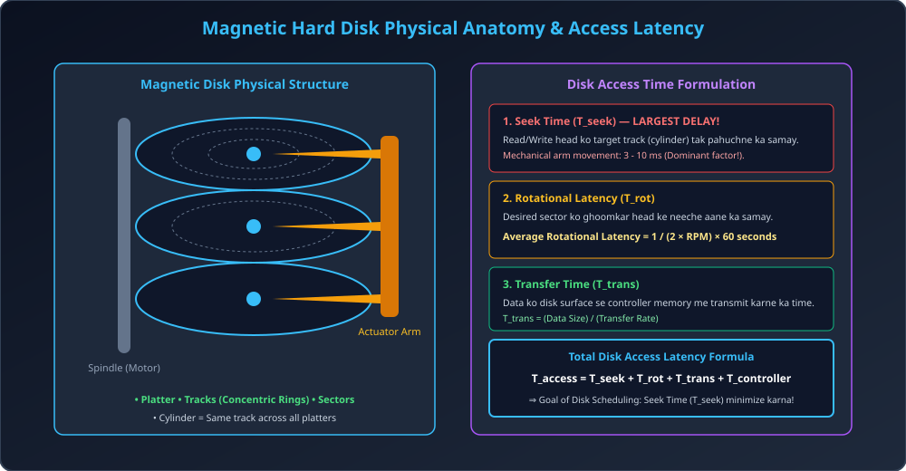

# Module 02: Disk Storage and Physical Architecture

> **Unit 5: I/O Management, Disk Scheduling & File Systems** | *B.Tech CS/IT/Allied (AKTU BCS401)*

---

## 1. Physical Disk Structure & Anatomy

Magnetic Hard Disk Drives (HDD) computer system ka primary secondary persistent storage hote hain. Iske core physical components:

1. **Platters:** Circular aluminum ya glass disks jinke dono surfaces par magnetic material ki coating hoti hai.
2. **Tracks:** Har platter surface concentric rings me divided hoti hai jinhe **Tracks** kehte hain.
3. **Sectors:** Har track chote-chote arcs me divided hota hai jinhe **Sectors** kehte hain. Ek sector standard size $512	ext{ bytes}$ ya $4	ext{ KB}$ (Advanced Format) ka hota hai. Sector disk par smallest addressable unit of I/O hai.
4. **Cylinders:** Sabhi platters ke same vertical position wale tracks milkar ek **Cylinder** banate hain. E.g., sabhi platters ka Track 5 milkar Cylinder 5 banata hai.
5. **Read/Write Heads & Actuator Arm:** Har surface ke paas ek magnetic read/write head hota hai. Saare heads ek common **Actuator Arm** se jude hote hain aur ek sath horizontally move karte hain.
6. **Spindle:** Central motor jo platters ko high constant speed par rotate karti hai (typically 5400 RPM, 7200 RPM, ya 15000 RPM).

---

## 2. Disk Access Time Mathematical Breakdown

Disk se kisi data block ko read/write karne me lagne wala kul samay (**Total Access Time**) 4 components ka sum hota hai:

$$	ext{Total Access Time} = T_{	ext{Seek}} + T_{	ext{Rotational}} + T_{	ext{Transfer}} + T_{	ext{Controller}}$$

### 2.1 Seek Time ($T_{	ext{Seek}}$) &mdash; The Major Bottleneck
- Read/Write head ko current track se target track (cylinder) tak horizontally travel karne me lagne wala physical mechanical samay.
- Typical range: $3	ext{ ms} - 10	ext{ ms}$.
- **Access time ka sabse bada hissa (approx 70-80%) seek time hi hota hai!**
- *Isi seek time ko minimize karne ke liye Disk Scheduling Algorithms invent kiye gaye!*

### 2.2 Rotational Latency ($T_{	ext{Rotational}}$)
- Desired sector ko rotate hokar read/write head ke theek neeche aane me lagne wala samay.
- Average case me disk ko **aadha chakkar (half rotation)** ghoomna padta hai:
  $$	ext{Average Rotational Latency} = rac{1}{2} 	imes \left( rac{60}{	ext{RPM}} 
ight) 	ext{ seconds} = rac{30}{	ext{RPM}} 	ext{ seconds}$$
- **Numerical Example:** Agar disk speed $7200	ext{ RPM}$ hai:
  $$	ext{Average Latency} = rac{30}{7200} = rac{1}{240} 	ext{ s} pprox 4.167	ext{ ms}$$

### 2.3 Transfer Time ($T_{	ext{Transfer}}$)
- Data ko disk magnetic surface se controller buffer me read/write karne ka actual electrical transmission time:
  $$T_{	ext{Transfer}} = rac{	ext{Bytes to be transferred}}{	ext{Transfer Rate (Bytes/sec)}} = rac{b}{N 	imes 	ext{Bytes per Track}}$$

### 2.4 Controller Overhead ($T_{	ext{Controller}}$)
- Disk controller electronics dwara protocol handshake aur command processing me lagne wala microsecond level delay.

---

## 3. Architectural Diagram

---

## 4. Solved Numerical: Total Access Time Calculation (AKTU Pattern)

### Problem:
Ek hard disk ke specifications nimn hain:
- Spindle rotation speed = $5400	ext{ RPM}$.
- Average seek time = $8	ext{ ms}$.
- Transfer rate = $50	ext{ MB/s}$.
- Controller overhead = $0.2	ext{ ms}$.

Calculate kijiye: Ek $512	ext{ KB}$ file ko read karne me total disk access time kitna lagega?

---

### Step-by-Step Thought Process:
1. **Seek Time ($T_{	ext{Seek}}$):**
   $$T_{	ext{Seek}} = 8	ext{ ms}$$
2. **Rotational Latency ($T_{	ext{Rot}}$):**
   $$	ext{Avg Rotational Latency} = rac{30}{	ext{RPM}} = rac{30}{5400} = rac{1}{180}	ext{ s} = 0.00555	ext{ s} = 5.56	ext{ ms}$$
3. **Transfer Time ($T_{	ext{Trans}}$):**
   $$T_{	ext{Trans}} = rac{512	ext{ KB}}{50	ext{ MB/s}} = rac{512 	imes 1024	ext{ bytes}}{50 	imes 10^6	ext{ bytes/s}} = rac{524288}{50000000} pprox 0.01048	ext{ s} = 10.48	ext{ ms}$$
4. **Controller Overhead:**
   $$T_{	ext{Controller}} = 0.2	ext{ ms}$$
5. **Total Access Time:**
   $$T_{	ext{Total}} = 8 + 5.56 + 10.48 + 0.2 = \mathbf{24.24	ext{ ms}}$$
