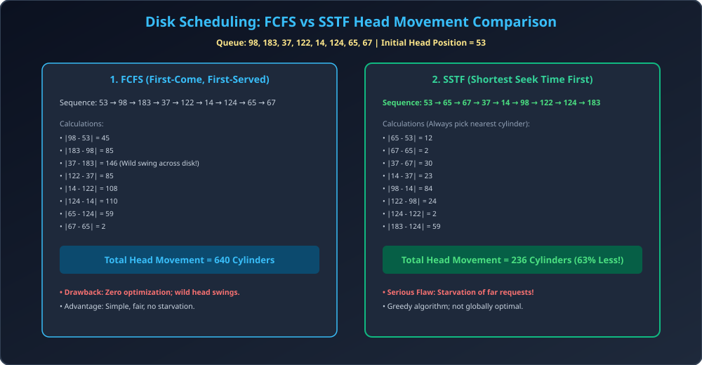

# Module 03: Disk Scheduling &mdash; FCFS and SSTF

> **Unit 5: I/O Management, Disk Scheduling & File Systems** | *B.Tech CS/IT/Allied (AKTU BCS401)*

---

## 1. The Disk Scheduling Problem

Operating System me ek samay par multiple processes alag-alag disk blocks (cylinders) ke liye read/write requests generate karte hain. Disk controller ke pass in requests ka ek queue hota hai.
- **Goal:** Disk arm ke **Total Head Movement (THM)** ko minimize karna taaki average seek time kam ho aur system throughput maximize ho sake.

---

## 2. FCFS (First-Come, First-Served) Scheduling

- **Working Principle:** Requests ko usi sequential order me serve kiya jata hai jis order me wo request queue me arrive hui thi.
- **Advantages:**
  1. Sabse aasan implementation ($O(1)$ queue pop).
  2. 100% Fair; kisi bhi request ki **Starvation nahi hoti**.
- **Disadvantages:**
  1. Head wild swings karta hai (Disk ke ek kone se doosre kone tak baar-baar bhaagta hai).
  2. Extremely high seek time aur poor throughput.

---

## 3. SSTF (Shortest Seek Time First) Scheduling

- **Working Principle:** Current head position se jis cylinder ka distance sabse kam (minimum seek distance) ho, pehle use serve kiya jata hai (Greedy approach):
  $$\min |	ext{Requested Cylinder} - 	ext{Current Head Position}|$$
- **Advantages:**
  1. FCFS ki tulna me Total Head Movement dramatically decrease ho jata hai (typically 60-70% reduction).
- **Major Disadvantages (Starvation):**
  1. **Starvation (Indefinite Delay):** Agar continuously current head ke paas nayi requests aati rahein, to disk ke doosre kone par maujood request ko kabhi service nahi milegi!
  2. Har step par minimum search karna padta hai.

---

## 4. Architectural Diagram & Solved Comparison

---

## 5. Comprehensive Solved Numerical (Standard AKTU Pattern)

### Problem:
Consider a disk queue with requests for I/O to blocks on cylinders:
`98, 183, 37, 122, 14, 124, 65, 67`
Initial head position is at cylinder **`53`**. Disk cylinders range from `0` to `199`.
Calculate the **Total Head Movement (in cylinders)** for:
1. FCFS Scheduling
2. SSTF Scheduling

---

### Step-by-Step Solution & Thought Process:

#### 1. FCFS Scheduling:
Order of service: $53 	o 98 	o 183 	o 37 	o 122 	o 14 	o 124 	o 65 	o 67$
- $|98 - 53| = 45$
- $|183 - 98| = 85$
- $|37 - 183| = 146$
- $|122 - 37| = 85$
- $|14 - 122| = 108$
- $|124 - 14| = 110$
- $|65 - 124| = 59$
- $|67 - 65| = 2$

$$	ext{Total Head Movement (FCFS)} = 45 + 85 + 146 + 85 + 108 + 110 + 59 + 2 = \mathbf{640	ext{ Cylinders}}$$

---

#### 2. SSTF Scheduling:
- Initial Head = `53`. Remaining Queue: `[14, 37, 65, 67, 98, 122, 124, 183]`.
1. From 53: Distances: $|65-53|=12$, $|37-53|=16$. Min is 65 $	o$ Move to **65** ($|65-53| = 12$).
2. From 65: Nearest is 67 ($|67-65| = 2$) $	o$ Move to **67**.
3. From 67: Nearest is 37 ($|37-67| = 30$, whereas $|98-67|=31$) $	o$ Move to **37**.
4. From 37: Nearest is 14 ($|14-37| = 23$) $	o$ Move to **14**.
5. From 14: Remaining: `[98, 122, 124, 183]`. Nearest is 98 ($|98-14| = 84$) $	o$ Move to **98**.
6. From 98: Nearest is 122 ($|122-98| = 24$) $	o$ Move to **122**.
7. From 122: Nearest is 124 ($|124-122| = 2$) $	o$ Move to **124**.
8. From 124: Only 183 left ($|183-124| = 59$) $	o$ Move to **183**.

$$	ext{Total Head Movement (SSTF)} = 12 + 2 + 30 + 23 + 84 + 24 + 2 + 59 = \mathbf{236	ext{ Cylinders}}$$

### Conclusion:
SSTF ne total head movement ko $640$ se ghata kar $236$ kar diya (**63.1% performance gain!**), lekin 14 aur 183 jaise boundary cylinders ne lamba wait kiya.
