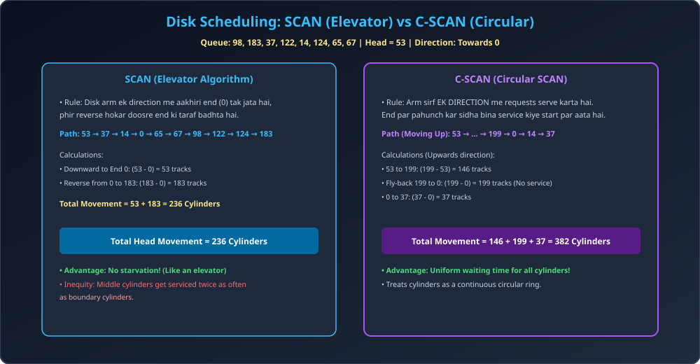

# Module 04: Disk Scheduling &mdash; SCAN and C-SCAN

> **Unit 5: I/O Management, Disk Scheduling & File Systems** | *B.Tech CS/IT/Allied (AKTU BCS401)*

---

## 1. SCAN (Elevator Algorithm)

- **Principle:** Building me elevator (lift) ki tarah kaam karta hai. Disk arm ek direction (e.g., towards cylinder 0 ya towards cylinder 199) me continuously aage badhta hai aur raste me aane wali sabhi requests ko serve karta jata hai.
- Jab arm disk ke **aakhiri physical end (boundary)** par pahunchta hai, tab apni direction reverse (ulta) karta hai aur wapas aate waqt requests ko serve karta hai.
- **Advantage:** Starvation bilkul nahi hoti. Har request bounded time me serve hoti hai.
- **Drawback:** End par pahunchne ke theek baad reverse hone par jo requests abhi-abhi serve hui thi unhe jaldi turn mil jata hai, jabki doosre kone ki requests ko poora traversal wait karna padta hai (Non-uniform waiting time).

---

## 2. C-SCAN (Circular SCAN) Algorithm

- **Principle:** Traversal ko **Uniform** banane ke liye C-SCAN disk ko ek circular list maanta hai.
- Disk arm strictly **ek hi direction me service provide karta hai** (e.g., only moving upwards).
- Jab arm aakhiri boundary cylinder (199) par pahunchta hai, to yeh bina kisi request ko serve kiye **sidha opposite boundary (0) par jump (fly-back)** kar jata hai, aur waha se dobara service shuru karta hai.
- **Advantage:** Sabhi cylinders ko perfectly **Uniform Wait Time** milta hai.

---

## 3. Architectural Diagram

---

## 4. Solved Numerical Masterclass (AKTU Frequent 10-Marker)

### Problem:
Queue: `98, 183, 37, 122, 14, 124, 65, 67`  
Initial Head = `53`, Disk Cylinder range = `0` to `199`.
Direction: Arm is currently moving **towards 0 (downwards)**.
Calculate Total Head Movement for:
1. SCAN Scheduling
2. C-SCAN Scheduling (Moving towards 199)

---

### Step-by-Step Solution & Thought Process:

#### 1. SCAN Scheduling (Moving towards 0):
- Head at 53, moves towards 0:
  - Sequence: $53 	o 37 	o 14 	o 0$ (Touches boundary!)
  - Reverses direction towards 199:
  - Sequence: $0 	o 65 	o 67 	o 98 	o 122 	o 124 	o 183$.
- **Calculation (Shortcut method):**
  - Leg 1 (53 down to 0): $|53 - 0| = 53$
  - Leg 2 (0 up to 183): $|183 - 0| = 183$
  $$	ext{Total Head Movement (SCAN)} = 53 + 183 = \mathbf{236	ext{ Cylinders}}$$

---

#### 2. C-SCAN Scheduling (Moving towards 199):
- Head at 53, moving upwards towards 199:
  - Requests served: $65, 67, 98, 122, 124, 183, 199$ (Boundary hit!).
  - Fly-back to 0 without serving: $199 	o 0$.
  - Resume upwards from 0: Serves $14, 37$.
- **Calculation:**
  - Leg 1 (53 to 199): $|199 - 53| = 146$
  - Leg 2 (Fly-back 199 to 0): $|199 - 0| = 199$
  - Leg 3 (0 to 37): $|37 - 0| = 37$
  $$	ext{Total Head Movement (C-SCAN)} = 146 + 199 + 37 = \mathbf{382	ext{ Cylinders}}$$
