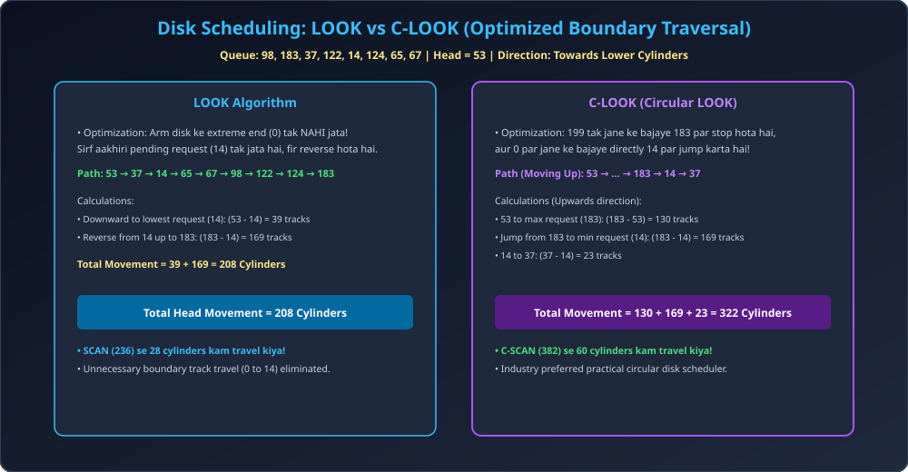

# Module 05: Disk Scheduling &mdash; LOOK and C-LOOK

> **Unit 5: I/O Management, Disk Scheduling & File Systems** | *B.Tech CS/IT/Allied (AKTU BCS401)*

---

## 1. LOOK Scheduling (Practical Elevator)

SCAN algorithm me disk arm hamesha boundary cylinder `0` ya `MAX` (199) tak jata hai, chahe waha koi request ho ya na ho.
- **LOOK Algorithm:** Arm kisi bhi direction me sirf tab tak aage badhta hai jab tak us direction me **requests pending hain**. Aakhiri request serve hote hi arm wahi se apni direction **reverse** kar leta hai (It "LOOKs" ahead before moving!).
- **Fayda:** Unnecessary boundary head movement (e.g., $14 	o 0$ ya $183 	o 199$) completely eliminate ho jati hai.

---

## 2. C-LOOK (Circular LOOK) Scheduling

- **Principle:** C-SCAN ka practical aur optimized version.
- Arm ek direction me highest pending request tak jata hai. Waha se return jump **0 par jane ke bajaye sidha lowest pending request par** karta hai.
- **Fayda:** C-SCAN ki tulna me seek distance kafi kam ho jata hai jabki uniform wait time ka benefit barkarar rehta hai.

---

## 3. Architectural Diagram

---

## 4. Solved Numerical Masterclass

### Problem:
Queue: `98, 183, 37, 122, 14, 124, 65, 67`  
Initial Head = `53`. Range = `0` to `199`.
Direction: Arm is currently moving **towards lower cylinders**.
Calculate Total Head Movement for:
1. LOOK Scheduling
2. C-LOOK Scheduling (Moving towards higher cylinders)

---

### Step-by-Step Solution & Thought Process:

#### 1. LOOK Scheduling (Moving towards lower cylinders):
- Head at 53. Lowest request is `14` (Does not go to 0!).
- Serves: $53 	o 37 	o 14$.
- Reverses at 14 and goes towards highest request `183`:
- Serves: $14 	o 65 	o 67 	o 98 	o 122 	o 124 	o 183$.
- **Calculation:**
  - Leg 1 (53 down to 14): $|53 - 14| = 39$
  - Leg 2 (14 up to 183): $|183 - 14| = 169$
  $$	ext{Total Head Movement (LOOK)} = 39 + 169 = \mathbf{208	ext{ Cylinders}}$$
- *(Note: SCAN me 236 tha, LOOK me sirf 208 laga!)*

---

#### 2. C-LOOK Scheduling (Moving towards higher cylinders):
- Head at 53. Moves up to highest request `183` (Does not touch 199!):
  - Serves: $65, 67, 98, 122, 124, 183$.
  - Distance $= |183 - 53| = 130$.
- Fly-back directly to lowest request `14` (Does not touch 0!):
  - Jump distance $= |183 - 14| = 169$.
- Resume upwards from 14:
  - Serves: $37$.
  - Distance $= |37 - 14| = 23$.
  $$	ext{Total Head Movement (C-LOOK)} = 130 + 169 + 23 = \mathbf{322	ext{ Cylinders}}$$
- *(Note: C-SCAN me 382 tha, C-LOOK me sirf 322 laga!)*
