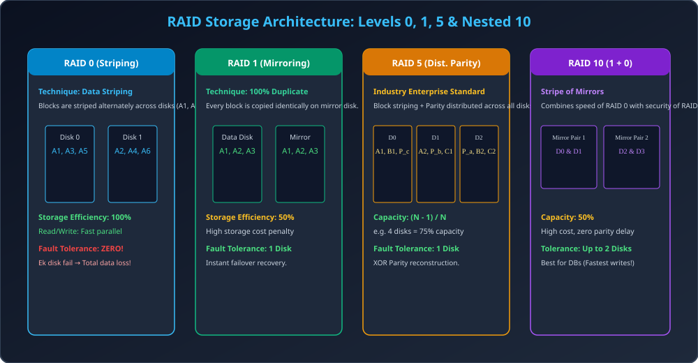

# Module 06: RAID Architecture &mdash; Levels 0 to 6 and Hybrid

> **Unit 5: I/O Management, Disk Scheduling & File Systems** | *B.Tech CS/IT/Allied (AKTU BCS401)*

---

## 1. What is RAID? Fundamental Motivation

RAID ka full form **Redundant Array of Independent (Inexpensive) Disks** hai.
- **Problem:** Ek single hard disk fail ho sakti hai aur data loss ho sakta hai. Saath hi single disk ka data transfer rate limited hota hai.
- **Solution:** Multiple physical hard disks ko ek single logical disk unit ke roop me combine karna.
- **Key Benefits:**
  1. **Performance:** Parallel read/write channels ke zariye bandwidth badhana.
  2. **Reliability (Fault Tolerance):** Agar koi disk physically crash bhi ho jaye, tab bhi system bina downtime ke data recover kar le.

---

## 2. The 3 Core Building Blocks of RAID

1. **Data Striping:** Data ko fixed-size blocks (chunks) me baantkar multiple disks me sequentially distribute karna. Parallel reading/writing possible hoti hai (high throughput).
2. **Mirroring (Shadowing):** Har disk ka ek exact identical duplicate copy banana. Highly reliable, but 50% storage overhead.
3. **Parity (XOR Computation):** Striped blocks par mathematical XOR operation laga kar Parity calculate karna ($P = D_1 \oplus D_2 \oplus D_3$). Agar koi ek data disk crash ho jaye, to surviving disks aur parity se lost data instantly reconstruct ho jata hai:
   $$D_1 = P \oplus D_2 \oplus D_3$$

---

## 3. Comprehensive Breakdown of RAID Levels

| RAID Level | Primary Technique | Usable Capacity ($N$ disks) | Minimum Disks | Fault Tolerance | Read/Write Performance | Primary Drawback / Use Case |
| :---: | :--- | :---: | :---: | :---: | :---: | :--- |
| **RAID 0** | Block Striping | $N$ (100%) | 2 | **0 (Zero)** | Fastest | No redundancy; Video editing / scratch data. |
| **RAID 1** | Mirroring | $N / 2$ (50%) | 2 | 1 disk per pair | Fast Read, Normal Write | 50% capacity wasted; OS boot drives, accounting. |
| **RAID 2** | Bit Striping + Hamming Code | Complex | 3 + ECC | 1 disk | High latency | Obsolete (disks now have internal ECC). |
| **RAID 3** | Byte Striping + Dedicated Parity | $N - 1$ | 3 | 1 disk | Good sequential | Single parity disk bottleneck. |
| **RAID 4** | Block Striping + Dedicated Parity | $N - 1$ | 3 | 1 disk | Bottleneck on write | Parity disk write contention. |
| **RAID 5** | Block Striping + **Distributed Parity** | $N - 1$ | 3 | 1 disk | **Excellent Read, Good Write** | **Standard Enterprise storage** (Web servers, NAS). |
| **RAID 6** | Block Striping + **Dual Parity ($P+Q$)** | $N - 2$ | 4 | **2 Disks simultaneously** | Good Read, Slower Write | Mission-critical cloud storage, big data arrays. |
| **RAID 10 (1+0)**| Stripe of Mirrors | $N / 2$ (50%) | 4 | Up to 1 per pair | **Ultra Fast R/W** | Expensive; High-load RDBMS Databases. |

---

## 4. RAID 0+1 vs RAID 1+0 (Interview Favorite)

- **RAID 0+1 (Mirror of Stripes):** Pehle do RAID 0 stripe banaye, fir unka mirror banaya. Agar ek disk fail hoti hai, to poora RAID 0 stripe fail ho jata hai. Ab surviving stripe par single disk fault aate hi total data crash!
- **RAID 1+0 (Stripe of Mirrors):** Pehle disks ke mirror pairs banaye, fir un pairs ko stripe kiya.
  - **Verdict:** **RAID 10 is vastly superior!** Kyunki agar do alag-alag mirror sets se ek-ek disk fail bhi ho jaye, tab bhi system smoothly chalta rehta hai!

---

## 5. Architectural Diagram

