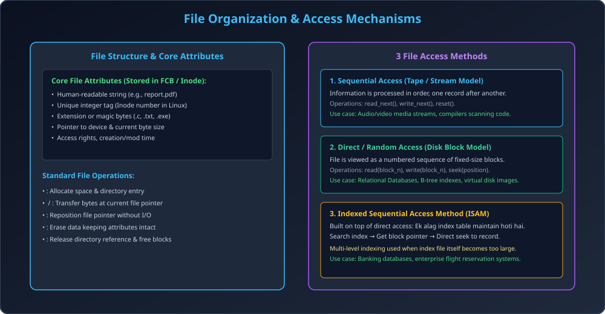

# Module 07: File Concept and Access Methods

> **Unit 5: I/O Management, Disk Scheduling & File Systems** | *B.Tech CS/IT/Allied (AKTU BCS401)*

---

## 1. The File Concept

Operating System physical storage devices (Disks, SSDs, Tapes) ki complex geometry ko hide karke user ko ek uniform logical abstraction provide karta hai jise **File** kehte hain.
- **File Definition:** A named collection of related information recorded on secondary storage.
- **User View:** Continuous sequence of bits, bytes, lines, ya records.

### 1.1 File Attributes
Har file ke sath metadata associated hota hai jo OS maintain karta hai (Linux me **Inode**, Windows me **MFT Entry**):
1. **Name:** User-friendly symbolic string.
2. **Identifier:** OS kernel ka unique integer number (Inode number).
3. **Type:** File content format (`.c`, `.pdf`, `.tar`).
4. **Location:** Secondary storage device par starting block ka physical pointer.
5. **Size:** Current size in bytes/blocks.
6. **Protection:** Access control list (Read, Write, Execute).
7. **Time, Date & User:** Creation time, Last modified timestamp, Owner User ID (UID).

---

## 2. Fundamental File Operations

OS kernel nimn 6 basic system calls provide karta hai:
1. `create()`: Directory me entry banata hai aur disk space allocate karta hai.
2. `write()`: Open file table ke pointer par memory buffer se data disk me write karta hai.
3. `read()`: Current file pointer se bytes read karke RAM buffer me transmit karta hai.
4. `lseek()` / `reposition()`: Data transfer kiye bina file pointer ko nayi byte offset par shift karta hai.
5. `delete()` / `unlink()`: Directory entry delete karta hai aur blocks ko free space list me return karta hai.
6. `truncate()`: File ke attributes aur directory entry preserve rakhte hue uske content blocks ko erase karke size $0$ kar deta hai.

---

## 3. File Access Mechanisms

| Access Method | Working Principle | Operations | Typical Applications |
| :--- | :--- | :--- | :--- |
| **Sequential Access** | Records ko shuru se aakhir tak ek-ek karke sequentially access kiya jata hai. | `read_next()`, `write_next()`, `rewind()` | Audio/Video playback, Compilers scanning source code |
| **Direct (Random) Access**| Kisi bhi fixed-size logical record ya block ko bina pichhle records read kiye direct access kiya ja sakta hai. | `read(block_n)`, `write(block_n)`, `seek()` | Database Management Systems (SQL), Key-Value Stores |
| **Indexed Access (ISAM)** | File ke records ke key fields ka ek alag **Index File** banaya jata hai. Pehle index search hota hai fir direct block access hota hai. | `search_index(key)` $	o$ `read(ptr)` | Bank account lookup, Airline reservation systems |

---

## 4. Architectural Diagram

