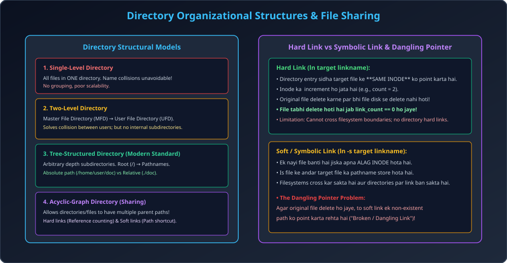

# Module 08: Directory Structures and File Sharing

> **Unit 5: I/O Management, Disk Scheduling & File Systems** | *B.Tech CS/IT/Allied (AKTU BCS401)*

---

## 1. Directory Structure Progression

Directory ek kernel symbol table hai jo human-readable file names ko unke physical File Control Blocks (Inodes) me map karti hai.

### 1.1 Single-Level Directory
- Poore system ke sabhi users ki files ek single root directory me rehti hain.
- **Flaws:** Name collision unavoidable (do users `test.c` naam ki file nahi bana sakte), no grouping capability.

### 1.2 Two-Level Directory
- Poore system ke liye ek **Master File Directory (MFD)** hoti hai.
- Har user ke paas apni private **User File Directory (UFD)** hoti hai.
- **Benefit:** Do alag users bina conflict ke same file name use kar sakte hain.

### 1.3 Tree-Structured Directory
- Modern OS (Linux, Windows) ka standard. Directory ke andar files ke alawa subdirectories bhi ban sakti hain.
- **Pathnames:**
  - *Absolute Pathname:* Root se shuru hone wala complete path (e.g., `/home/shivam/os/unit5.c`).
  - *Relative Pathname:* Current working directory se relative path (e.g., `./unit5.c`).

### 1.4 Acyclic-Graph Directory
- Files aur subdirectories ko multiple directories ke beech **Share** karne ki permission deta hai (Graph without cycles).

---

## 2. File Sharing: Hard Links vs Symbolic (Soft) Links

| Parameter | Hard Link (`ln file link`) | Soft / Symbolic Link (`ln -s file link`) |
| :--- | :--- | :--- |
| **Inode Allocation** | **Same Inode** share karta hai (Zero new inode). | Ek **naya Inode** banta hai jisme target ka path store hota hai. |
| **Reference Count** | Target Inode ka `link_count` $+1$ ho jata hai. | Target Inode ke reference count par koi effect nahi padta. |
| **Deletion Behavior** | Original file delete hone par bhi data intact rehta hai jab tak link_count $> 0$ ho. | Original file delete hone par link **Broken (Dangling Link)** ban jata hai. |
| **Cross-Filesystem** | Nahi chal sakta (Inodes filesystem specific hote hain). | Filesystems aur partitions cross kar sakta hai. |
| **Directories** | Loops prevent karne ke liye directories par prohibited. | Directories par allowed hai. |

---

## 3. General Graph Directory & Garbage Collection

Agar directory graph me cycle allow kar di jaye (General Graph), to do major problems create hoti hain:
1. Directory traversal me infinite recursive loop lag sakta hai.
2. **Cycle Garbage Collection:** Agar do directories ek doosre ko refer kar rahi hon par root se unka access cut ho jaye, to unka reference count kabhi $0$ nahi hoga! Iske liye mark-and-sweep garbage collection run karni padti hai.

---

## 4. Architectural Diagram

