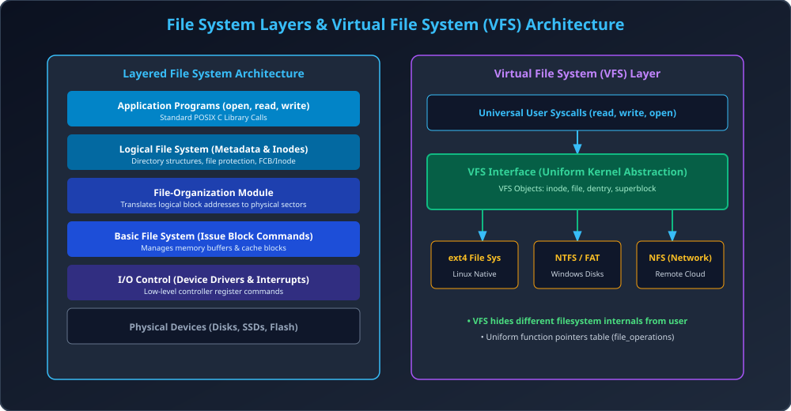

# Module 09: File System Implementation and VFS

> **Unit 5: I/O Management, Disk Scheduling & File Systems** | *B.Tech CS/IT/Allied (AKTU BCS401)*

---

## 1. On-Disk and In-Memory File System Structures

Ek operating system files ko physical disk aur RAM me manage karne ke liye specialized structures maintain karta hai:

### 1.1 On-Disk Data Structures (Permanent Storage)
1. **Boot Control Block (Boot Block):** Partition ka block 0; isme OS ko boot karne ke liye bootstrap loader binary code hota hai.
2. **Partition Control Block (Superblock in Linux):** Partition ke total blocks, free block count, free block pointers, aur total Inodes ki summary store karta hai.
3. **Directory Structure:** File names ko Inode numbers me map karta hai.
4. **File Control Block (FCB in Windows / Inode in Linux):** File ke ownership, permissions, size, timestamps, aur data blocks ke pointers store karta hai.

### 1.2 In-Memory Data Structures (RAM Cache)
1. **Mount Table:** Sabhi mounted filesystems aur unke mount points ki list.
2. **Directory-Structure Cache:** Recently searched directories ki RAM copy (fast pathname lookup).
3. **System-Wide Open-File Table:** Poore OS me open sabhi files ke FCB ki copy + global reference count.
4. **Per-Process Open-File Table:** Process specific table jisme file descriptor (`fd`), current read/write offset, aur system-wide table ka pointer hota hai.

---

## 2. Layered File System Architecture

File system 6 modular layers me divide hota hai:
1. **Application Layer:** Standard I/O library calls (`fopen`, `fread`, `fwrite`).
2. **Logical File System:** Metadata, Inodes, directory structures, protection enforcement.
3. **File-Organization Module:** Logical block address ($0, 1, 2...$) ko physical disk block numbers me map karta hai. Free space allocate karta hai.
4. **Basic File System:** Device driver ko generic block read/write commands issue karta hai aur memory buffers maintain karta hai.
5. **I/O Control (Device Drivers):** Controller specific hardware registers ko manipulate karta hai.
6. **Devices:** Physical hardware (HDD, SSD).

---

## 3. Virtual File System (VFS)

- **Problem:** Ek computer system me ext4 (Linux), NTFS (Windows USB), FAT32 (SD Card), aur NFS (Network File System) simultaneously connected ho sakte hain. Kya programmer ko har filesystem ke liye alag code likhna padega?
- **VFS Solution:** OS kernel ek **Virtual File System (VFS)** abstraction layer introduce karta hai.
- VFS user program ko ek universal standard interface deta hai (`open()`, `read()`, `write()`).
- Internally VFS function pointers ki table (`struct file_operations`) maintain karta hai jo actual mounted filesystem ke internal functions ko call karta hai.

### Core VFS Data Objects in Linux:
1. **`superblock` Object:** Specific mounted filesystem ko represent karta hai.
2. **`inode` Object:** Specific individual file ke metadata ko represent karta hai.
3. **`dentry` (Directory Entry) Object:** Pathname component aur directory structure ko represent karta hai.
4. **`file` Object:** Process dwara currently open file instance ko represent karta hai (file offset, flags).

---

## 4. Architectural Diagram

