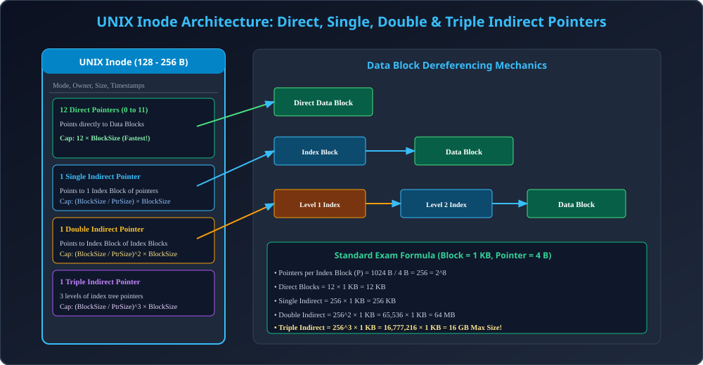

# Module 10: UNIX Inode Architecture and Calculations

> **Unit 5: I/O Management, Disk Scheduling & File Systems** | *B.Tech CS/IT/Allied (AKTU BCS401)*

---

## 1. The UNIX Inode Architecture

Traditional UNIX (ext2 / ext3 / UFS) me har file ko disk par represent karne ke liye ek **Inode (Index Node)** structure hota hai (typically 128 bytes ya 256 bytes ka).
Inode me file ke data blocks ke address store karne ke liye **15 Block Pointers** ka combination use hota hai:

1. **Direct Pointers (12 Pointers: 0 to 11):** Yeh pointers directly actual disk data blocks ko point karte hain. Chhote files (e.g., &le; 48 KB) ko bina kisi indirect table overhead ke turant ($O(1)$) access mil jata hai.
2. **Single Indirect Pointer (Pointer 12):** Yeh ek aise disk block ko point karta hai jisme data nahi, balki data blocks ke pointers store hote hain.
3. **Double Indirect Pointer (Pointer 13):** Yeh ek Index block ko point karta hai, jiska har pointer ek Single Indirect Index block ko point karta hai, jo aage data blocks ko point karte hain (2 levels of indexing).
4. **Triple Indirect Pointer (Pointer 14):** 3 levels of index tree banata hai jo giant multi-gigabyte files ko support karta hai.

---

## 2. Inode Maximum File Size Derivation (AKTU 10-Marker)

### Standard Problem:
Consider a UNIX-style Inode with:
- Block Size = $1	ext{ KB} = 1024	ext{ bytes} = 2^{10}	ext{ bytes}$.
- Disk Block Pointer Address Size = $4	ext{ bytes}$.
- Inode structure has: 12 Direct Pointers, 1 Single Indirect, 1 Double Indirect, and 1 Triple Indirect.

Calculate the **Maximum File Size** that can be supported by this filesystem.

---

### Step-by-Step Mathematical Derivation:

1. **Calculate Pointers per Index Block ($P$):**
   Ek index block me kitne pointers fit honge?
   $$P = rac{	ext{Disk Block Size}}{	ext{Pointer Size}} = rac{1024	ext{ bytes}}{4	ext{ bytes}} = 256 = 2^8 	ext{ pointers}$$

2. **Capacity from 12 Direct Pointers:**
   $$	ext{Capacity}_{	ext{Direct}} = 12 	imes 	ext{Block Size} = 12 	imes 1	ext{ KB} = \mathbf{12	ext{ KB}}$$

3. **Capacity from 1 Single Indirect Pointer:**
   Yeh 1 index block ko point karega jisme 256 data block pointers honge:
   $$	ext{Capacity}_{	ext{Single}} = P 	imes 	ext{Block Size} = 256 	imes 1	ext{ KB} = \mathbf{256	ext{ KB}}$$

4. **Capacity from 1 Double Indirect Pointer:**
   Yeh 1 index block ko point karega jisme $P$ index blocks honge, aur har ek me $P$ data pointers honge:
   $$	ext{Capacity}_{	ext{Double}} = P^2 	imes 	ext{Block Size} = 256^2 	imes 1	ext{ KB} = 65,536 	imes 1	ext{ KB} = \mathbf{64	ext{ MB}}$$

5. **Capacity from 1 Triple Indirect Pointer:**
   $$	ext{Capacity}_{	ext{Triple}} = P^3 	imes 	ext{Block Size} = 256^3 	imes 1	ext{ KB} = 16,777,216 	imes 1	ext{ KB} = 16,384	ext{ MB} = \mathbf{16	ext{ GB}}$$

6. **Total Maximum File Size:**
   $$	ext{Max Size} = 12	ext{ KB} + 256	ext{ KB} + 64	ext{ MB} + 16	ext{ GB} pprox \mathbf{16.064	ext{ GB}}$$

---

## 3. Architectural Diagram

