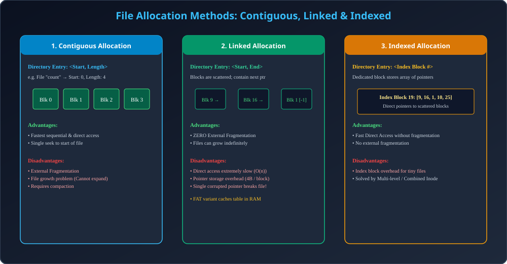

# Module 11: File Allocation Methods

> **Unit 5: I/O Management, Disk Scheduling & File Systems** | *B.Tech CS/IT/Allied (AKTU BCS401)*

---

## 1. The File Allocation Problem

Jab disk par naye files create hote hain, to OS physical disk blocks ko files me kaise allocate kare? 3 standard approaches hain:
1. **Contiguous Allocation**
2. **Linked Allocation (and FAT)**
3. **Indexed Allocation**

---

## 2. Detailed Technical Comparison

| Feature | Contiguous Allocation | Linked Allocation | Indexed Allocation |
| :--- | :--- | :--- | :--- |
| **Directory Entry** | Starting Block &amp; Length | Starting Block &amp; Ending Block | Pointer to Index Block |
| **Sequential Access**| Extremely Fast ($O(1)$) | Fast (follow pointer) | Fast |
| **Direct (Random) Access**| **Instant ($O(1)$)** | **Extremely Slow ($O(n)$)** | **Fast ($O(1)$)** |
| **External Fragmentation**| **High** (Dynamic holes) | **Zero (None)** | **Zero (None)** |
| **Internal Fragmentation**| Yes (in last block) | Yes (in last block) | Yes (in last block) |
| **File Growth** | Difficult (Relocation needed) | **Easy &amp; Dynamic** | **Easy &amp; Dynamic** |
| **Storage Overhead** | None | Pointers per block (4 bytes) | Full index block overhead |
| **Reliability** | Good | Poor (Broken link corrupts file) | Good |

---

## 3. FAT (File Allocation Table) Optimization

Linked allocation me slow direct access ki problem ko door karne ke liye MS-DOS / Windows ne **FAT (File Allocation Table)** banaya:
- Har block ke andar pointer rakhne ke bajaye, poore disk volume ke block pointers ko partition ke shuru me ek central table (FAT) me rakha jata hai.
- **Key Advantage:** Boot time par poori FAT table ko RAM me load kar liya jata hai. Ab kisi bhi $n$-th block ka pointer dhoondhne ke liye disk seek nahi karna padta, RAM me instant lookup ho jata hai!

---

## 4. Architectural Diagram

