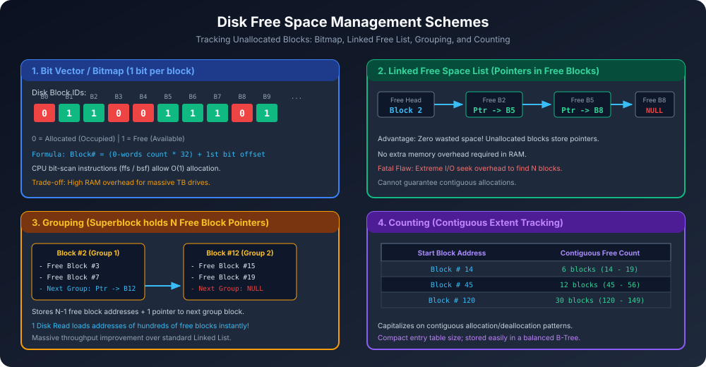

# Module 12: Free Space Management Techniques

Disk par continuously files create, modify aur delete hoti rehti hain. Jab koi file delete hoti hai, toh uske blocks unallocated (free) ho jaate hain. Nayi files ko allocate karne ke liye Operating System ko ek accurate record maintain karna padta hai ki **disk ka kaun sa block free hai aur kaun sa allocated**.

---

## 1. Free Space Management Goals
1. **Fast Allocation:** Jab process ko nayi file ke liye blocks chahiye, toh OS ko bina pure disk ko scan kiye O(1) ya bahut kam time me free block milna chahiye.
2. **Minimal Space Overhead:** Free space tracking data structure ko store karne me disk ya RAM ka minimal fraction kharch hona chahiye.
3. **Contiguous Allocation Support:** Files ke sequential access speed ke liye adjacent (contiguous) free blocks aasani se find kiye ja sakein.

---

## 2. Free Space Management Architecture

---

## 3. Four Core Free Space Management Techniques

### 3.1 Bit Vector / Bitmap Scheme
Har disk block ke liye ek single bit allocate ki jaati hai:
- `0` $\rightarrow$ Block Allocated / Occupied
- `1` $\rightarrow$ Block Free / Available

#### Address Calculation Formula:
Free block find karne ke liye OS word-by-word scan karta hai:
$$\text{Block Number} = (\text{Number of 0-words} \times 32) + \text{Offset of First 1-Bit}$$
*Note: Agar word 64-bit ka hai toh 64 se multiply hoga.*

#### Hardware Acceleration:
Modern CPUs me built-in hardware instructions hote hain jaise:
- `ffs` (find first set bit)
- `bsf` / `tzcnt` (bit scan forward / count trailing zeros)
Inki madad se CPU hardware cycle me hi pehla free block O(1) me find kar leta hai!

#### RAM Overhead Mathematical Derivation:
Agar Disk Size = $D$, Block Size = $B$:
$$\text{Total Blocks } N = \frac{D}{B}$$
$$\text{Bitmap Size (Bytes)} = \frac{N}{8} = \frac{D}{8 \times B}$$

**Solved Numerical:**
> **Question:** Ek 1.3 TB disk hai jisme block size 512 Bytes hai. Iska bit vector RAM me rakhne ke liye kitni memory chahiye?
> 
> **Solution:**
> 1. Total Blocks = $\frac{1.3 \times 10^{12} \text{ Bytes}}{512 \text{ Bytes}} \approx 2,539,062,500 \text{ blocks}$.
> 2. Total Bits = $2,539,062,500 \text{ bits}$.
> 3. Total Bytes = $\frac{2,539,062,500}{8} \approx 317,382,812 \text{ Bytes} \approx \mathbf{302.68\text{ MB}}$.
> 
> *Conclusion:* 300+ MB RAM sirf free space bit vector ke liye reserve rakhna costly ho sakta hai, isliye modern systems me large block sizes (jaise 4 KB) use kiye jaate hain:
> If Block Size = 4 KB:
> $$\text{Bitmap Size} = \frac{1.3 \times 10^{12}}{8 \times 4096} \approx \mathbf{37.8\text{ MB}} \quad (\text{8x reduction!})$$

---

### 3.2 Linked Free Space List (Free List)
Har free block ke andar hi **agla free block ka disk pointer** store kar diya jaata hai. Superblock sirf **first free block** ka pointer store karta hai.

- **Khas Baat (Zero Disk Waste):** Jo blocks free hain, unme user data toh hota nahi, toh unke andar pointer rakhne se koi extra storage waste nahi hoti!
- **Fatal Defect:** List traverse karna bahut slow hai! Agar ek file ko 100 contiguous blocks chahiye, toh OS ko 100 separate disk I/O seeks karne padenge linked list traverse karne ke liye. Isliye pure free list traversal practical nahi hai.

---

### 3.3 Grouping
Linked list ka brilliant optimization!
- Pehla free block $N$ free blocks ke addresses store karta hai.
- Unme se pehle $N-1$ addresses sach me free data blocks ke hote hain.
- $N$-th address agle grouping block ka pointer hota hai.

**Fayda:** Ek single disk read karke OS ko ek saath saikdo free blocks ke direct physical addresses mil jaate hain!

---

### 3.4 Counting
Files aksar multi-block chunks me allocate aur deallocate hoti hain (especially extents use karne wale file systems jaise ext4, XFS).
- Har entry me do cheezein hoti hain:
  1. `First Free Block Address` (e.g., Block 14)
  2. `Contiguous Block Count` (e.g., 6 blocks: 14 to 19)
- Entries ko disk par B-Tree me store kiya jaata hai.
- Yeh approach table size ko dramatically reduce kar deti hai aur contiguous chunks instantly provide karti hai.

---

## 4. Comprehensive Comparison Matrix

| Parameter | Bit Vector (Bitmap) | Linked Free List | Grouping | Counting |
| :--- | :--- | :--- | :--- | :--- |
| **RAM Overhead** | High ($\approx D / (8B)$) | Minimal (1 Head Pointer) | Low (Current Group Block) | Low (B-Tree nodes) |
| **Disk Overhead** | Dedicated bitmap blocks | **Zero** (free blocks used) | **Zero** (free blocks used) | Moderate (Extent Tree) |
| **Finding 1st Free Block** | **O(1)** (CPU `bsf`/`ffs`) | **O(1)** (Head block) | **O(1)** (Group block) | **O(log N)** (Tree search) |
| **Contiguous Allocation** | Easy (bit masking) | Almost Impossible | Difficult | **Best & Native** |
| **Real-world Adoption** | ext2, ext3, NTFS | Historical | Legacy UNIX Systems | **ext4, XFS, ZFS** |

---

## 5. Summary Cheat Sheet
- **Bitmap:** Fastest via bitwise CPU instructions, best for finding contiguous chunks, but consumes RAM proportional to disk size.
- **Linked List:** Zero overhead but disastrous seek latency.
- **Grouping:** Batched linked list, yields $N-1$ blocks per disk read.
- **Counting:** Extent-based pairs `(Start_Block, Count)`, optimal for modern high-performance file systems.
