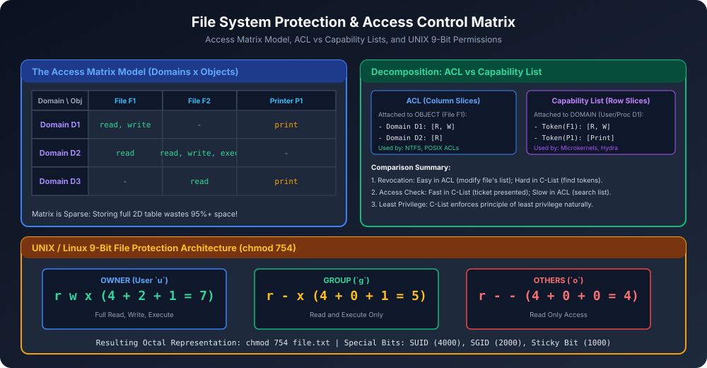

# Module 13: File System Protection and Access Matrix

Multi-user Operating Systems me multiple users ek sath files share aur access karte hain. Protection mechanism ka goal yeh guarantee karna hai ki **sirf authorized users hi un permitted operations (Read, Write, Execute, Delete) ko perform kar sakein**.

---

## 1. Types of File Operations & Access Types
OS files par access categorize karta hai:
1. **Read ($R$):** File ke contents ko view ya copy karna.
2. **Write ($W$):** File me content add ya overwrite karna, file modify karna.
3. **Execute ($X$):** Binary program ya script ko memory me load karke run karna.
4. **Append ($A$):** Data sirf end me add kar sake, existing content edit na kar sake.
5. **Delete ($D$):** File ko directory structure se remove karna.
6. **List Directory ($L$):** Directory ke andar files ke names dekhna.

---

## 2. Protection Model: The Access Matrix



Access Matrix ek theoretical 2D model hai:
- **Rows:** **Domains / Subjects** (Users, Processes, Security Contexts).
- **Columns:** **Objects** (Files, Devices, Memory Regions, Semaphores).
- **Entry $A[D_i, O_j]$:** Set of access rights jo domain $D_i$ ko object $O_j$ par allowed hain.

### Sparsity Problem:
Agar system me 1,000 users aur 1,000,000 files hain, toh matrix me $1,000 \times 1,000,000 = 10^9$ entries hongi! Lekin unme se 99.9% entries empty (no access) hongi. Isliye pure 2D table ko store karna sheer memory wastage hai.

---

## 3. Implementation of Access Matrix

### 3.1 Access Control Lists (ACL) - Column Slices
Matrix ko **columns** ke along cut kiya jaata hai. Har file ke sath ek list attach hoti hai:
- $\text{File } F_1 \rightarrow [(D_1, \{\text{read, write}\}), (D_2, \{\text{read}\})]$
- Jab process file open karta hai, OS file ki ACL check karta hai.
- **Advantage:** Single file ke permissions change ya revoke karna super easy hai.
- **Real-world Example:** Windows NTFS ACLs, POSIX Extended ACLs (`setfacl`, `getfacl`).

### 3.2 Capability Lists (C-Lists) - Row Slices
Matrix ko **rows** ke along cut kiya jaata hai. Har domain (user ya process) ke sath ek **Capabilities List** attach hoti hai (jaise ek VIP security badge ya cryptographic ticket):
- $\text{Process } P_1 \rightarrow [(\text{File } F_1, \{\text{read, write}\}), (\text{Printer } P_1, \{\text{print}\})]$
- Jab process access request karta hai, woh apna capability token present karta hai.
- **Advantage:** Access check O(1) me hota hai (ticket present karo aur direct access pao).
- **Disadvantage:** Revocation extremely difficult hai (agar kisi file ka access revoke karna ho, toh pure OS me har process ke paas jaakar check karna padega kis-kis ke paas token hai).
- **Real-world Example:** Capability-based microkernels (Mach, seL4, Fuchsia).

### 3.3 Lock-Key Mechanism
Har object ke paas ek **Lock** hota hai (bit pattern), aur har domain ke paas **Keys** ki list hoti hai. Agar domain ki key object ke lock se match kar gayi, toh access grant ho jaata hai.

---

## 4. UNIX / Linux 9-Bit File Protection System

UNIX pure ACL overhead ko eliminate karne ke liye ek ultra-lightweight **9-bit protection scheme** use karta hai:

### User Categories:
1. **Owner (`u`):** User jisne file create ki.
2. **Group (`g`):** Group of users jo project share kar rahe hain.
3. **Others / World (`o`):** Baki sabhi users on the system.

### Permission Bits:
- `r` (Read) = Value 4 ($2^2$)
- `w` (Write) = Value 2 ($2^1$)
- `x` (Execute) = Value 1 ($2^0$)

### Octal Calculation Example (`chmod 754 file.txt`):
- **Owner:** $r + w + x = 4 + 2 + 1 = \mathbf{7}$ (Full control)
- **Group:** $r + - + x = 4 + 0 + 1 = \mathbf{5}$ (Read & Execute)
- **Others:** $r + - + - = 4 + 0 + 0 = \mathbf{4}$ (Read only)

```bash
# Terminal View:
-rwxr-xr--  1 shivam devteam 4096 Oct 7 09:30 script.sh
```

### Special Security Bits (12-Bit Mode):
1. **SUID (Set User ID, bit 4000):** Program runs with the permissions of the file owner (e.g., `/usr/bin/passwd` runs as `root`).
2. **SGID (Set Group ID, bit 2000):** Program runs with file's group privileges.
3. **Sticky Bit (bit 1000):** Directory me sirf file ka owner hi apni file delete kar sakta hai (e.g., `/tmp` directory permission `1777`).

---

## 5. Architectural Comparison: ACL vs Capability List

| Parameter | Access Control List (ACL) | Capability List (C-List) |
| :--- | :--- | :--- |
| **Association** | Object (File / Resource) ke sath | Domain (Subject / Process) ke sath |
| **Matrix Slice** | **Column Slices** | **Row Slices** |
| **Access Verification** | Moderate (List traverse karke user find karo) | **Instant O(1)** (Token validation) |
| **Revocation of Rights** | **Very Easy** (File ki list se entry delete karo) | **Extremely Difficult** (Tokens scattered) |
| **Enforcement Model** | Centralized in Kernel File System | Distributed Ticket / Token based |
| **Primary Systems** | UNIX/Linux, Windows NTFS | seL4, Fuchsia, Amoeba, Capros |
